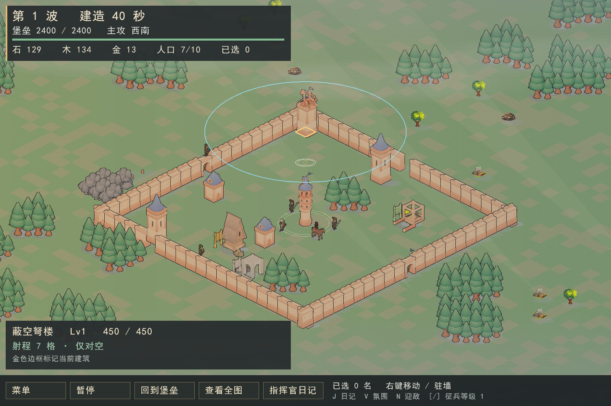
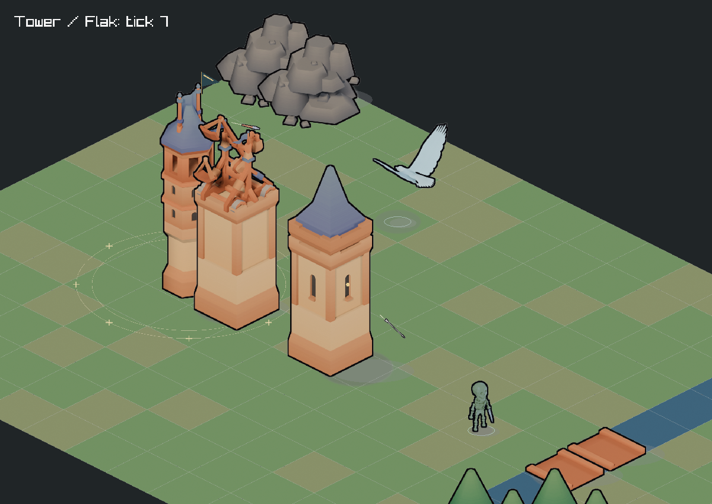

# 城墙、塔楼与破城推进修复

## 玩家能看到的变化

| 问题 | 修复 |
|---|---|
| 城门略微浮空、城圈四角接不上 | 城墙和城门读取逐朝向地面锚点，修正 NE 方向的竖直错位；沿用原有拐角双墙板，保持破墙后真实缺口 |
| 开局箭楼/弩楼挡门 | 门内三格、横向三格预留通道；生成器避免在通道放箭楼，加载旧池图时把挡路的防御塔确定性移到附近城内空地；运行时补充弩楼也避开通道 |
| 弩楼攻击贴图未应用 | 读取建筑真实前摇与冷却，播放已有四帧攻击图；前摇结束时进入素材声明的释放帧 |
| 箭/弩矢发射位置偏低 | 弹丸保存发射原点，渲染从逐朝向的箭孔/弩臂出口平滑过渡到目标高度；不改伤害命中坐标 |
| 进城步兵等攻城锤拆完墙 | 射程内有墙可砸的攻城锤不再决定全军步速线；行军中的编队限速仍保留 |
| 不死鸟向堡垒作无效攻击 | 核心目标选择排除不能破坏核心的单位；脚本优先有效单位/建筑，远处没有目标则返回集结点，不再以堡垒为默认移动目标 |
| 弩楼射程偏短 | 默认射程从 5 调到 7 格，保持只对空、单体攻击，伤害与冷却不变 |
| 不直观的防御覆盖 | 选中已建成塔楼显示按实际战斗射程投影的边界；箭楼金色、弩楼青色，面板标出仅对地/仅对空 |

箭楼原攻击图片内烘焙的箭位置与方向不适合当前弹道，继续播放会出现一支错向的装饰箭。因此箭楼保持稳定楼体，以箭孔闪光和真实弹丸表达发射；弩楼使用现有机械动画。未重绘位图。

## 锚点与出口的数据来源

原模型规范化后，旋转仍绕带偏移的 Pivot；NE 朝向的实际脚底偏离元数据记录的世界原点。按原 GLB 包围盒中心与相机投影计算，256 像素格宽时，Wall 的 NE 锚点 Y 应增加 32，Gate 应减少 23.68。二者原先相反方向的误差叠加，既造成门槛浮空，也造成转角错位。

`_sprite_meta.json` 新增 `ground_anchor_by_facing` 和 `muzzle_by_facing`，像素值仍只由素材元数据提供。SpriteAtlas、Python 预览同步读取；Blender 生成器会输出实际脚底逐朝向投影，素材清单保存出口标记的归一化坐标。当前 PNG 保持原样；没有在本机重新运行 Blender。

建筑动画使用 `impact_frame`，前摇阶段不提前播放释放帧。弹丸原点随压缩数组一起保留、复制和回收，并参与世界哈希。箭楼范围仍为 7；弩楼调整为同样的 7，面积覆盖增加较明显，后续应根据真人试玩观察防空强度。

## 存档兼容性

本次改了初始建筑位置与进攻规则，新增弹丸原点进入哈希，因此世界格式提升为 `World/15`，交互存档提升为版本 2。不能用新规则重放旧操作并冒充同一局。

读取不兼容档时会保留独立的 `campaign.json.legacy-v<版本>-<状态哈希>.json`，不会被新局的普通备份轮换覆盖。旧对局需要用旧版（PR #155 / 主线提交 25401ef）继续；先复制备份到独立保存目录并命名为 `campaign.json`，通过 `--save-dir` 指向该目录。永久日记格式保持不变。新版本内正常保存、继续仍接受确定性恢复校验。

## 验证方法

- `[battlefix]`：不死鸟跳过近处堡垒仍伤害其他建筑；弩楼真实前摇/释放/飞行；全部标准池图的初始塔楼通道检查；缺口内步兵不等待仍在砸墙的攻城锤。
- `[save]`：新版对局跨多波恢复及后续一致；版本备份独立于新局轮换。
- `render_weapon_shots`：真实 World 驱动四张前摇、释放和飞行截图，使用正式 SceneRenderer。
- `render_range_shot` / `render_flak_range_shot`：正式游戏选中塔楼的范围与面板截图。
- `--battle --inspect X,Y --screenshot ...` 可重复拍摄选中建筑；此参数限定截图模式，不接触玩家存档。

剧情节点保持 1/10/20/30/40/50/60/70。本轮不调整攻方预算、剧情间隔或结局门槛。

## 本次验证结果

Release 构建成功；全套 CTest 85/85 通过。随后把弩楼目标放到旧 5 格射程之外，专项测试再次通过（4 个用例、62 个断言）。素材生成相关 Python 文件通过语法检查。已目视检查标准地图门墙接合、四角、两个塔楼范围，以及真实前摇/释放/飞行截图。尚未做多名真人的长局平衡对比。

