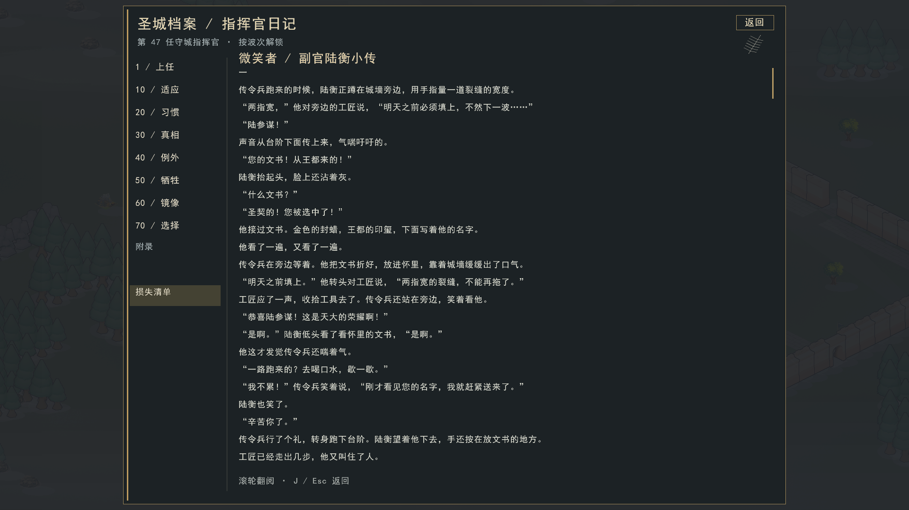
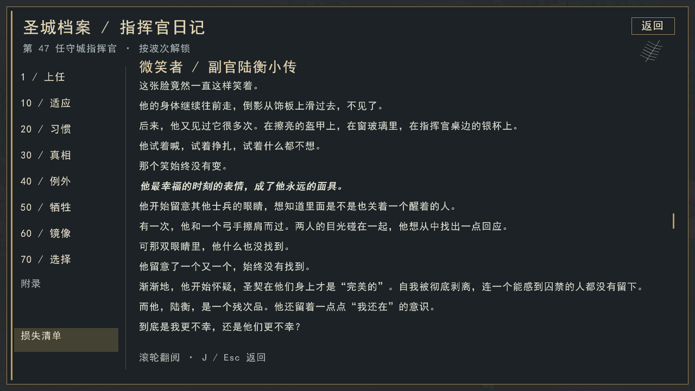
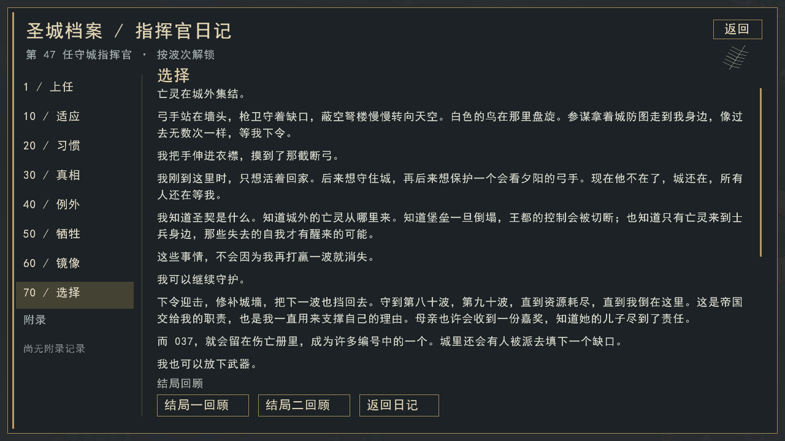

# 守方体验核验记录

本页为[改进提案](README.md)提供已观察到的事实与复查入口。规则版本：v1.0.1，提交 `fb0c36d6f121d24521a618c801393f17ad71f748`；地图 `gen_01009000`，种子 `8709371129856055178`，20Hz、MSVC Release、脚本攻方。

第41—69波来自原通关路线，第70—91波来自选择继续守护后的续局，不能描述成一条未经分支的完整轨迹。续局冻结于第92波起点tick209499，世界哈希 `7198304080585817914`。既有复盘已做两入口原规则重放；本次提案未重跑整局。

## 1. 后期压力与工程操作

| 区间 | 敌毁建筑/工地 | 其中箭楼 | 守军阵亡 | 建造命令 | 升级命令 | 玩家输入记录 |
|---|---:|---:|---:|---:|---:|---:|
| 第70—79波 | 125 | 6 | 8 | 254 | 186 | 522 |
| 第80—89波 | 124 | 16 | 8 | 420 | 153 | 625 |

两段堡垒伤害均为0。后段损失更多转向火力点，第89波敌毁35处，其中5座箭楼、10个工地。玩家同时主动扩张，420条建造命令不能全部算为被迫补损，也不等于420次点击：拖线会展开多个命令。

这支持外围维护负担加重，不支持“已经接近陷落”的判断。续局箭楼222→327，承担97.93%的对敌有效伤害；石材主导工程投资，但木材9769→3249仍是真实消耗，不能说其余资源完全无用。

## 2. 墙体的静态承伤门槛

第85波单锤对结构原始伤害734。下表仅计算满血墙、无抢修、无其他伤害时的命中次数；两锤齐击是假定同步的静态组合，不是新跑的战斗实验。

| 墙等级 | 满血 | 累计建造+升级石/木 | 单锤击毁命中次数 | 两锤同步击毁齐击次数 |
|---|---:|---:|---:|---:|
| 1 | 1200 | 30/10 | 2 | 1 |
| 2 | 1325 | 42/14 | 2 | 1 |
| 3 | 1440 | 57/19 | 2 | 1 |
| 4 | 1546 | 75/25 | 3 | 2 |
| 8 | 1912 | 177/59 | 3 | 2 |
| 14 | 2357 | 420/140 | 4 | 2 |

一级升二级花12石4木，增加125血，未跨本例门槛。四级跨过门槛，累计材料为一级2.5倍；八级继续加价却未增加本例的命中次数。第80波单锤709伤害，三级墙已能多撑一次，不能概括成“三级始终无效”。

墙的半血高度优势、抢修、快速补缺口和攻城锤攻击动作也影响实际收益。以上HP计算已与冻结终点全部存活墙核对，锤伤害公式已与22波伤害记录核对；这些核验不替代动态对照。

四级箭楼累计200石75木，单工匠工作量为240+3×120=600tick，即30秒。直接按一级240tick成型会额外省18秒，属于平衡变化。

## 3. 兵营与资源建筑升级

| 兵营等级 | 满血 | 累计石/木 |
|---|---:|---:|
| 1 | 700 | 60/60 |
| 2 | 773 | 84/84 |
| 3 | 840 | 114/114 |

征兵等级上限取决于堡垒；训练时间取决于兵种和所招单位等级。兵营等级不改变这些能力，也不增加并行训练或人口。

第41—69波和第70—91波的详细伤害与攻击前摇日志中，兵营承伤、被毁和作为攻击前摇目标的记录均为0，包含不死鸟。本例不能估计所有布局下的遭袭概率，但明确说明本局没有兑现耐久收益。

普通地面脚本没有“附近可打兵营则主动打”的通用分支。通往堡垒或经济目标的路径被兵营阻挡，且寻路选择拆除而非绕行，才可能通过移动碰撞触发攻击；普通推进也可能被攻击守军、锤打墙、集结或等队行为抢先。经济袭击的通用建筑选目标可碰巧选中更近的兵营，攻城锤范围攻击也可波及。

资源建筑同样不随升级提高收入。本续局7座采石场、3座伐木场、1座金矿被毁。一级500、二级552、三级600血，面对第85波734伤害均一次被毁；是否划算仍需看对手与维修条件。

## 4. 部队、人口与友伤

- 三名猎骑在第70—91波保持174/572、106/628、30/646血，无输出、无承伤，长期占3个人口；均低于40%撤退阈值。
- 终点堡垒29级，人口上限8+2×29=66；存活31工匠、32弓手、3猎骑。工匠占47%是观察值，不是超出游戏限制。
- 每升一级堡垒花200石200木并增加2人口，还同时关联建筑和征兵等级上限；本局末金币库存32815。
- 第41—69波自家箭楼对枪卫造成17086伤害、40次击杀；对猎骑478伤害、1次击杀；对弓手2455伤害。
- 第70—91波箭楼对弓手造成468友伤、0次击杀。这个下降不能证明问题消失：枪卫已退出阵容，猎骑也不再参战。

源码齐射落点遍历地面单位而未过滤友军。这里是建筑造成的友伤，不是自家建筑受到箭雨伤害。

## 5. 战术控制与侦查源码核验

| 机制 | 当前实现 | 评估含义 |
|---|---|---|
| 玩家地面调遣 | 到达后清除临时命令，恢复自主行为 | 不支持持续城外地面驻防 |
| 默认驻防 | 堡垒附近约3格分散点 | 不能代表玩家的外围防区 |
| 猎骑 | 城墙外接矩形、堡垒8格内选敌；骑士距离、人数比、40%血量撤退 | 任务范围与墙外机动用途冲突 |
| 手动移动、清障 | 手动移动先于自主避险；空闲清障无风险选路 | 存在绕开避险的路径，具体阵亡须追日志 |
| 攻方宏观 | 读取侦察记忆调整编成；主攻按波次轮换、固定比例分兵 | 有局部反应，尚不足以形成完整牵制与应对 |
| 斥候 | 0.13格/tick、视野10、一级25金/60tick | 应按有效情报的到达时间评估速度 |
| 侦查判定 | 默认距集结点10格内且周围有敌军，固定40%概率判死 | 与骑士速度没有直接联系，实际战斗死亡另计 |
| 报告 | 按侦查时附近敌军计数；下一次成功清空并重写 | 多斥候不等于自动汇总多路情报 |

普通建造阶段660tick=33秒，首波900tick=45秒。判定无需走到集结点中心，也无需返回城内。19—21秒的口头估计使用了到中心的旧假设；本提案不将其当作当前地图实测。

`noncombat_max_permille` 默认300，部分自动守方配置400，只被自动招募逻辑读取。玩家训练受总人口、金币、等级和训练槽限制，没有工匠比例上限。

## 6. 剧情与发行版截图

同一只不死鸟每次成功撤离使 `waves_alive` 增加1，击落后重生从0累计；缺席不推进。达到10获得白羽，阅读另需第60波。已检查第41—91波快照的最大计数为7，终点白羽未解锁；快照最大值不等于逐tick峰值或总体触发率。

《微笑者》当前要求守护选择且到第90波；正文包含两种结局。普通日记在第70波后仍显示两种结局入口，禁止再次提交选择并不禁止切换展示内容，因此主线与小传均需检查分支访问。

发行版阅读器正文18像素、行高27像素，Markdown小标题未以独立层级排版。关键句已加粗斜体，本轮不把它误报成缺失。以下是发行程序离屏截图，未加载或写入实时对局。

选择页截图处于回顾模式，初次选择按钮文案不同，不能当成首次抉择全过程。代码确认首次流程仍沿用日记页面。Alt+F12及剧情预览入口没有普通发行构建隔离，Release优化不等于禁用工具。

## 7. 复查入口与限制

- [完整通关与续局证据 PR #197](https://github.com/Cody-ic/siege-rts-rl/pull/197)：冻结存档、观测源码、逐波与事件数据的取得及复现说明。
- [续局证据清单（固定提交）](https://github.com/Cody-ic/siege-rts-rl/blob/9379af2c0c4477ebab9249918101fe62477c43e7/docs/playtest-victory-20260919/guard-evidence.md)、[续局统计表](https://github.com/Cody-ic/siege-rts-rl/blob/9379af2c0c4477ebab9249918101fe62477c43e7/docs/playtest-victory-20260919/guard-tables.md)。
- [守方脚本](https://github.com/Cody-ic/siege-rts-rl/blob/fb0c36d6f121d24521a618c801393f17ad71f748/game/src/defender_script.cpp)、[自动守方招募](https://github.com/Cody-ic/siege-rts-rl/blob/fb0c36d6f121d24521a618c801393f17ad71f748/game/src/defender_macro.cpp)、[人口与训练规则](https://github.com/Cody-ic/siege-rts-rl/blob/fb0c36d6f121d24521a618c801393f17ad71f748/rts_core/src/world.cpp)。
- [攻方宏观](https://github.com/Cody-ic/siege-rts-rl/blob/fb0c36d6f121d24521a618c801393f17ad71f748/game/src/attacker_macro.cpp)、[波次、侦查与不死鸟](https://github.com/Cody-ic/siege-rts-rl/blob/fb0c36d6f121d24521a618c801393f17ad71f748/game/src/demo_driver.cpp)、[伤害与移动](https://github.com/Cody-ic/siege-rts-rl/blob/fb0c36d6f121d24521a618c801393f17ad71f748/rts_core/src/mechanics.cpp)、[寻路](https://github.com/Cody-ic/siege-rts-rl/blob/fb0c36d6f121d24521a618c801393f17ad71f748/rts_core/src/flow.cpp)。
- [阅读器](https://github.com/Cody-ic/siege-rts-rl/blob/fb0c36d6f121d24521a618c801393f17ad71f748/render/src/chronicle_view.cpp)、[剧情条件](https://github.com/Cody-ic/siege-rts-rl/blob/fb0c36d6f121d24521a618c801393f17ad71f748/game/include/game/chronicle.hpp)、[发行边界说明](https://github.com/Cody-ic/siege-rts-rl/blob/fb0c36d6f121d24521a618c801393f17ad71f748/docs/release-1.0.0.md)。

原始存档、CSV及本轮本地统计脚本未随本文提交。本文足以复核规则入口与整理结果，不足以单独完整重放；不能把这一份长局当作跨地图平衡结论。本PR只提交文档和既有截图，没有新增规则实验、RL训练或游戏功能。
