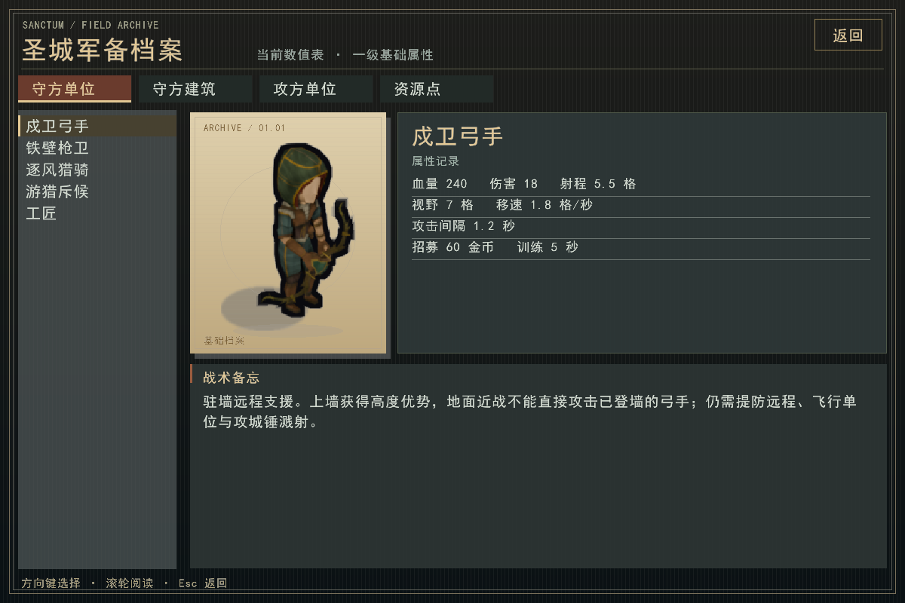
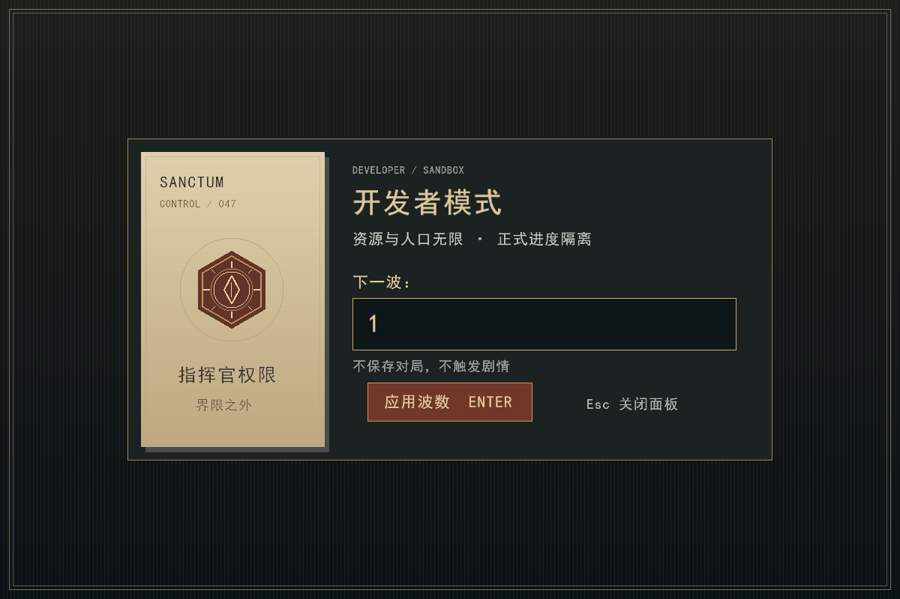
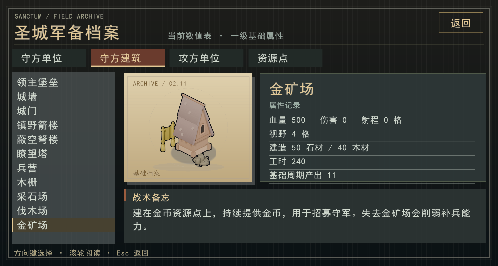
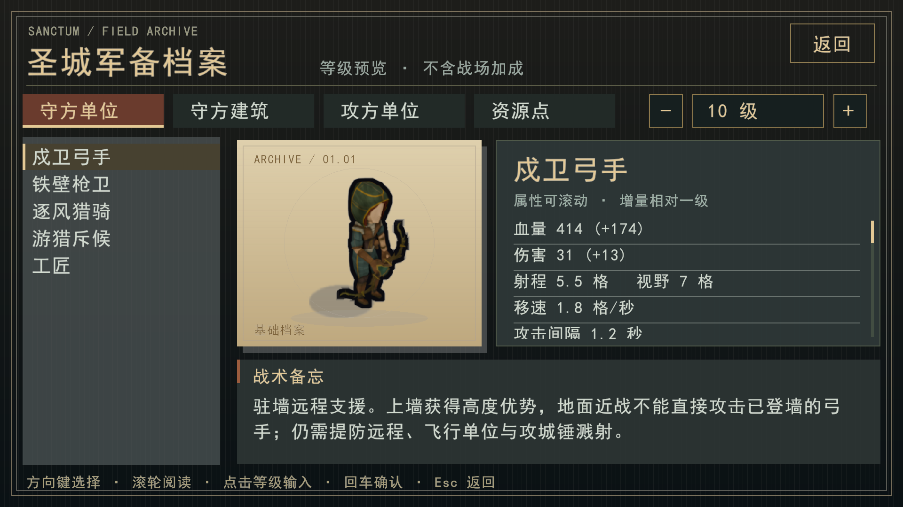

# 试玩调整：守方协同、保守施工与长局体验

## 玩家能看到的变化

| 项目 | 当前行为 |
|---|---|
| 弓手 | 血量 200→240、伤害 12→18、基础射程 5→5.5；已登墙后地面近战不能直接砍到，远程和飞行单位仍能攻击，攻城锤的破墙溅射仍保留 |
| 猎骑 | 血量 260→320、伤害 16→20；默认在城内截击，优先找幽影弓手；接近骑士、寡不敌众或低于 40% 血量时回撤，玩家仍可主动调遣 |
| 协同 | 多人驻墙会分配相邻位置；收到指向敌人的迎击指令，进入射程后会开火，不再只顾走到敌人脚下 |
| 升级 | 非堡垒建筑每次升级有递增工料下限，升级保留受损比例，维修仍需单独进行 |
| 工匠 | 选择可到达的安全施工位置；城墙/城门从内侧施工，战斗中在城内行走；准备期且敌人远离时允许安全的城外建设；敌人接近即避险，手动命令也不能强制穿越危险区 |
| 窥使 | 必须有活着的窥使亲眼看见防御建筑才算侦查成功；成功时提示，记录当时情报用于下一波，普通攻城部队不能冒充窥使；HUD 显示本波攻城锤和不死鸟编队相对无情报编成的增减 |
| 保存恢复 | 保存完整战场快照，校验通过后直接恢复；快照损坏才尝试操作日志，旧文件与备份仍保留 |
| 开发者模式 | Alt+F12 开启面板，输入波数（1–9999）后回车：移除当前攻方，从指定波数的准备阶段开始，按该波的预算与编制重新生成；资源与人口无经济限制 |
| 剧情 | 本局首次到达 1/10/20/30/40/50/60/70 波时自动暂停，打开完整日记页面；关闭后继续，不依赖永久日记此前是否已解锁 |

枪卫、箭塔和弩楼的基础数值保留。本轮先修复不工作/送死的行为、补齐弓手和猎骑，再约束廉价升级；不把提高其他兵种存在感简单等同于削弱现有防线。数值仍需要真人长局复核，未宣称所有配置已经等强。

## 升级价格

非堡垒的石材、木材分别计算：取原有成长差价与 `upgrade_cost × (40 + 10 × (当前等级 − 1)) / 100` 中的较大值，整数取整。以箭塔为例：1→2 级最低为 **32 石、12 木**，2→3 级为 **40 石、15 木**；随后继续递增。工时和堡垒价格保持原值。升级前半血，升级后仍约半血。

## 开发者模式与正式进度

开启时先尝试保存普通对局，之后本局不写入正式存档、不解锁日记，也不在第 70 波弹出结局选择。Esc 或 Alt+F12 关闭面板，开发者状态仍持续到本局结束；重新开局回到普通模式。人口不受游戏经济上限限制，底层实体槽位仍有引擎容量边界。

`--developer-wave N` 仅供截图测试使用，必须搭配 `--screenshot`；正常玩家入口是 **Alt+F12**。

## 快照与兼容性

快照逐字段保存世界、实体槽位和代数、弹丸、迷雾、命令队列、三个随机数流、单兵临时指令、波次阶段、编队与侦查记忆。地图与数值随存档携带，寻路缓存按需重建。读取时验证完整性、数组结构及最终世界哈希；测试继续推进后仍与原局一致。不会把 C++ 对象内存或指针直接写入文件。

本轮规则改动采用 **World/16、Stats/13、存档 v3**。此前 v2 对局不能直接套用新规则；启动时保留独立 legacy 备份，需用 PR #156 对应旧版继续。永久日记格式不变。

## 验证

- Release 构建完成，完整 CTest **87/87** 通过。
- 回归覆盖墙头近战保护、远程高度伤害、工匠城内修墙及撤退、猎骑不追出城、迎击开火、窥使独立侦查与次波使用、开发者波次/人口和剧情抑制、升级不送满血。
- 快照读取、损坏回退、取消恢复、命令队列、跨多波恢复后继续战斗均有测试。
- 同一份第 4 波、10,000 tick（8 分 20 秒模拟时间）存档：快照恢复 **52.48 ms**，日志重演 **17,610.89 ms**，约 **335 倍**；快照文本约 1.21 MB。这是本机该样本的恢复阶段测量，不含启动窗口、加载素材，也不是所有机器和存档的保证值。
- 第 70 波开发者模式使用正式渲染器截图检查。真人 Alt+F12 操作及第 70 波完整长局仍需试玩反馈。

本地 `play.bat` 使用 `build/render/Release/rts_render.exe`，本轮重新编译该正式入口。GitHub 的批处理脚本仍不会自动更新或编译程序，拉取代码后需要重新构建。

## 后续试玩修正：图鉴、开发者面板与经济袭击

- Alt+F12 崩溃根因是输入提示中的 U+2013 未登记进字体集合。开发者面板改用共享文案表供字体加载和实际绘制读取，并加入面板本身的截图测试，避免只测试开发者战场而漏掉输入页面。
- 按 frontend-design 流程选定军备档案风格，采用墨黑背景、羊皮纸展台、暗金与封蜡红。图鉴放大精灵并按实际透明边界适配展台；开发者面板提供独立波数输入框与可点击应用按钮。
- 主菜单及暂停菜单新增图鉴，覆盖 5 个守方单位、11 座守方建筑、6 个攻方单位和 3 类资源点。图片来自正式素材，基础数值读取当前 StatsTable。支持鼠标、上下方向键、滚轮阅读和 Esc 返回，浏览不会推进对局。
- 攻方战斗单位看到附近城外采集建筑后优先袭击，进入射程使用建筑攻击，路途中使用寻路；目标只来自攻方可见的建筑，并限于单位视野半径内。侦查单位继续侦查，已在破墙的攻城锤继续破墙。建筑被毁后自然恢复原推进目标。同一决策拍共享同兵种、等级档及目标的寻路结果。
- 新增全部 25 条图鉴渲染、开发者输入面板、图鉴导航与资源袭击测试。已检查 960×540 下开发者面板、采石场与金币点页面。

本轮完整测试 113/113 通过；最终寻路缓存、存档和界面复核 30/30 通过。补充袭击测试覆盖从射程外主动接近采集建筑。

### 图鉴分辨率适配

图鉴使用 960×540 逻辑基准，按窗口宽高的较小缩放比例同步放大文字、导航、立绘与间距；超宽屏限制内容宽度并居中。鼠标位置反向映射到同一逻辑坐标，滚动区裁剪转换到屏幕坐标，窗口改变尺寸后即时重算。

验证：25 条目及 1920×1080、2559×1368、2560×1440、3840×2160、3440×1440 共 30 项图鉴渲染测试通过。

### 图鉴等级预览

- 右上角减号/加号切换等级，点击数字可输入 1–9999，回车确认；Esc 取消输入，再按 Esc 返回菜单。这是预览范围，不是对局等级上限。
- 血量、基础伤害使用实战的 level_permille/apply_permille，增量相对一级；射程、视野、移速等不随等级变化的属性如实保留，不包含墙头等战场加成。
- 招募费用、训练时间和下次升级的石木成本直接调用 World 现有计算接口，工时读取当前数值表；只读的独立计算环境不修改对局。
- 建筑分别显示当前预览级与下一级的堡垒要求；对局中查看时附当前堡垒等级及是否满足。资源点没有等级，采集产出不随升级增长。
- 属性区与战术说明区独立滚动，沿用统一分辨率缩放和点击坐标。
- Release 构建成功，57 项图鉴渲染测试通过，覆盖全部条目、10 级预览、9999 级边界、费用滚动区及多分辨率；额外检查了实际对局的条件提示截图。键鼠交互仍需真人试玩反馈。

