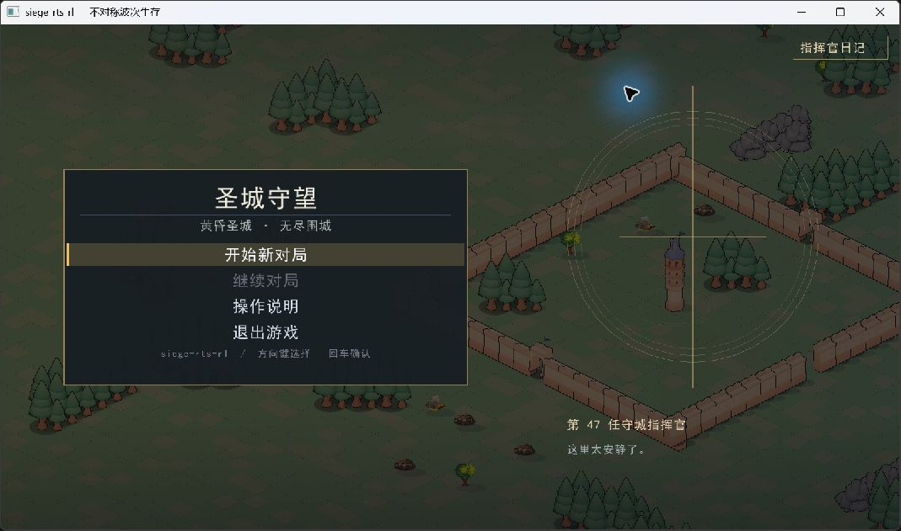
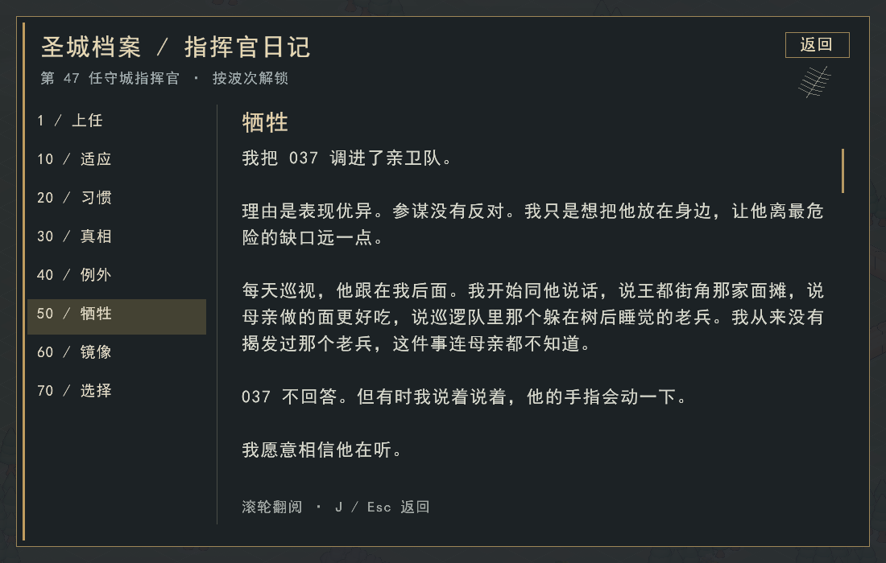
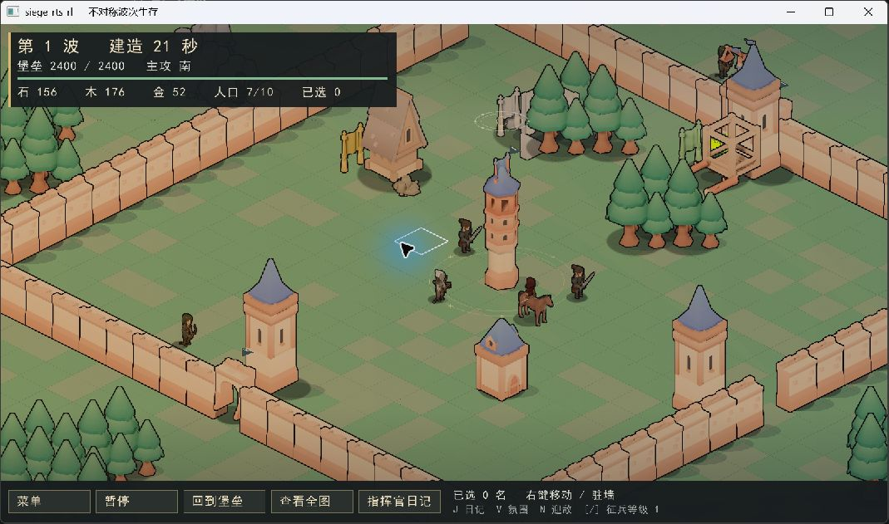

# 圣城守望：视觉与日记呈现

本次将现有等距 RTS 的展示统一到「黄昏圣城」：旧金、石灰色、冷色圣契光。保留现有模型、地图和操作方式，以庄严而不安的气氛承接世界观。

世界观来源为 [PR #151](https://github.com/Cody-ic/siege-rts-rl/pull/151) 的 `世界观与剧情设定.md`，审阅版本 `e5490792f89779c705f169264a6d5de488e7d4cf`。该 PR 仍开放；这里提供节选改编和呈现，不代替原作者的设定文档。

## 玩家能看到什么

- 主菜单以堡垒为背景，加入圣契纹章、第 47 任指挥官与「这里太安静了」的引句。
- 战场增加暖冷色调、低透明度斜照和薄雾、地面投影、堡垒仪式环、旗帜与波次标题。堡垒升级时光环变化；建筑受损和倒塌产生碎屑，低血量的完工建筑冒烟，弹丸带短轨迹。
- 亡灵采用冷色，Phoenix 保持白鸟形象。色彩不替代血条、轮廓和原有操作反馈。
- 主菜单右上及战场底部可打开指挥官日记；`J` 打开/返回，`Esc` 返回，滚轮或翻页键阅读。阅读期间对局暂停，返回保留原本的暂停状态。
- 操作说明改为可滚动排版，小窗口仍能使用底部返回按钮。
- `V` 切换战场氛围，`--classic-visuals` 可关闭新增世界视觉效果；菜单与日记的新版排版保留。

## 日记与剧情边界

| 波次 | 章节 | 叙事内容 |
|---|---|---|
| 1 | 上任 | 旅途、母亲、圣城的沉默 |
| 10 | 适应 | 服从命令的士兵、反复出现的白鸟 |
| 20 | 习惯 | 对圣契「祝福」的疑问 |
| 30 | 真相 | 97% 自我剥离、指挥官与民众、帝国的伦理矛盾 |
| 40 | 例外 | 发现 037 的异常并试图保护他 |
| 50 | 牺牲 | 亲卫队五人、赴死命令、断弓与自我麻木 |
| 60 | 镜像 | 菲尼克斯、控制节点、亡灵共振与解放 |
| 70 | 选择 | 继续守护进入无尽；放下武器结束本局并达成伪通关 |

正文已整体重写，保留原作八篇标题与事件顺序，移除新增第九篇。普通篇约 550–660 字，三篇关键转折约 940–1070 字，两个结局约 400/830 字（含标点、去空白）。[重写全文](chronicle.md) 可独立审阅。精简重复铺陈，保留场景与情感发展；对白、过渡和部分生活细节有补写，不声称是逐字摘录。

章节由本次程序运行期间到达的最高波次解锁，重新开局仍可阅读已解锁内容；退出程序后不保存。尚未解锁章节不可点击。真正的选择只在当前对局到达第 70 波后可提交一次，历史解锁不会让新局提前触发结局。第 70 波停止仿真并自动打开《选择》，关闭阅读仍不推进，需重新打开日记作出选择。

这些是指挥官的记述，不是本局事件日志：不会强制生成或杀死编号 037，也不会在第 60 波偷偷改变 Phoenix 或防空行为。结局通过完整文字过场表现堡垒倒塌、共振、苏醒与逃亡，没有战场动画演出。选择「放下武器」后本局实际停止推进，返回主菜单不能继续该局；「继续守护」读完后可恢复无尽战斗。随后两个结局的回顾按钮只供阅读，不重新提交选择。重开清空本局选择。不会向核心仿真或训练接口伪造伤害、胜负或奖励。

## 实现与验收

`BattleAtmosphere` 只读取 `WorldView`，效果时间取仿真 tick；不消耗仿真随机数，不修改攻击、碰撞、寻路、经济或训练接口。瞬时碎屑上限 96 组、最长 1.8 秒，重新开局清空。没有新增图片素材依赖或音频素材。

初版视觉实现通过 49 项非渲染与 21 项渲染测试，并实机检查菜单和日记操作。此次重写重新构建并检查正文、解锁边界、一次性选择、伪通关不能恢复和重开重置；增加八篇长文末尾及两种结局在 960×540 下的截图验证。第 70 波状态测试用 World 的公开波次接口设置夹具，未自然打完七十波；未在本次执行 Linux/GCC 构建或帧率基准。

全量回归发现旧版也会失败的近卫塔测试：修复工匠升级后，开局资源更早用于升级，原测试的 4000 tick 经济假设不再稳定。将该几何测试改为充足资源下调用真实宏观决策、Build 命令和 World 合法性检查；仍断言至少一座实际塔位于堡垒射程内，不改变 AI 参数或放宽距离要求。调整后宏观组和完整 C++ 测试组通过。

截图预览可用 `rts_render --menu --journal-page 0 --screenshot journal.png --size 1100 700`，页码为 0–7。附加 `--journal-bottom` 检查长文末尾；第 7 页可加 `--journal-ending 1` 或 `2` 检查结局。预览参数必须和截图一起使用，不会解锁正常游戏内容；第九篇参数明确报错。
