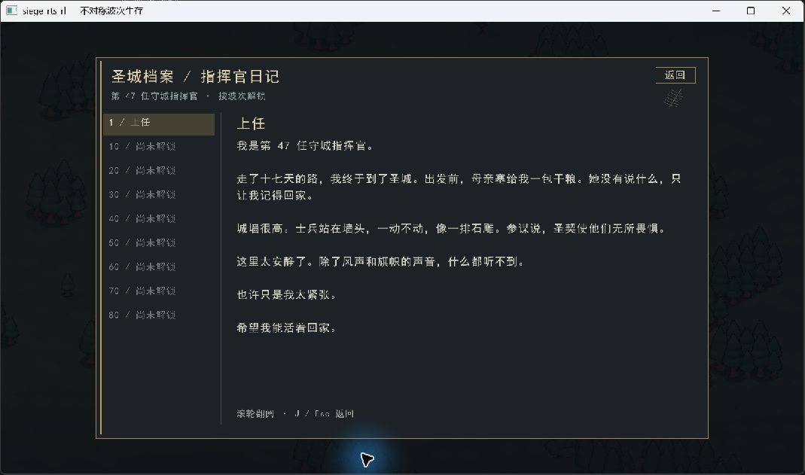

# 圣城守望：视觉与日记呈现

本次将现有等距 RTS 的展示统一到「黄昏圣城」：旧金、石灰色、冷色圣契光。保留现有模型、地图和操作方式，以庄严而不安的气氛承接世界观。

世界观来源为 [PR #151](https://github.com/Cody-ic/siege-rts-rl/pull/151) 的 `世界观与剧情设定.md`，审阅版本 `e5490792f89779c705f169264a6d5de488e7d4cf`。该 PR 仍开放；这里提供节选改编和呈现，不代替原作者的设定文档。

## 玩家能看到什么

- 主菜单以堡垒为背景，加入圣契纹章、第 47 任指挥官与「这里太安静了」的引句。
- 战场增加暖冷色调、低透明度斜照和薄雾、地面投影、堡垒仪式环、旗帜与波次标题。堡垒升级时光环变化；建筑受损和倒塌产生碎屑，低血量的完工建筑冒烟，弹丸带短轨迹。
- 亡灵采用冷色，Phoenix 保持白鸟形象。色彩不替代血条、轮廓和原有操作反馈。
- 主菜单右上及战场底部可打开指挥官日记；`J` 打开/返回，`Esc` 返回，滚轮或翻页键阅读。阅读期间对局暂停，返回保留原本的暂停状态。
- 操作说明改为可滚动排版，小窗口仍能使用底部返回按钮。
- `V` 切换战场氛围，`--classic-visuals` 可关闭新增世界视觉效果；菜单与日记的新版排版保留。

## 日记与剧情边界

| 波次 | 章节 | 叙事内容 |
|---|---|---|
| 1 | 上任 | 旅途、母亲、圣城的沉默 |
| 10 | 适应 | 服从命令的士兵、反复出现的白鸟 |
| 20 | 习惯 | 对圣契「祝福」的疑问 |
| 30 | 档案 | 97% 自我剥离、亡灵与士兵的关联 |
| 40 | 例外 | 编号 037 的记忆 |
| 50 | 断弓 | 命令与牺牲 |
| 60 | 白羽 | 菲尼克斯档案、堡垒作为控制节点 |
| 70 | 守望 | 继续守护的矛盾 |
| 80 | 未寄出的信 | 「继续守护」「放下武器」两个文字分支 |

原文八篇日记与结局在界面中编排为九个阅读节点。章节由本次程序运行期间到达的最高波次解锁，重新开局仍可阅读已解锁内容；退出程序后不保存。尚未解锁章节不可点击。

这些是指挥官的记述，不是本局事件日志：不会强制生成或杀死编号 037，不会修改 Phoenix 行为，也不会把叙事猜测视为已验证的 AI 能力。第 80 波选择仅切换文字，界面明确提示「文字分支不会改变当前对局」；真正的投降结局、圣契断开和持久存档不在本次实现内。

## 实现与验收

`BattleAtmosphere` 只读取 `WorldView`，效果时间取仿真 tick；不消耗仿真随机数，不修改攻击、碰撞、寻路、经济或训练接口。瞬时碎屑上限 96 组、最长 1.8 秒，重新开局清空。没有新增图片素材依赖或音频素材。

Windows MSVC Release 构建通过。49 项非渲染测试与 21 项渲染测试均已通过（分组执行）；包含九篇日记截图、中文字体覆盖、缺素材/缺字体失败路径、解锁边界和菜单回归。实际窗口检查了主菜单、进入对局、日记开关、锁定章节及暂停状态；九篇截图逐页检查了标题、正文与滚动区域。未完成第 80 波的自然通关试玩，也未在本次执行 Linux/GCC 构建或帧率基准。

全量回归发现旧版也会失败的近卫塔测试：修复工匠升级后，开局资源更早用于升级，原测试的 4000 tick 经济假设不再稳定。将该几何测试改为充足资源下调用真实宏观决策、Build 命令和 World 合法性检查；仍断言至少一座实际塔位于堡垒射程内，不改变 AI 参数或放宽距离要求。调整后宏观组和完整 C++ 测试组通过。

截图预览可用 `rts_render --menu --journal-page 0 --screenshot journal.png --size 1100 700`，页码为 0–8；预览参数必须和截图一起使用，不会解锁正常游戏内容。
