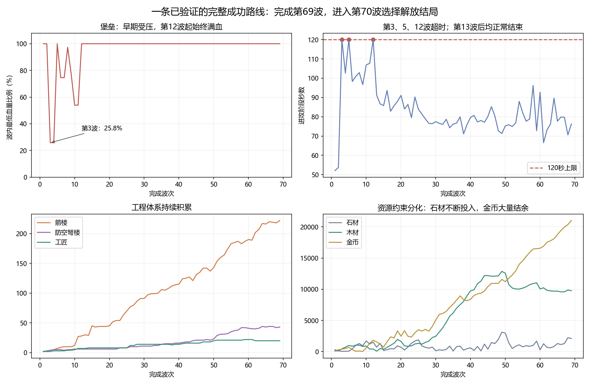
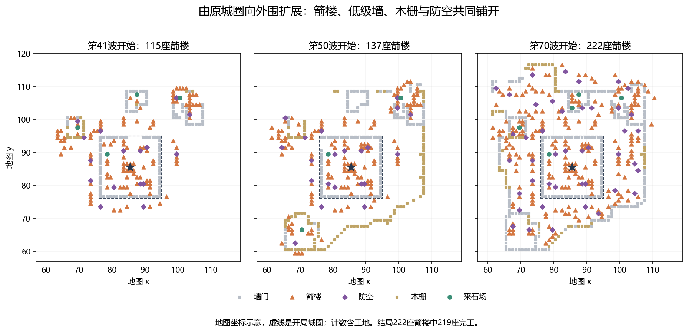
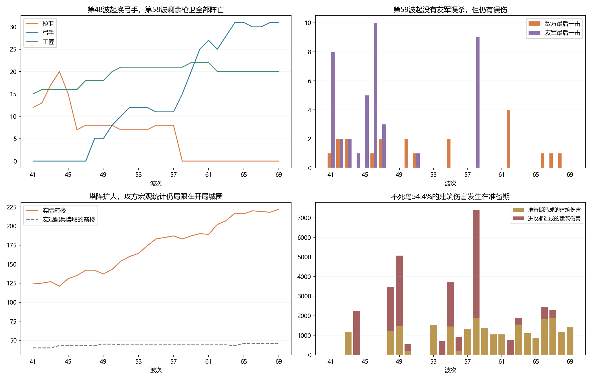

# 《圣城守望》通关对局深度复盘

[通关复盘](README.md) · [逐波分析](waves.md) · [突破代价](breakthrough.md) · [策略对照](counterfactuals.md) · [实验核对表](counterfactual-tables.md) · [逐条事件](events.md) · [核对表](supporting-tables.md) · [证据与复现](evidence.md)

分析日期：2026-09-19。游戏规则基线：v1.0.1；地图 `gen_01009000`；脚本攻方。

## 1. 核心判断

**这是一局早期承受过真实压力、随后靠工程扩张建立长期优势的胜局。后期仍有外围损失和操作需求，但敌军没有把这些局部战果转化为对堡垒的持续威胁。**

玩家并非只靠“堆塔后什么也不做”：记录里有持续外扩、低级墙与木栅分担攻击、防空补点、受损塔主动拆除、工匠扩编、枪卫向弓手转型，以及手动调整弓手位置。与此同时，攻方的宏观信息范围、塔下停步、目标选择和不死鸟任务冲突，确实让这套布局比应有的更容易维持。

四个最需要修正的认识：

1. **不能用后期安全概括整局。** 第3波堡垒曾跌至619/2400血；第10波仍明显受伤。但第10波之后再无记录到的堡垒损伤，第12—69波连续58波保持满血。
2. **不能只看敌方击毁数就说没有压力。** 第41—69波敌方摧毁333个建筑/工地，其中37座箭楼；玩家另主动拆除22座箭楼，其中19座此前受到不死鸟攻击。局部阵地反复损失，但总防御仍增长。
3. **不能把城墙的视觉瞬毁一律解释成单次伤害过高。** 记录中有多锤同一tick范围攻击叠加，低级墙升级也存在能否多扛一次命中的离散门槛。
4. **防空覆盖和墙体都不是不可突破的静态边界。** 第55波鸟拆掉一级防空后仍有425血；第69波锤实际4.5秒拆墙，流场破坏项却估27秒。应比较突破与绕路各自的损失，以及突破后是否能持续压制。

## 2. 这次到底分析了什么

冻结的存档为 tick `160800`、第70波、`choice=2`，对应解放结局。按当前实现，进入第70波后选择结局即结束本局，**实际打完的是第1—69波，第70波战斗尚未进行**。堡垒在结局文字中倒下，不等于仿真中的堡垒被敌军击毁。

成功路线共134分钟模拟时间，不含暂停和读剧情所用的现实时间。本次新增详细分析为第41波起点 `95979` 至结局，共54分1.05秒；逐tick重放和详细观测两条路径都匹配存档状态哈希 `14010302102068610454`。

同时重新核对前两段已验证记录，地图、数值、种子及旧输入前缀均与本次存档一致，得到连续69波总览。本次逐条附录含1325条玩家输入、76次征兵完成、61次守军阵亡、333次敌毁建筑/工地，共1795条事件。输入不等于成功执行。

这是保存在当前档案中的成功路线，不包含被回档抹去的分支，也不把 `attempt=4` 解读成四次失败。开发者模式为关闭状态，学习策略身份为空；**这局证据不能直接评价RL模型强弱**。

## 3. 全局节奏：真正的压力集中在前期

| 阶段 | 实际变化 | 判断 |
|---|---|---|
| 第1—10波 | 第3波最低25.8%堡垒血量；第6—10波仍有多次堡垒损伤 | 这一段确有守不住的风险，不能被通关结果掩盖 |
| 第11—20波 | 第11波恢复堡垒；第20波开始已有44座箭楼，堡垒9级 | 防御体系开始摆脱核心危机 |
| 第21—30波 | 箭楼45→91，城外塔11→52；堡垒无伤 | 从守住原城圈转向外围火力覆盖 |
| 第31—40波 | 箭楼91→115，防空11→16，堡垒14→16级 | 扩张、升级、局部止损并行，优势延续 |
| 第41—47波 | 枪卫大量折损，继续补枪卫和工匠；外围继续扩张 | 人力体系低效，建筑体系仍然稳定 |
| 第48—58波 | 开始招弓手，大量补木栅和防空；第58波剩余8名枪卫全部阵亡 | 转型阶段；不死鸟造成明显局部损失 |
| 第59—69波 | 弓手15→31；箭楼183→222；完成剧情结局 | 前线仍有损失，但核心安全和库存增长未被扭转 |

第3、5、12波达到120秒上限；第13—69波均正常结束。第41—69波平均进攻78.76秒，最长第58波96.20秒。因此，**本次后半程优势不是靠每波拖到超时白拿胜利**。早期三次超时仍可能影响成功路线，不能据此认定超时设置整体已经合理。

## 4. 玩家策略是怎样演化的

### 4.1 真正扩大的不只是塔数量，而是受保护的工作与射击空间

第41波到结局，箭楼115→222、原城圈外箭楼72→176、防空16→43、城墙119→259、城门5→13、木栅16→67。结局的222座箭楼中219座已完工，城墙中还有1段工地。这里“城外”指开局城圈之外，不表示没有后来新建的墙保护。

玩家把低级障碍、防空、工程人员和火力一起向外铺，让敌人更早进入箭楼射程，又让部分工地在保护下完成。后半程箭楼承担97.86%的对敌伤害，其中88.01%来自原城圈外的塔，证明外围布局确实成为主要交战区域。

建筑升级也没有停止：每秒状态采样确认214次箭楼升级、48次防空升级、7次堡垒升级。塔数增长不能代替对升级投入的统计。

### 4.2 换弓手的收益主要体现在少送人，并非取代塔的输出

第41波有21名枪卫，此后又完成26名枪卫征召，最终这47名全部阵亡：**40名死于己方箭楼，7名死于敌人**。本段枪卫承受19404伤害，其中17086、即88.1%来自友军；对敌仅造成1505伤害。

第48波开始完成16级弓手征召，之后混用1级、16级、20级和22级。共完成40名，最终31名存活；9名阵亡均由敌方最后一击造成。弓手对敌伤害19799，约为枪卫的13.2倍，但仍只占本段守方对敌伤害的1.20%。

第59—69波没有友军误杀，仍有2085友军伤害。这说明转型后的损失结构改善，不能说误伤机制消失，也不能用这局直接推出弓手在所有场景都优于枪卫：双方出场时长、站位、敌人编成和外层防御都发生了变化。

第50—51波有3次、第61波有7次单名弓手手动移动，主要从东侧、南侧墙位调整向北侧、西侧。记录支持“玩家在重新分配布防”，并非始终完全依靠自动站位。

### 4.3 木栅除了挡地面，也在分走不死鸟的攻击

这一段共有184条建木栅输入。敌方实际摧毁103段木栅，其中不死鸟拆掉67段，并对木栅完成142次伤害命中，占它全部建筑命中的36.6%。这67段按基础建造成本合计1005木，未计升级或取消退款。

原因不是不死鸟被木栅挡住飞不过去。当前 `AtkBld` 排除城墙和城门，却包含木栅；它主要选择最近建筑，缺少火力威胁、经济价值和廉价诱饵的区分。木栅因此能消耗不死鸟的攻击机会。

这与“把富余木材换成拖延和塔的生存空间”的策略吻合，但是否每段都是玩家有意诱导，记录无法证明。它也并非完全无效输出：木栅被拆会改变地面路径。配平应保留有价值的诱导操作，同时防止低成本目标长期主导空中核心兵种的选择。

### 4.4 工匠扩编有效，高等级仍不提高施工速度

工匠从14人发展到最高22人，最终20人；新增9人、阵亡3人。更多工匠扩大了同时施工、抢修和重建的能力，而等级只增加生命等适用属性，不增加工作速度。

第62波两名1级工匠各以120满血受到214点骑士攻击，当场阵亡；第68波一名11级工匠以215满血受到226点攻击阵亡。这里存在真实的生命门槛：同一次214伤害，215血可以活下来；同一次226伤害则不行。但没有重新模拟追击后的第二击，不能把这个算术比较当作高级工匠一定脱险的实验结论。

## 5. 攻方的主要行为问题

### 5.1 “知道城里有很多塔”，却没有统计真正的主战场

后半程实际箭楼由115增至222，宏观配兵读取的塔数却只有40—46；防空实际16→43，读取值6—8。源码将这部分统计限定在开局城圈内部，外围塔即便已经参与战斗，也不会进入这项宏观计数。这与正常战争迷雾下“未见过就不知道”不是同一问题。

同时，29波的攻城锤计划都为5台。记忆里的原城圈缺口始终非零，“有缺口就削减锤”的规则持续压过塔海应对。玩家后来补上的外层墙、塔阵及完整进攻路线没有得到同等表达；原圈有洞也不意味着从出生点到堡垒已经畅通。

应让配兵读取合法侦查记忆中的外围防御与路径风险，不应直接给敌人读取玩家全图的能力。

### 5.2 塔下等队形仍是大量无效消耗的来源

第41—69波累计约9580单位·秒处于“等队形且在塔射程内”的决策状态，期间承受384789伤害，约占守方全部对敌伤害的23.3%。最长连续停步约9.6秒。单位·秒是多单位累计值，不能当成现实时间。

其中还存在可用建筑攻击动作但继续等队形的情况。当前地面脚本优先打单位、锤优先破墙，随后处理集结/步速，缺少稳定的就近清除火力点规则；塔阵扩到城外后，这一遗漏会持续放大。

但不能说锤完全不拆塔：本段锤实际摧毁16座箭楼。它的前摇目标记录里直接选箭楼仅2次，而对墙的前摇有246次；范围伤害可波及旁边的塔，所以“摧毁了塔”也不等于它已经在有计划地清塔。应同时看目标、路线和伤害落点。

### 5.3 不死鸟能施压，但准备期、撤退和诱饵规则互相干扰

本段不死鸟造成43536建筑伤害，直接摧毁18座箭楼，另有19座受过它攻击的箭楼被玩家主动拆除。第58波尤其明显：它造成7421建筑伤害，拆2座塔；玩家又拆7座此前被它攻击的塔。只看“2座击毁”会严重低估这波局部压力。

但它的23680建筑伤害、即54.4%发生在准备期。地面主力此时仍集结，不死鸟却可能先行动、先打外围、甚至先撤离。因此部分波次的敌军损耗并没有形成有效的同时进攻。

低血应撤退却仍进入矿区袭扰分支的问题也继续出现，记录到158次该类决策；本段共6次被击落，不能把全部死亡都未经逐次对照归于同一个原因。第41—42、45—47、51—52波存在计划有名额但实际没有不死鸟的空窗，说明配额不能直接当实际出场数。

另一个设计问题是防空同时提供两重收益：既现场克制空军，又按记忆中的数量扣减下一波不死鸟配额。第49波起城内记忆防空达到8，基础上限5只被减为1只；外围再铺防空，则继续提高这1只的生存难度。这个反馈可能过度奖励既有优势，应与其他机制一起评估。

### 5.4 防空覆盖应按能否守住局部来判断

低级防空可以被不死鸟突破，在第55波有真实记录：74级鸟785满血，先打了三段木栅，承受防空8发共360伤害后，仍以4次攻击拆掉满血450血的一级防空，剩425血。此后34.8秒内未再受伤，又对五座箭楼造成2142伤害，直到遭到登墙弓手攻击。

因此，之前只强调“火力覆盖比例”的建议不完整。需要加入鸟的当前血量、接近损失、防空等级与交叉火力、集火拆除时间，以及拆除后开放的目标。该鸟实际先打木栅，并非已经在执行“防空优先”；若调整目标顺序能改善多少，还需对照实验。

### 5.5 猎骑的问题贯穿到结局，没有因高波次自动改善

第41波已有的4名低血猎骑，在本段均没有对敌输出；其中1名第58波被己方箭楼击杀，其余3名以174、106、30血活到结局，持续低于40%回撤线。它们在驻点附近仍不断选择移动。

第43波新出的1级猎骑只造成40伤害，承受306友军伤害后，由锤的14点实际扣血结束生命。这再次表明最后一击归属不足以解释损失。

结局人口已占满54/54，其中3个位置被长期不自主参战的猎骑占据。它们没有恢复生命、回撤到位停止、恢复参战等完整闭环，是应优先修复的行为问题。

## 6. 城墙：需要更精确地理解升级收益

本段被锤摧毁的完工墙中，136段能在日志里追溯到满血开始受击。它们没有一段被单次满血秒杀：89段吃3次命中，44段吃2次，其余吃4—6次。18段从首击到毁坏发生在同一个tick，是多台锤同时结算；整体首击至毁坏的中位时间约2秒。

第60波有多段1200血墙在同tick遭3台锤各590伤害。玩家看起来可能只感到一次冲击，实际是1770点范围伤害叠加，而且一次可以同时拆掉邻近多段墙。

升级收益也确实不是均匀的：

| 固定单次锤伤害 | 1级墙1200血 | 2级墙1325血 | 3级墙1440血 |
|---|---:|---:|---:|
| 第41波：458 | 3次 | 3次 | 4次 |
| 第60波：590 | 3次 | 3次 | 3次 |
| 第69波：646 | 2次 | 3次 | 3次 |

表中是假定满血、无其他伤害和维修的独立命中次数，不是重新模拟的存活时长。它说明玩家选择低级墙做消耗品有合理性，但“升了永远一样”也不成立：末段1→2级可以增加一次命中容错。多锤同步及范围攻击又可能抹平视觉上的差别。

配平宜看“升级后能否改变破口出现的时间与面积”，不能只比较最大血量，或只把锤的单次伤害调低。

### 6.1 绕路是否划算，当前寻路没有算清楚

当前流场只估算行走加破坏时间，没有估算绕路期间的塔火承伤。更具体的偏差是：8级以上全部按8级结构伤害估价，并把同时进行的前摇与冷却相加作为每次攻击的代价。

第69波一台99级锤对两段相邻满血墙各造成646、554实际扣血，从首次前摇到墙毁共4.5秒，没有其他单位帮打这两段。流场对1200血墙按8级217伤害、6次攻击估为27秒。这里比较的是破坏代价项，不是证明另一条完整路线一定更优，也不是说这只锤当时绕了路。

关于“找弱点绕路反而多挨打”的判断指出了现有模型缺项。下一步应比较绕行、集火破墙、先拆塔的预计战损和突破后剩余战力；同时考虑玩家能快速补墙，不能把打出缺口就当成已经冲进内城。详细事件与算术见[防空突破与破墙代价核验](breakthrough.md)。

## 7. 经济和损失：为什么外围一直被打，优势仍在增长

第41—69波收入40897石、18480木、19810金，库存603/9746/8391→2103/9769/21020。扣除退款后的净支出为39397石、18457木、7181金。

石材继续被大量投入塔、防空、升级和补墙；木材从3座伐木场逐步减至1座，消耗了大规模建设所需材料后仍保有近万库存；金币又净增12629，说明后期的限制不是简单的“所有资源都不足”。人口上限、招兵时间和兵种有效性妨碍金币转成与塔阵同等可靠的战力。

敌方333次建筑/工地摧毁中，313处是完工建筑、20处为工地。玩家另有32处去重后的取消工地操作、56次拆除；取消不全是1血空工地，其中1座塔已经施工到262血。退款与敌毁分开统计，不能把主动止损计成敌人直接摧毁。

22座主动拆除塔的基础和已完成升级投入，扣除拆除退款后仍有1328石、498木未收回；其中有两座满血塔，不能把所有拆塔都解释为“马上要被打爆”。

维修支出414木，仅为木材收入的2.24%。这继续支持“伤而不毁的经济惩罚偏轻”，但不能说267701建筑承伤全被414木修复：其中包含被毁建筑、主动拆除、工地和未补回的血量。

资源建筑本段还完成4次采石场升级。当前收入实现按基础产量及资源点档位结算，等级不增加产量；升级主要买耐久。应确保图鉴和升级界面让玩家看得出这一点。

## 8. 关键波次与局部压力

完整29波汇总及逐波简析见[逐波复盘](waves.md)，所有1795条记录见[逐条事件附录](events.md)。这里突出会改变判断的节点：

- **第41波：** 9名枪卫阵亡，其中8名被友军击杀；同时箭楼115→124，说明兵损和整体防御成长不是一回事。
- **第44波：** 两只不死鸟都被击落，箭楼127→121；主动拆塔、取消工地和局部战损同时出现。随后三波空窗给恢复留下时间。
- **第46波：** 10次友军误杀，是后半程单波最高；补兵不能解决近战长期被己方箭雨消耗的问题。
- **第48—49波：** 开始完成弓手征召；两波分别被敌人摧毁6座、3座箭楼。第49波不死鸟还拆掉10段木栅，局部压力真实存在。
- **第51—52波：** 防空23→29→31，箭楼143→154→160，石木库存明显投入建设；同时将弓手向不同方向调整。
- **第58波：** 不死鸟本段最高建筑伤害；2塔敌毁、7座受过它攻击的塔主动拆除。8名枪卫和1名猎骑死于友军，成为人力转型的分界。
- **第60—62波：** 外围继续推进，锤能以范围攻击快速清除局部墙塔；第62波损失两名1级工匠和两名弓手，但堡垒满血、塔数仍189→202。
- **第66波：** 敌毁26处，与第58波并列最多，其中7处是未完工工地；不能按26座完整建筑计算投资损失。
- **第68—69波：** 第68波一名11级工匠被骑士击杀；第69波无守军阵亡，最终以满血23级堡垒、219座完工箭楼和大量库存进入结局。

## 9. 对配平的判断与调整优先级

**这局最明显的问题是攻方未能可靠应对玩家持续扩张的防御体系；单纯增加敌人等级，很可能先放大友军误伤、工地秒杀和骑士追工匠，而不能解决有效进攻不足。**

建议顺序：

1. **先修已有职责的执行。** 处理塔下等待、猎骑低血后的完整行为、不死鸟撤退分支优先级；这些有直接行为证据。
2. **让宏观策略看懂合法已知的外围防线。** 不以原城圈缺口代替整条进攻路线，不以原城圈内塔数代替实际塔阵；避免赋予全图作弊信息。
3. **先校正突破成本，再改善路线与目标选择。** 修正流场高档固定按8级、攻击周期估算偏高的问题；比较绕行、先拆防空、集火破墙和清塔的预计战损及后续收益。保留抢修、快速补墙和诱导操作的对抗空间。
4. **在相同地图与可响应的连续对局中重新校准。** 检查防空“压数量+现场克制”的双重收益、墙升级命中门槛、维修代价和金币用途。先修行为再定数值，避免靠猛加攻击掩盖问题。
5. **重新安排后期挑战节奏。** 这条成功路线58波核心满血，说明现有后期缺少能改变玩家决策的问题；但这只是一个熟练玩家、一张地图、一条成功路线，不能据此把新手前期也一并加难。

后续已对第49、55、58、60、69波完成[35组突破策略局部对照](counterfactuals.md)：5组原规则均匹配原局，30组改动比较破墙周期、实际等级、射程内防空优先与塔下等待。第二个探针另有1次基线复核，共执行36次。

结果使上述建议更具体：修准破墙估价单独使用时没有产生堡垒伤害，第60波五台锤的建筑输出反而从15209降至7644，路径进入21—22座塔的覆盖范围；塔下不停及组合在部分波次终于命中堡垒，但最高147伤害仍未动摇优势。第58波组合毁塔2→6、进原城圈地面数17→50，堡垒仍无伤，说明必须看抵达后的剩余战力。共同时间窗口保留这些新增堡垒命中和额外毁塔，但仍无法替代玩家会响应、会补墙的连续对照。

这批实验没有证明某个数值改动必然改善体验，也不能用于评价RL训练成果。已有第36、40波撤退对照仍只支持此前那个具体分支修复。

## 10. 结局与彩蛋

选择解放结束本局是存档明确记录的结果，不是失败。没有取得白羽：冻结状态 `white_feather=false`，后半程所见不死鸟连续存活计数最高6，未达到10波条件。结局时花名册是6和3。

《微笑者》的损失清单还要求选择继续守城并到第90波，因此这条解放路线未解锁它，符合当前设定。本报告仅以该解放结局的冻结数据为准，不包含后续继续守城路线。

## 11. 文件与证据

- [全局69波总览](supporting-tables.md#campaign)：每波堡垒状态、进攻用时、建筑/兵力和库存。
- [逐波复盘](waves.md)：新增29波的统计表和简析。
- [逐条事件附录](events.md)：1795条操作、出兵和损失。
- [守军贡献与承伤](supporting-tables.md#combat)、[逐名守军活动](supporting-tables.md#units)。
- [不死鸟逐波记录](supporting-tables.md#phoenix)、[经济明细](supporting-tables.md#economy)、[墙门木栅被毁明细](supporting-tables.md#walls)。
- [防空突破与破墙代价核验](breakthrough.md)：防空对拼、实际破墙周期与决策建议。
- [突破策略局部对照](counterfactuals.md)、[实验核对表](counterfactual-tables.md)：35组主矩阵、30组共同时间窗口与反例。
- [证据与复现说明](evidence.md)：冻结输入、规则版本、哈希核验、统计边界和两份原始证据归档。

原局复盘和局部对照均使用回档前冻结副本。实验开关只存在于隔离研究目录，正在玩的游戏、存档和正式规则未改变；火力估价、指定目标协同与可响应守方的连续实验尚未完成。

本报告接续 [PR #196](https://github.com/Cody-ic/siege-rts-rl/pull/196)，与 [#195](https://github.com/Cody-ic/siege-rts-rl/pull/195)、[#193](https://github.com/Cody-ic/siege-rts-rl/pull/193) 组成同一局的阶段分析，可独立审阅和合入。原始存档、逐tick日志及临时工具保留在本地证据包；取得该包后才能完整重跑，范围与指纹见[证据说明](evidence.md)。
