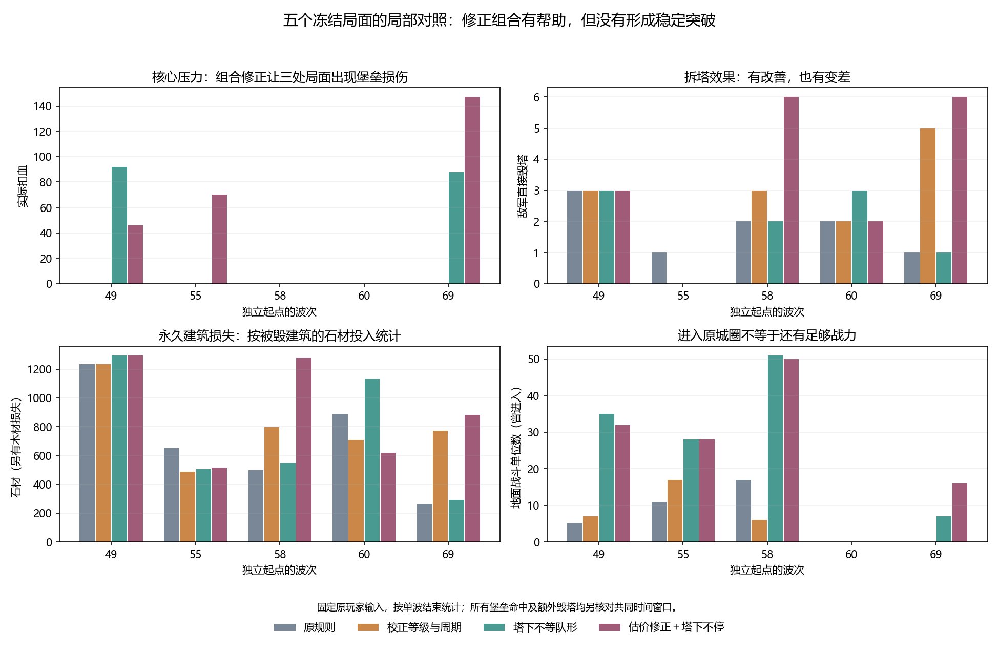
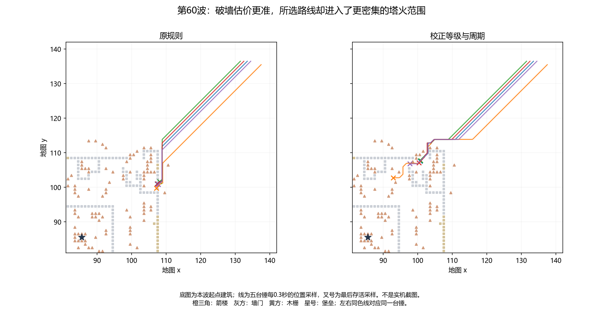

# 突破策略局部对照：从问题定位到效果验证

[通关复盘](README.md) · [90波续局](guard-route.md) · [逐波分析](waves.md) · [突破代价](breakthrough.md) · [策略对照](counterfactuals.md) · [实验核对表](counterfactual-tables.md) · [逐条事件](events.md) · [核对表](supporting-tables.md) · [证据与复现](evidence.md)

分析日期：2026-09-19。接续通关复盘，规则基线仍为v1.0.1，地图gen_01009000、种子8709371129856055178。实验使用回档前冻结副本，未改正在玩的游戏、存档或正式仓库代码。

## 1. 新结论

**破墙估价确实失真，但把它修准并不能保证进攻更好。路线的火力风险、编队推进和攻击目标必须一起考虑。**

这次完成五个起点的原规则校验和30组改动对照，共35组单波重放；第二个探针程序另做一次基线复核，总执行36次。不是35张地图，也不是35次完整通关，更不是35个独立随机样本。

最有价值的结果是：

- 第69波校正破墙等级和周期后，敌军直接毁塔从1座增至5座；第55波却从1座降至0座。修正有作用，但方向取决于阵地。
- 单独取消塔火覆盖下的等队形，第49、69波分别对堡垒造成92、88伤害；与破墙估价修正组合后，第49、55、69波分别造成46、70、147伤害。原规则五波均为0。
- 组合在第58、69波将毁塔数由2→6、1→6；第60波却没有改善。所有新增堡垒伤害及这些额外毁塔，在双方共同时间窗口内仍成立。
- 射程内优先防空只改变了五波中的两波，第55波多输出126建筑伤害，却多承受29伤害；目标选择改善不等于整次出击收益一定改善。

这些改动没有让任何一组击毁堡垒。最大147点堡垒伤害相对于数千血仍然很小，不能把“终于摸到核心”写成“已经解决后期配平”。

## 2. 怎样比较

选择第49、55、58、60、69波，覆盖鸟被击落、鸟拆防空、鸟施压峰值、多锤拆墙和接近结局五类局面。这些是根据已知原局选择的诊断案例，没有预注册或随机抽样，不能用它们估总体胜率。

每组从相同准备期起点恢复。原规则到下一波的世界哈希全部与原局一致；五组均使用同一份玩家输入时间线、原有守方自主行为和原有战斗数值。

| 模式 | 改变内容 | 没有验证的范围 |
|---|---|---|
| 原规则 | 全部实验开关关闭 | 作为逐波状态校验基线 |
| 只校正周期 | 破坏代价改为首次前摇＋后续命中数×攻击周期 | 不考虑接近、当前冷却、多人协作与维修 |
| 只校正等级 | 攻方流场改用该单位实际等级 | 不加入火力风险 |
| 校正等级与周期 | 同时采用上述两项 | 不代表完整最优路线 |
| 射程内优先防空 | 不死鸟执行AtkBld时，优先射程内完工防空 | 不主动飞去拆射程外防空；不改变原撤退分支 |
| 塔下不等队形 | 当单位位于至少一座完工箭楼射程内时，不执行等队形Stop | 不取消所有集结，也不保证仍保持合适队形 |
| 两项组合 | 校正等级与周期＋塔下不等队形 | 仍无火力代价、突破任务协同和自主改配兵 |

“射程内优先防空”是临时修改目标选择器的诊断实验，改变了AtkBld“最近建筑”的原有语义。它不是现有动作接口内已经落地的新策略，更不能直接替换进正式版或现有RL模型而不处理兼容和重新验证。其余实验也仅存在于隔离源码目录。

## 3. 不死鸟：局部先手收益真实，整场交换未必更好

第55波优先防空后，防空被拆时间由tick127615提前到127551，即提前3.2秒。鸟少承受一发防空：360→315伤害；但随后多挨两发弓手：222→296伤害，整波承伤582→611。最后存活采样血量203→174，两种规则均成功撤离。

建筑输出3718→3844，多出的126正好是一记鸟的建筑攻击；直接毁塔、毁防空和毁木栅数量不变。它仍先拆了两个木栅，因为防空尚在鸟的攻击射程外，改“射程内目标优先级”不会自动产生“主动接近那座防空”的计划。

第49波多拆一座防空，但鸟仍被击落；第58、60、69波最终状态哈希与原规则完全一致，说明这一小改动在这三处局面根本没有触发有效行为差异。

结论应是：**先拆防空可以打开攻击机会，但必须把后续路线、登墙弓手和撤退一起估算。** 实验没有否定更主动的防空突破策略，也没有证明“防空永远优先”。

## 4. 地面：纠正低估自身能力后，也可能选择更危险的路线

第60波，原规则五台锤曾进入的最大同时箭楼射程数均为14；校正等级和周期后升至21—22。这里是射程覆盖数，不表示这些塔都同时选择了该锤。

五台锤对建筑的实际伤害合计15209→7644。全部攻方造成的被毁建筑石材投入损失890→708；与塔下不停组合后也只有618。第60波单独“不等队形”反而达到1130。

这给“绕路与破墙谁更划算”补上了关键反例：原估价高估破墙固然不对，但改成更便宜后，**缺少火力风险的寻路可能更愿意进入塔群密集区域**。要修的是估价完整性，不能把“更敢砸墙”本身当目标。

第69波则相反：校正等级与周期让毁塔1→5，被毁建筑石材投入262→772。相同修正在不同阵地出现相反结果，是下一步必须按路线和战场结构验证的理由。

## 5. 塔下等待确实挡住了推进，但取消后还剩其他瓶颈

| 波次 | 原规则堡垒伤害 | 只修估价 | 塔下不停 | 两项组合 | 原规则→组合毁塔 |
|---:|---:|---:|---:|---:|---:|
| 49 | 0 | 0 | 92 | 46 | 3→3 |
| 55 | 0 | 0 | 0 | 70 | 1→0 |
| 58 | 0 | 0 | 0 | 0 | 2→6 |
| 60 | 0 | 0 | 0 | 0 | 2→2 |
| 69 | 0 | 0 | 88 | 147 | 1→6 |

组合并非总比单项更强：第49波堡垒伤害92→46，第60波建筑石材损失1130→618。这说明编队、路线和接战位置存在交互，不能将单项收益直接相加。

第58波组合已有50名地面战斗单位曾进入原城圈，原规则为17名，堡垒仍未受伤。追踪其中最接近核心的一台锤：到堡垒约1.03格时，只剩10/2770血，在22座箭楼射程内，紧接着便被击毁。抵达位置是进展，却不是尚有足够战力完成目标。

完整判断需要衡量到达后的有效兵力、能完成几次攻击、同伴是否同时接敌，以及能否持续压制工匠补墙，而不能只看路程短、进城人数多或单波敌军存活时间长。

## 6. 固定玩家输入的偏差已检查，但未消除

如果新规则让波次提前结束，后面记录的玩家输入就不会执行：七组案例各少了2条输入。如果波次拖长，原局结束后没有新的玩家反应，最长多出15.6秒。守方自主脚本仍工作，但这不等于真实玩家会在那段时间什么都不做。

因此额外计算了两组各自结束时间中较早者之前的共同时间窗口。新增的堡垒命中，以及第58波组合多毁4塔、第69波组合多毁5塔都发生在此窗口内，不能归因于实验尾段额外多跑了几秒。

但相同输入在变化后的战场可能作用不同，例如本来要拆的塔已经被击毁，本来安全的施工点变危险。共同时间窗口只排除时间长度的一部分混淆，不能排除玩家响应缺失。现在可以判断某个控制问题确实阻碍行动，不能据此估长期难度或玩家最终胜率。

“被毁建筑石材投入”取仿真累计量差值，包含已完成升级投入；它不是守方总净经济损失，也没有合并木材、主动拆除、取消退款和后续收入。伤害、击毁与经济损失在表中分列。

## 7. 更深一层的问题是“意图没有完整落实到动作”

现有战术动作中，AtkBld表示攻击最近的非墙/门建筑，不带建筑ID；AtkWall选择最近墙段或城门。上层即便识别出“先拆某座防空”或“多单位集中砸同一段墙”，现有低层也不能仅靠发出一次这类动作就保证执行该目标。

这不代表RL永远学不会：它可以通过移动改变谁最近。但目标偏好必须间接转成站位，路径、木栅和其他敌人都会打断执行。不能把这类接口限制全部归结为奖励权重不对或训练轮数太少。

后续方案应先定义可以审查的局部任务：接近指定火力点、集中突破、扩大破口、保护攻城单位通过、转入核心攻击、达到损失阈值后撤。共享任务不等于所有单位同时选同一个动作；每类单位仍需按自己的射程、速度和职责执行。具体接口属于后续设计评审，当前实验没有修改正式契约。

## 8. 现在能据此做什么

1. 保留“校正等级和攻击周期”的问题单，但验收不应止于公式正确，还要检查是否把部队送入更危险的路径。
2. 将塔火覆盖下等待改成有条件的接敌/退让选择，验证对队形、分兵和攻城单位保护的影响；直接不停步只是诊断开关。
3. 为候选突破路线估计火力损失和到达后的攻击次数，并在防空/墙被拆、破口被补上后更新任务。
4. 让可响应的守方参与连续对照，包含补墙、抢修和临时补防空。现有单波固定输入实验不足以决定正式数值。

本轮已完成35组主矩阵和1次额外基线复核；没有启动新的长RL训练，也没有把实验开关部署到游戏。

## 9. 文件与复现

- [35组完整汇总](counterfactual-tables.md#matrix)、[时间与输入边界](counterfactual-tables.md#timing)
- [30组共同时间窗口核验](counterfactual-tables.md#common-horizon)
- [第60波逐台锤对照](counterfactual-tables.md#rams)
- [五个起点及基线哈希](counterfactual-tables.md#baselines)
- [实验开关、证据归档与复现](evidence.md#counterfactual-evidence)

动作粒度依据固定规则版本的[战术动作定义](https://github.com/Cody-ic/siege-rts-rl/blob/fb0c36d6f121d24521a618c801393f17ad71f748/rts_core/include/rts/action.hpp)。正式动作契约未变更。
