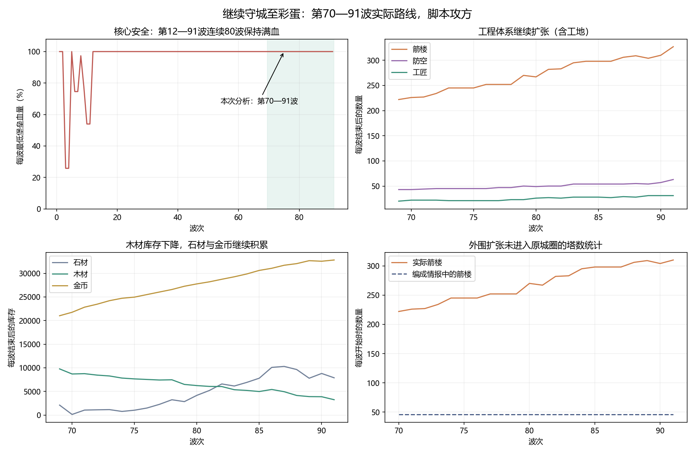
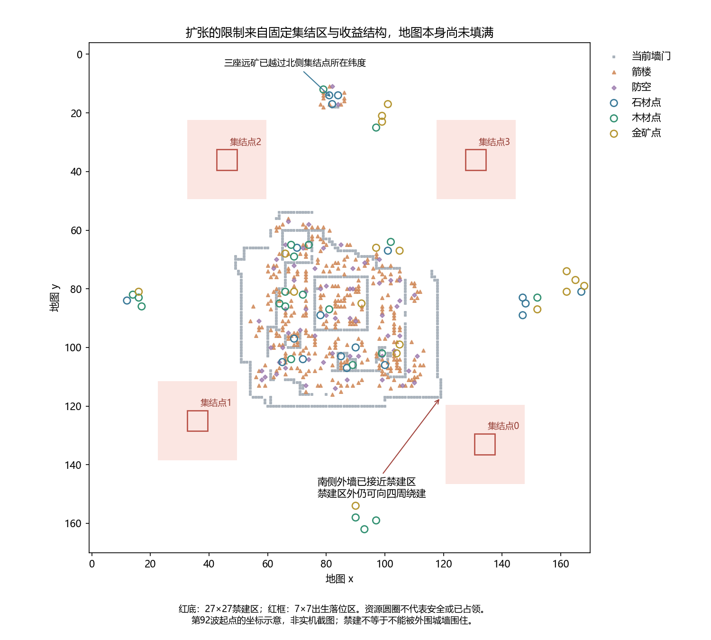
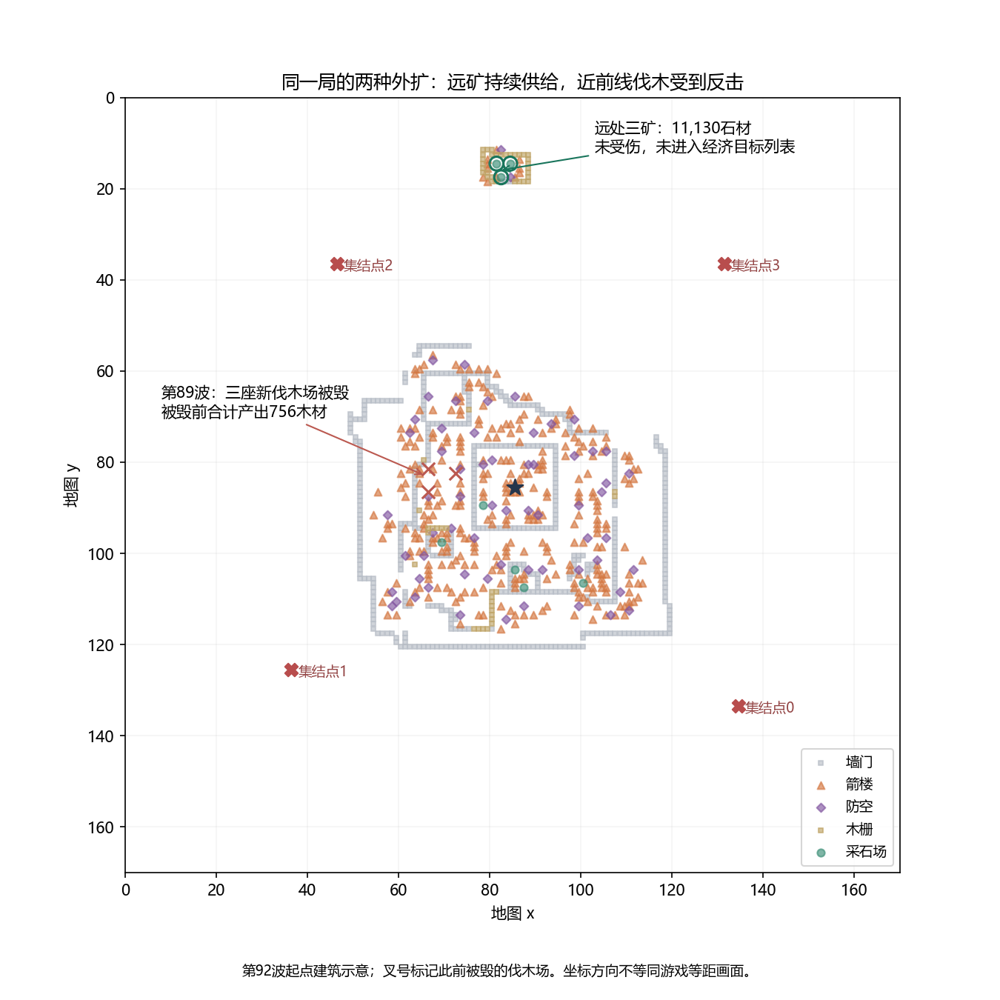
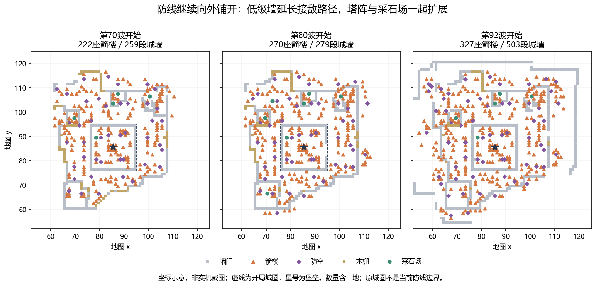

# 第70—91波续局复盘：彩蛋之后，扩张与进攻还剩什么

[原通关复盘](README.md) · [续局逐波分析](guard-waves.md) · [续局核对表](guard-tables.md) · [1577条事件](guard-events.md) · [续局证据](guard-evidence.md)

分析日期：2026-09-19。v1.0.1，地图 `gen_01009000`，脚本攻方。冻结于第92波起点；本文不包含之后继续游玩的变化。

## 1. 结论与分析范围

**守城路线已稳定到达第90波彩蛋，继续靠工程扩张变强；敌军仍能造成局部损失，却没有形成与城防增长相匹配的战略反制。新的突出矛盾是：固定集结区开始限制合理外扩，资源用途越来越偏向永久工事。**

这次完整重放第70—91波共22场战斗，区间 `160800 ≤ tick < 209499`，40分34.95秒模拟时间。普通回放和带观测回放均精确匹配冻结存档世界哈希 `7198304080585817914`。第92波已经开始，战斗不在统计范围内。

此前的第70波解放结局与本次继续守城是两个不同结局分支。地图、数值、种子及2843条旧输入前缀一致，原通关报告保留不变；本报告单列守城续局。两段成功路线合起来，第12—91波连续80波堡垒保持满血。不能据此声称前期也没有压力，或未来任何波次都不可能失败。

| 指标 | 第70波起点 → 第92波起点 / 本段累计 |
|---|---|
| 堡垒 | 23→29级，5798/5798→6420/6420血；22波均未受伤 |
| 箭楼 / 防空弩楼 | 222→327 / 43→63；终点这些建筑均已完工 |
| 城墙 | 259→503段，其中终点502段完工；485段一级、18段二级 |
| 工匠 / 弓手 / 猎骑 | 20→31 / 31→32 / 3→3 |
| 敌军战果 | 276100建筑伤害；275个建筑或工地被毁，其中252个完工、23个工地 |
| 守军损失 | 9工匠、8弓手；均为敌军最后击杀，另有468友军伤害 |
| 战斗节奏 | 进攻期平均77.68秒，最短57.35、最长92.15秒，无超时 |

## 2. 扩张接近集结区：用户指出的是结构问题

地图170×170格，当前仍有大量未占地块，56个资源点中有46个未占：石材10、木材20、金币16。它们在第92波均已解锁、资源格地形合法且无障碍，但这**不等于工匠能安全到达，也不等于继续占领有足够收益**。

更准确的问题是：有意义的扩张目标变少，而整圈推线开始撞上固定集结区。远处三座采石场已经越过北侧集结点所在纬度，说明玩家能以飞地方式开矿；把这些飞地全部接进主城，可能需要绕过乃至包住集结区。

### 禁建区保护了出生位置，没有禁止外围包围

四个固定集结点分别为 `(134,133)`、`(36,125)`、`(46,36)`、`(131,36)`。每处中心周围半径13格，即27×27格禁建；敌军在中心附近7×7范围生成。地图生成器的原意是防止永久建筑视野买断集结情报。

核验结果：

- 南侧外墙到集结点0禁建格集合的最近格心距离约3.61格，到集结点1约5格；尚未实际包围出生区。
- 集结点0、2的半径14格外围方环，各112格全部满足静态建墙所需的地形、无建筑、无障碍、无资源占位条件；当前也无地面单位占位。资金、施工可达性和敌军反击另算。
- 两处外围环证明“禁建区外可以继续围”在地图上没有被封死。这里是静态建造条件核验，**没有替玩家施工，也没有完成围困后的战斗实验**。
- 原规则按波数轮换固定主攻点和佯攻点，未根据新城墙重新定位集结点。因此，若玩家把集结区包进新的外墙，敌军仍会从墙内的原位置出现。

不能进一步夸大成“塔能直接盖在出生格上”或“敌人一出生就被塔打”：27×27禁建区确实拦住前者；最近合法箭楼格到7×7落位格集合仍至少11格，超过箭楼7格射程。外围堵出口、破坏城内外概念，与出生即遭射击是不同问题。

**设计上应先决定长期守城的空间终点。** 若保留长局扩张，更合适的方向是让敌军从可解释的外部入口进入，并提前展示新的集结位置；原集结地应是可争夺的前线据点，而非玩家城内永不移动的出兵坐标。这个方案还需要解决无可用入口、全图占领和资源飞地的规则，不能直接临时把出生点瞬移到玩家薄弱处。

若本模式主要服务有限波数与剧情结局，则应明确后期目标和可建设边界，避免玩家投入一轮扩张后才发现地图规则不支持。单纯增大地图只会推迟同一问题；只增加禁建面积则可能进一步压缩选择。

## 3. 资源价值：石材主导工程，金币过剩，木材仍是真实约束

| 资源 | 起始库存 | 本段收入 | 净支出（扣除退款后） | 结束库存 |
|---|---:|---:|---:|---:|
| 石材 | 2103 | 50014 | 44233 | 7884 |
| 木材 | 9769 | 10962 | 17482 | 3249 |
| 金币 | 21020 | 14478 | 2683 | 32815 |

净支出按“收入－库存增量”计算，不用同tick命令推测退款金额。不同资源并非同一货币，不能按44233大于17482直接判定石材单位价值更高。

用户判断的机制依据在于：箭楼负责97.93%的对敌有效伤害，永久火力、挡路墙和堡垒升级主要消耗石木。一级箭楼80石30木，一级墙30石10木；积累工程直接换来更厚的火力纵深。金币主要买人，而本段战斗人员的替代价值不足，工匠与人口上限又限制其用途。

但木材不能归入“没价值”：库存下降66.7%，消费超过产出；第88波还新建三座伐木场补给。本段维修仅花228木，占木材收入2.08%、净支出1.30%，主要木材需求来自其他建设投入。**这不能解释成全部276100建筑伤害只需228木就能修好**，因为大量建筑被毁、主动拆除或未维修。

金币则收入远大于消耗，增加11795库存。三名残血猎骑持续占人口而无战斗贡献，也是“钱能买人，却未必买到有用战力”的具体例子。单纯提高招募价格会减少账面盈余，却未必增加策略价值。

扩张结束后，石材仍能用于升级和补损，但“多一座矿→多一片有效塔阵”的收益也会受空间饱和影响。下一步应检验三种资源各自能换到什么有效能力，优先恢复部队用途、进攻拆塔与经济反制，再定成本；暂不建议为消耗库存直接加全局维护税或强制资源兑换。

## 4. 远矿与近前线伐木：扩张风险并不随距离单调增加

第79波下令在 `(81,14)`、`(82,17)`、`(84,14)` 建三座采石场，随后陆续投产，共产出11130石，占本段石材收入22.25%。三矿均未受伤，未进入任一记录波次的宏观经济情报和经济目标列表，也没有以其坐标为目标的就近袭击采样。

这不是证明所有敌军从未“看见”它们；可直接确认的是经济目标链和实际伤害都没有触达。三矿偏离固定进攻线路，又缺少主动远程侦搜，结果是非常远的供给点反而长期安全。

反例是第88波的三座伐木场 `(66,81)`、`(66,86)`、`(72,82)`：第89波全部被摧毁，附近攻方确有就近经济袭击决策。三场在被毁前仍合计产出756木，基础建造合计120石90木；不能称为没有产出的失败扩张，也不能跨资源直接算净利润。同波 `(69,81)` 金矿被毁。

**当前攻方会打遇见的经济点，但尚不能有效寻找并持续争夺远处供给。** 后续应让侦查所得的外围建筑信息进入实际计划，按预计到达时间、守卫火力、矿点产出和撤离机会选目标，不能用全图透视替代侦查。

## 5. 地面攻方：破墙不少，清理火力与突破兑现不足

敌军名义等级由101升到141；当前并不是99级封顶。它摧毁198段墙、6座门、26段木栅，还毁25座箭楼、9座防空及11座经济建筑，局部伤害真实存在。

问题在于输出分配：攻城锤贡献234154建筑伤害，占攻方建筑输出84.81%；全部敌军建筑伤害的80.44%打在墙上。锤320次攻击前摇中，280次瞄准墙、12次门，**零次直接瞄准箭楼**；但范围攻击仍击毁7座箭楼，因此不能说锤完全没碰到塔。

玩家最终有503段墙，485段一级。墙的主要价值仍是迫使敌人绕行、停下来攻击和重启推进，以换取塔阵射击时间；敌军拆墙的同时，没有充分清掉造成这些损失的火力点。箭楼净增105座，原城圈外箭楼贡献94.88%的箭楼伤害，证明主要战场早已向外移动。

宏观编成却始终只记46座箭楼、8座防空，且标记为 `fresh=true`。代码限定在原城圈统计塔与防空；“新鲜”并不等于“覆盖了新防线”。原城圈缺口为零时编11台锤，有缺口时降到5台；第71、72、85、86、87波均为11锤。多锤编成地面总数50，常见5锤编成则61，存在单位数量与能力交换，不能只数锤就判优劣。

本段1287个地面单位出战记录中，901个没有开始任何攻击前摇，约70%。其中亡灵步兵544/666、鬼域骑士103/166、攻城锤19/140、亡灵法师235/315。肉盾能通过承伤支援同伴，所以零前摇不自动等于每个单位都有AI错误；但它说明大量兵力没能兑现主动输出。

塔射程内等队形累计约7184.1单位秒；按最近决策归因的承伤391602，占守方对敌伤害24.67%。这是采样关联，不能全部当作取消等待后必然避免的损失。最接近核心的是第71波一台锤，距堡垒约4.09格时只剩21/3147血，全波没有开始攻击；到得近与成功突破仍有差别。

前一轮[35组局部对照](counterfactuals.md)已经证明：校准破墙代价、取消暴露位置等待，有时能改善推进，有时会引向更危险的火力区。本次没有重做改规则实验，不能把上一轮结果当作第90波方案已经验证。改进目标应是“以足够剩余战力形成持续突破”，并计入玩家快速补墙的反应。

## 6. 不死鸟：有真实价值，但与地面攻击错时

22波都计划一只，实际19次出击、5次被击落；第75、81、83波受重生等待影响没有出鸟。不能把计划数当实际出击数。

它造成26890建筑伤害，直接击毁16塔、7防空、2木栅、1采石场；玩家另主动拆掉18座此前被它打伤的箭楼。直接击毁、迫使重建和自身损失需要分别统计，不能只看是否打到堡垒。

**94.12%的鸟建筑伤害发生在准备期。** 空袭能制造工事损伤，却大多没有与地面主攻同时施压，给了玩家处理和补损的时间。五次被击落的波次中，都有“已满足撤退条件、仍走经济袭击分支”的采样，共81条；说明任务优先级冲突仍在，但不能声称修撤退分支就必定能救下全部五只。

本段鸟受到的有效伤害均来自防空，弓手为零。这加强了用户此前提出的议题：应比较单座防空是否可优先拆除、突破后的收益、其余火力与退出路线，不能只按覆盖面积或防空总数决定出不出鸟。但这里尚未验证主动拆防空在第70—91波的整体收益。

## 7. 守军与操作：工程成为主角，单位机制继续压缩选择

玩家进行了1256条输入，完成20名工匠、9名弓手招募；采样确认堡垒升级6次、箭楼263次、防空67次，城墙仅4次。输入可能被拒绝，采样升级统计也不等同于逐命令完工日志。

新增工匠用于维持扩张与补损；第88波三名工匠被骑士击杀，其中一名16级、满血249点仍被一击带走。等级带来的生存收益在这类敌军冲锋面前未必改变结果，也不能把高等级工匠理解为更快施工。

三名猎骑的生命值在22波内始终分别为174/572、106/628、30/646，没有输出也没有承伤。决策持续是移动，但坐标仅在原城圈局部变化；都低于40%撤退阈值，且没有恢复到可重新参战状态。这是此前“送死或不攻击”反馈的长期化表现，持续占用三个人口。

本段零友军最后击杀不等于误伤消失：仍有468伤害落在弓手身上，个别后来阵亡者此前已受友军伤害。此次主要矛盾不是简单的误伤计数，而是守军贡献、人口和黄金消费之间失去良性联系。

## 8. 彩蛋核验与下一步

选择继续守城后，在tick205089进入第90波，满足《微笑者》附录对应的 `loss_list` 解锁条件。规则要求到达90波且选择Guard，并不要求打完第90波。本段也实际打完第90、91波。

这与白羽附录不同：冻结状态 `white_feather=false`，本段检查到的不死鸟连续生存计数最高7，未达到10。不能把一次彩蛋触发解释成全部附录解锁。

建议按以下顺序继续验证，而非直接同时改多项价格：

1. **明确长局的扩张边界与敌军进入规则。** 分别测试正常外扩、资源飞地、围住旧集结区、接近全图占领；测地图可用性、入口合法性和提示是否公平。
2. **让攻方认识并争夺新前线。** 先修外围塔/防空信息统计，再比较清火力、突破墙和袭击经济的任务分配，保留侦查约束。针对远矿检查发现率、到达率和断供时长。
3. **把时间与损失纳入突破方案。** 同时估绕路承伤、直接破墙承伤、工匠补墙速度、开口后存活兵力；不死鸟安排压制窗口和撤退优先级。包含玩家及时补墙的多波测试。
4. **恢复金币可以买到的有效能力，再调资源比价。** 修猎骑长期退而不战等问题，比较有无机动部队的相同预算防线；记录石木金库存、消费去向及工程占比，不用“库存必须一样”作平衡标准。

这些是待验证方向。本次已验证的是原局证据与地图/代码规则；没有据此更改正式游戏、实时存档或RL训练配置。全部逐波结果、事件与复现限制见文首链接。
