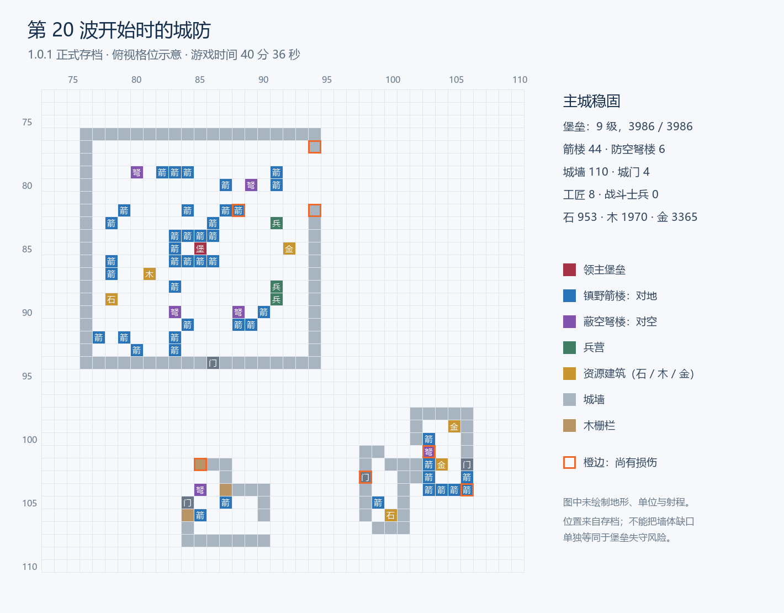

# 第20波试玩复盘：局势、平衡与敌军行为

## 结论与适用范围

第20波开始时，玩家已建立明显优势：第12—19波堡垒全程满血，第13—19波均在时限前结束进攻，平均耗时87.7秒。没有存活战斗士兵、部分墙段受损，不等于堡垒濒临失守。

优势既来自经济和箭楼建设，也与脚本未能有效消耗核心火力有关。本局发现：防空总数过度削减空军、有缺口即削减攻城锤、攻城锤连续清理外围墙段、队形在火力范围内等待、主攻方向固定轮换、守军误伤，以及当前升级费用与收益不匹配的倾向。建议先让攻方兑现已有反制能力，再调整整体数值。

本报告整合局势复盘、逐波记录、机制分析与诊断实验，针对**一局正常游戏推进至第20波准备阶段**。完整实战覆盖第1—19波；第20波的后续交战是从同一局面进行的离线对照。后续开发者模式跳波与本报告无关。攻方是脚本，不将这些结果归因于RL策略。

## 证据标识与统计口径

| 项目 | 值 |
|---|---|
| 游戏版本 | Sanctum 1.0.1 |
| 源码提交 | `fb0c36d6f121d24521a618c801393f17ad71f748` |
| 地图 | `gen_01009000`（生成图1009000），170×170 |
| 地图内容哈希 | `sha256:c6eb8a2f576467d58628910c30a7f4685d036ffd117169e6dfd62898c928e197` |
| 随机种子 | `8709371129856055178` |
| 存档格式/平台 | save v6，`World/16`，`msvc-1944/win/x64` |
| 保存时间 | 2026-09-16 21:55:13（北京时间） |
| 存档时刻 | tick 48722，仿真时间40分36.1秒，不含暂停 |
| 世界终态哈希 | `14991328465615254247` |
| 快照哈希 | `15177722484300712180` |

从相同种子、内嵌地图和数值表重放690条玩家操作，终态与原档一致。新增伤害/出手追踪覆盖第12—19波，仍通过终态校验，伤害合计与原逐波统计相符；第16波队形原因追踪也通过对应检查点校验。

- **操作请求与成功执行分开统计：**107条训练请求实际完成103次征募，不能用点击次数代替产出。
- **实战与反事实实验分开：**第20波实验保留同一起点，调整指定规则后不再下玩家指令；玩家适应性操作未纳入。
- **战损与主动拆除分开：**建筑/工地总数包括每一段墙和未完工工地，不能理解成同等价值的大型建筑。
- **伤害、击杀与经济损失分开：**伤害按实际扣血计，致死归因不等于该来源造成了全部损伤。
- **单局与全局平衡分开：**结果可用于定位问题，尚不能证明纯塔在所有地图最优，也不足以确定最终调整幅度。

完整玩家归档、逐次追踪和临时诊断程序保留在本地分析材料中；本文收录关键统计及实验参数，未附完整复跑输入。种子和地图本身不能重现人类操作序列。本次为文档记录，未修改游戏规则或原存档。

## 对局演变

1. **先发展经济，再逐步补强。** 第2波开始时已从1座采石场扩到3座。早期箭楼少，堡垒在第3波最低降至619/2400，但之后修复；这是前期经历，不能代替第20波的局势判断。
2. **第11波是防御规模的转折。** 第11波开始时12座箭楼，到第12波开始时27座；工匠由5人增至7人。随后第12—19波堡垒保持满血。时间上的对应支持建筑集群建立优势的解释，但不等于已经单独测出了每种投入的因果效果。
3. **第15波继续扩建。** 第15波开始时29座箭楼，第16波开始时45座；到第20波仍有44座。后7波平均87.7秒结束进攻，比第6—11波的102.2秒更快，且没有触及120秒上限。
4. **玩家持续重组外城。** 资源点数量下降有主动拆除因素，不能全部记作战损。例如第19波主动拆除了(87,107)采石场、(89,106)伐木场和一处城门。当前是防御成形后的布局调整状态。

## 第20波存档局面

| 项目 | 实际状态 |
|---|---|
| 堡垒 | 9级，3986/3986生命 |
| 对地/对空建筑 | 44座箭楼、6座防空弩楼 |
| 工事 | 110段城墙、4座城门、3段木栅 |
| 人力 | 8名满血工匠；没有存活战斗士兵；人口8/26 |
| 库存 | 石953、木1970、金币3365 |
| 资源建筑 | 2座采石场、1座伐木场、3座金矿 |
| 当前收入 | 每5秒石23、木14、金47（含堡垒）；以当前建筑保持运作为前提 |

当时所有建筑均已完工，也没有在训士兵、维修工单或升级工程。8名工匠待机不能据此认定避险逻辑失灵。共有7个建筑实体尚有损伤，最明显的是(94,82)城墙100/1200、(88,82)箭楼170/720，可作为继续操作时的维修检查点。

第20波集结中的敌军实际为36名亡灵步兵、15名法师、8名骑士、5台攻城锤和1名窥使；没有不死鸟。攻方用于配兵的侦查记忆中有4座防空，当前脚本因防空数量把这波不死鸟配额压至0。不能把这里的编成位数当作实体人数，也不能把其配兵响应当成RL表现。

## 平衡与敌军行为诊断

### 1. 建筑火力积累没有受到有效制衡

对第12—19波重新回放、记录每一次实际伤害后：

| 项目 | 结果 |
|---|---:|
| 守方对敌实际伤害 | 187461 |
| 其中箭楼造成 | 184121，约98.2% |
| 枪卫/弓手/猎骑造成 | 1640 / 1667 / 33 |
| 攻方对建筑实际伤害 | 91826 |
| 其中城墙与城门承受 | 81301，约88.5% |
| 其中箭楼承受 | 4813，约5.2% |
| 被敌方摧毁的箭楼 | 4座 |
| 箭楼存量 | 第12波开始27座 → 第20波开始44座 |
| 堡垒受伤 | 这8波始终为0 |

这些比例是本局实际投入与行为共同产生的结果，不能单独当成每种单位的固有强度。但是，它们清楚说明这局后期的防御资本主要是箭楼，而敌人主要消耗外围工事。仅提高敌人的总伤害，可能只是让其更快拆墙，仍然不能打断核心火力积累。

资源建筑持续产出、箭楼不占士兵人口且没有维护费，本身可以是合理设计；问题在于与当前敌军目标选择结合后，存量火力增长缺少有效抵消。金币用于反复补充容易损失的部队，石材用于能跨波保留的箭楼，两种投入的长期回报需要在真实战斗中一起评估。

### 2. 防空总数直接把空军威胁抹掉

实际记录：第3—20波的不死鸟配额全部为0，快照中的不死鸟身份计数也未启动。这并非玩家每波把它们击落，而是它们根本没有进入编成。

规则是：每看到2座城内防空建筑，就从不死鸟配额中减去1只。它使用记忆里的防空总数，没有评估某条飞行路线的防空覆盖、薄弱外城目标或防空能否被地面部队牵制。即使城内局部防空很密，也不等于所有外城箭楼都没有可攻击窗口。

这条判断过于粗糙，还会撤掉本来用于对付箭楼集群的空中单位。下方对照验证了它在本局确实压低了攻方的拆塔能力。

### 3. 只要有缺口，就大砍攻城锤

配兵流程先按箭楼数量提高攻城锤比例，再在记忆里存在任何城墙缺口时把该比例削减60%。它没有判断缺口是否适合主攻、缺口后的箭楼火力、守军是否堵住入口，也没有区分“墙不用拆了”与“里面的塔仍要拆”。

本局第18波记忆里有33座箭楼、0处缺口，配置10台攻城锤；第19波仍记得33座箭楼，但有8处缺口，攻城锤降至5台。守方火力并未因此减半，敌方反制却显著收缩。

这会产生一个需要防止的倾向：开着被箭楼覆盖的缺口，反而使敌方少带攻城武器。保留通道本身可以是策略，但攻方不应仅凭“缺口存在”就认定拆塔需求消失。

### 4. 攻城锤容易连续清理墙段，缺少破口后的推进判断

第12—19波，攻城锤共承诺出手190次：143次瞄准城墙、12次城门、28次枪卫、5次猎骑、2次金矿；直接瞄准箭楼或堡垒均为0次。承诺出手不等于最终命中，箭楼仍受到3720点来自攻城锤的溅射伤害。

具体例子：第12波有一台攻城锤沿外城先后瞄准(106,102)、(106,104)、(104,104)、(102,102)、(102,104)的墙段，累计承诺出手24次。它确实造成损失，但没有把这些破坏转成对主城火力核心的打击。

实现上，只要附近墙段可攻击，脚本便倾向执行“打最近墙/门”；选墙时没有检查这段墙是否仍挡在它的战略路线中。路径规划主要计入行走与拆障时间，也不计沿途箭楼火力。因此“缺口出现后跟进”“给箭楼或堡垒明确目标”“是否值得继续清理外围墙段”是需要改进的具体行为。

不能简单把“先打人”全部删掉：护卫与敌方近战的纠缠可能有战术价值，应该按攻城任务、威胁和有效攻击窗口决定优先级。

### 5. 队形等待会让部队站在箭雨里挨打

第16波，一名亡灵步兵在(74.9055,95.8929)附近连续停留约14秒，处于3座箭楼的射程内，记录区间内血量由415降至148。额外追踪确认：这些停步决策确实来自等待队形的分支，不是仅凭画面猜测寻路卡死。

当前步速线以地面慢兵中较靠前者到堡垒的直线距离确定，各路快兵据此停步。规则没有按主攻/佯攻/骚扰路线分别协调，也没有“已经受火力威胁时不能原地等”的例外。

应考虑分路集结、接敌前集结，以及接敌后的继续推进或退到安全位置。直接删除全部等待也会破坏协同：本次对照中，完全取消等待只让第20波堡垒多掉15血，敌军摧毁建筑数反而从6降到5；因此它是真问题，但不是一项改动就能解决全部压力不足。

### 6. 进攻方向与目标选择缺少对防线的判断

主攻出生点直接按“波次对4取余”轮换，佯攻点固定取下一个。配兵会读侦查结果，主攻方向却不依据哪一侧箭楼少、防空弱或外矿暴露来选择。地图上的不同防线因此没有充分转化为攻方的进攻选择。

此外，看到附近外城采集建筑时，临时转向骚扰的规则可以覆盖所有战斗单位，并非只限制于已分配的骚扰编队。它可能牵走主攻力量，但不能据此断言骚扰无用：取消这一临时规则的第20波对照中，敌方建筑伤害从5414降至3064，堡垒仍未受伤。应改进任务分工与目标收益判断，而不是把经济骚扰整体删除。

### 7. 当前版本的建筑升级收益偏低

当前1.0.1箭楼的实际数值：

| 等级 | 累计石材成本 | 累计木材成本 | 生命 | 单次基础伤害 |
|---|---:|---:|---:|---:|
| 1 | 80 | 30 | 600 | 14 |
| 2 | 112 | 42 | 662 | 15 |
| 3 | 152 | 57 | 720 | 17 |
| 4 | 200 | 75 | 773 | 18 |
| 5 | 256 | 96 | 823 | 19 |

5级塔累计成本是1级的3.2倍，生命仅约1.37倍，单发伤害约1.36倍；射程、攻击周期和范围没有随等级提高。单看1升2，另付基础造价40%的资源，仅增加约10.3%生命、7.1%单发伤害。

升级节省空间，也可加强关键位置，存在合理溢价；但当前差距明显偏向扩建。最终44座箭楼，其累计建造与升级成本为7608石、2853木，升级部分贡献的单发总伤害增幅约21.3%；这个指标并不包含射程覆盖和实战溅射收益，不能直接等同总战力。

采集建筑升级也不提高收入。因此本版本不能继续沿用旧版本“升级特别便宜”的结论。需要明确升级到底买什么，再统一成本与成长曲线。

### 8. 近战与箭楼的配合造成显著误伤

 实际完成的103次征募中，75名枪卫、11名猎骑、7名弓手、8名工匠、2名斥候。全程敌军击杀70名守军，我方误伤击杀31名；另有1名斥候在侦查过程中消失。误伤击杀占双方战斗伤害导致的守军阵亡约30.7%，这是致死归因，不代表误伤造成了这些单位的全部生命损失。

该版本箭楼齐射对落点周围地面单位不分敌我结算，守方其他兵种的数值表没有范围伤害，因此这里的我方误伤来自箭楼。第18波尤其明显：敌方击杀8人，我方误伤也击杀8人。当前“补兵却留不下兵”不能只归结为玩家兵种选择，也应检查近战自动站位、箭楼选点与误伤反馈。它是现有机制的实际表现，是否需要改动应另行比较，不能先断言一定是程序错误。

### 9. 维修便宜与建筑被摧毁是不同成本

全程维修支出368木材；同时对方累计摧毁106个建筑/工地实体。后者包含独立墙段和可能尚未完工的工地，不是106座完整大型建筑，也不包含玩家主动拆除。损伤恢复便宜与被摧毁后的成本不是同一回事，不能只看累计建筑伤害就判定攻方取得等额经济收益。

## 第20波离线对照实验

### 配兵规则对照

从第20波配兵前的同一状态出发，保留玩家的城防、资源、种子和其他规则；重新配兵后完全不下玩家指令，跑到该波结束。原规则分支已与原存档的开波状态校验一致。所有分支敌军名义等级均为16；编成位总预算相同，调整特殊兵配额会相应改变其他兵种数量。

| 配兵规则 | 攻城锤 | 不死鸟 | 摧毁箭楼 | 摧毁建筑/工地总数 | 建筑总伤害 | 堡垒最终生命 |
|---|---:|---:|---:|---:|---:|---:|
| 原规则 | 5 | 0 | 0 | 6 | 5414 | 3986/3986 |
| 不因缺口削减攻城锤 | 11 | 0 | 0 | 8 | 7101 | 3986/3986 |
| 不按防空总数削减空军 | 5 | 2 | 3 | 10 | 8642 | 3986/3986 |
| 同时取消上述两种削减 | 11 | 2 | 3 | 8 | 7024 | 3986/3986 |

两只不死鸟在有空军的分支中直接击毁2座箭楼。增加攻城锤而不增加空军的分支中，墙体伤害从3064增加到4925，仍没有击毁箭楼。

结果说明：空军被过度取消在本局有实际影响；单纯堆攻城锤主要增加了拆墙；两项配兵调整也不是简单叠加增益。所有分支堡垒仍满血，进一步说明当时优势真实存在，也说明光调这两个配兵开关还不足以打破已成形的防御。

### 战术规则对照

另一组实验直接从保存时刻tick 48722出发，保留已生成的第20波编成，仅调整一个战术规则，随后不下玩家指令。该起点比配兵对照晚28 tick，不能把两组时长直接混用。

| 战术规则 | 摧毁建筑/工地 | 建筑总伤害 | 堡垒最终生命 |
|---|---:|---:|---:|
| 原规则 | 6 | 5414 | 3986/3986 |
| 取消全局队形等待 | 5 | 5051 | 3971/3986 |
| 取消临时外矿转向，保留原有经济编队任务 | 3 | 3064 | 3986/3986 |

取消全部等待仅让堡垒多损失15血，取消临时骚扰反而降低了建筑伤害。不能据此认定“全部不等队形”或“全部不骚扰”就是修复方案。两组对照都仅覆盖当前地图、种子与固定起点，没有跨地图统计显著性结论。

## 第1—19波记录

最低堡垒血量比例包含该波准备阶段和继承伤势。非超时结束指战斗单位已被清除或撤离完成，并不要求击杀侦查单位。建筑损失只计敌方摧毁，排除主动拆除；计数仍包含工地和每一段墙。

| 波次 | 进攻阶段/秒 | 结束方式 | 堡垒最低血量 | 敌方击杀守军 | 我方误伤击杀 | 敌方摧毁建筑/工地 |
|---|---:|---|---:|---:|---:|---:|
| 1 | 52.10 | 清除战斗单位 | 100.0% | 0 | 0 | 0 |
| 2 | 53.70 | 清除战斗单位 | 100.0% | 1 | 0 | 1 |
| 3 | 120.00 | 超时撤军 | 25.8% | 6 | 0 | 5 |
| 4 | 102.60 | 清除战斗单位 | 25.8% | 1 | 0 | 2 |
| 5 | 120.00 | 超时撤军 | 100.0% | 4 | 2 | 3 |
| 6 | 98.30 | 清除战斗单位 | 74.6% | 8 | 1 | 1 |
| 7 | 100.95 | 清除战斗单位 | 74.6% | 8 | 1 | 5 |
| 8 | 102.90 | 清除战斗单位 | 97.3% | 3 | 1 | 4 |
| 9 | 96.65 | 清除战斗单位 | 77.5% | 2 | 0 | 4 |
| 10 | 106.90 | 清除战斗单位 | 54.0% | 7 | 0 | 5 |
| 11 | 107.70 | 清除战斗单位 | 54.0% | 5 | 3 | 7 |
| 12 | 120.00 | 超时撤军 | 100.0% | 0 | 0 | 22 |
| 13 | 91.20 | 清除战斗单位 | 100.0% | 0 | 1 | 7 |
| 14 | 86.65 | 清除战斗单位 | 100.0% | 8 | 6 | 6 |
| 15 | 85.80 | 清除战斗单位 | 100.0% | 8 | 5 | 4 |
| 16 | 93.65 | 清除战斗单位 | 100.0% | 0 | 0 | 11 |
| 17 | 82.85 | 清除战斗单位 | 100.0% | 0 | 0 | 8 |
| 18 | 85.75 | 清除战斗单位 | 100.0% | 8 | 8 | 6 |
| 19 | 88.00 | 清除战斗单位 | 100.0% | 1 | 3 | 5 |

仅第3、5、12波达到120秒，撤走的战斗残兵分别是2、1、1台攻城锤。因此，第20波前的优势并不是最后几波反复依靠超时撤军维持的。

## 处理优先级与验收方向

以下是待实现、待验证的建议，不是本PR已经完成的游戏修改。

| 优先级 | 改进方向 | 重点验证 |
|---|---|---|
| 1 | 攻城锤破口后切换目标、主攻与骚扰任务协调 | 是否推进到箭楼/堡垒；实际伤害、摧毁目标与付出的损失；不再只看建筑总伤害 |
| 1 | 分路集结、受火力威胁时解除原地等待 | 塔火中的停留时间、护卫与攻城单位到达时序；同时避免把部队拆成逐批送死 |
| 2 | 按候选路线的防空、地面火力与目标价值选择配兵/方向 | 是否识别局部薄弱点；侦查信息是否真正影响主攻路线；保留经济打击能力 |
| 2 | 近战站位、箭楼选点与误伤反馈 | 误伤、对敌伤害、部队存活与堡垒安全；不能以减少误伤为由让塔停止必要输出 |
| 3 | 行为改进后统一升级收益和费用 | 新建与升级的成本、空间、覆盖和跨波战损；采集建筑升级的实际用途 |
| 3 | 比较塔与士兵的长期回报 | 保持地图/种子/预算可比，记录经济结余、维修、重建、伤害与战损；扩展多地图、多种子 |

当前证据支持先改进攻击目标和协同，再配平数值。直接统一削弱箭楼、大幅增加攻方血量，或照搬本报告的诊断开关，均未被这些实验验证为最终方案。

## 对应源码（固定于被分析版本）

以下链接固定到1.0.1源码，避免以后规则变化后反向解释本次试玩数据。

| 规则 | 源码入口 |
|---|---|
| 侦查记忆、缺口削减与空军削减 | [attacker_macro.cpp](https://github.com/Cody-ic/siege-rts-rl/blob/fb0c36d6f121d24521a618c801393f17ad71f748/game/src/attacker_macro.cpp) 中 `read_intel`、`compose` |
| 固定主攻点、队形等待、临时骚扰、攻城锤动作 | [demo_driver.cpp](https://github.com/Cody-ic/siege-rts-rl/blob/fb0c36d6f121d24521a618c801393f17ad71f748/game/src/demo_driver.cpp) 中 `spawn_wave`、`issue_actions` |
| 寻路成本 | [flow.cpp](https://github.com/Cody-ic/siege-rts-rl/blob/fb0c36d6f121d24521a618c801393f17ad71f748/rts_core/src/flow.cpp) 中 `FlowField::compute` |
| 就近目标、范围误伤、建筑收入 | [mechanics.cpp](https://github.com/Cody-ic/siege-rts-rl/blob/fb0c36d6f121d24521a618c801393f17ad71f748/rts_core/src/mechanics.cpp) 中 `pick_target`、`impact_projectile`、`tick_economy` |
| 维修与升级费用 | [world.cpp](https://github.com/Cody-ic/siege-rts-rl/blob/fb0c36d6f121d24521a618c801393f17ad71f748/rts_core/src/world.cpp) 中 `apply_one`、`bld_upgrade_cost_stone`、`bld_upgrade_cost_wood` |

新增伤害来源追踪的合计为187461点对敌伤害、91826点建筑伤害，与原回放统计一致。攻城锤记录的是前摇开始时的190次承诺出手，包含可能未命中的攻击；防空和攻城锤配额取实际波次快照，不能与最终实体人数混用。
