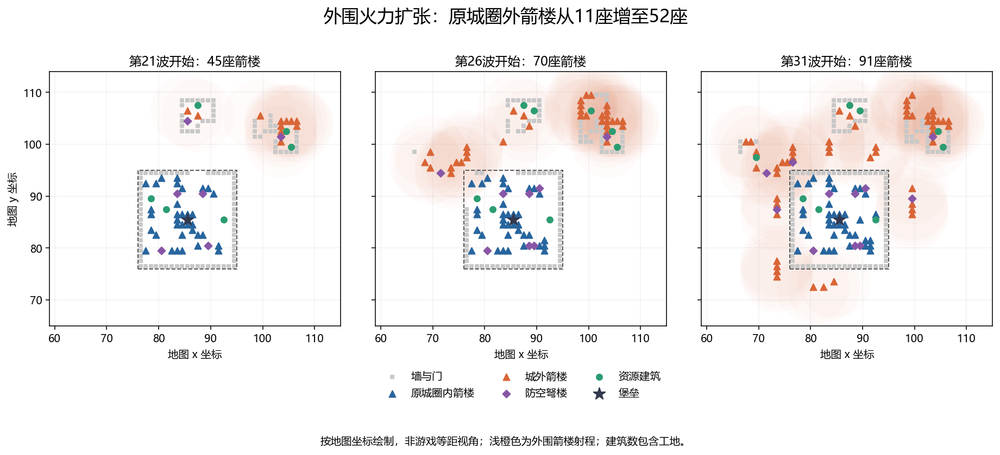
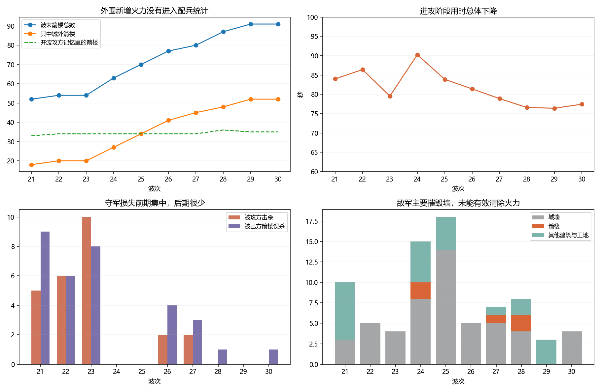
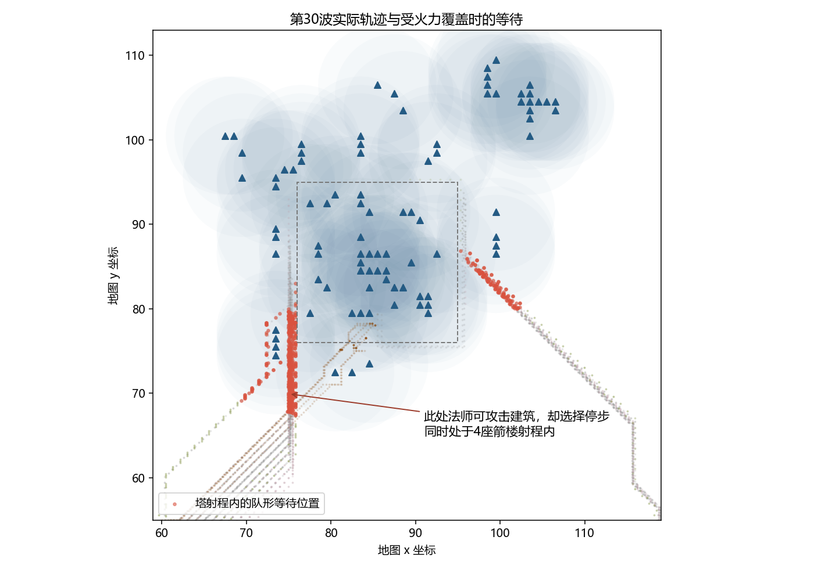

# 第21—30波深度复盘：外围塔阵、攻方行为与成长配平

本报告接续 [PR #193](https://github.com/Cody-ic/siege-rts-rl/pull/193) 的第20波复盘，记录后续十个完整波次；分析与建议尚非已落地的规则变更。

分析日期：2026-09-17。对象：玩家实际手动操作的《圣城守望》1.0.1普通对局，地图 `gen_01009000`。

## 1. 主要结论

**“局势一片大好”与这十波的数据一致。玩家以外围箭楼扩张为主线，增加经济与施工能力，枪卫留作城内拦截。攻方造成了持续损耗，却没有有效消除不断增长的火力。**

第21波开始到第31波开始，箭楼从45座增至91座，原城圈外箭楼从11座增至52座；两端的箭楼均已完工。十波堡垒受伤为0，没有一波靠120秒超时结束。第21—25波平均进攻阶段84.82秒，第26—30波78.15秒。这里的“耗时下降”包含行军、交战和撤离，不能单独当作战力指标，但与堡垒安全、火力增长和后期低伤亡相互印证。

最值得优先处理的不是统一加攻方血量，而是以下行为问题：

1. **配兵统计只扫描开局城圈，外围塔阵不进入箭楼数量判断。** 玩家最主要的扩张方向没有被宏观配兵完整识别。
2. **地面攻方缺少主动拆除附近火力建筑的常规分支。** 攻城锤的176次承诺攻击中，141次指向墙/门，35次指向守军，0次指向箭楼；它确实溅射拆过3座塔，不能表述为“完全不会拆塔”。
3. **部队在箭楼射程内仍按全局步速线停步，有可攻击建筑时也可能不出手。** 改掉等待不一定全面变强，目标选择比“一律往前冲”更关键。
4. **外矿袭扰分支覆盖不死鸟专属行为。** 同一只鸟在准备期无效停留，后来低于撤退血线仍继续攻击直至死亡。
5. **防空数量、历史缺口等粗粒度信息决定配兵，却未匹配实际进攻路线和玩家补建速度。** 第25波出现11台攻城锤仍未拆掉箭楼，说明配额与执行必须一起看。

配平方面，塔的长期积累、近战承受己方箭雨、升级收益不足、高级工匠不提高生产力，以及工匠可同时推进多个邻近工程，均值得进一步验证。报告分别标注已确认事实、机制解释、实验结果和玩家意图推测。

## 2. 证据范围与核验方式

| 项目 | 本次口径 |
|---|---|
| 主分析区间 | 第21—30波，tick 51176—74072，共1144.85秒模拟时间 |
| 前后背景 | 第20波回档后的操作；第31波存档时刻tick 75226，仅为该波进攻开始约24.65秒，尚未打完 |
| 原始存档 | 复制出的 `campaign.json`，v6，种子8709371129856055178 |
| 存档终点校验 | 状态哈希17023796055020904935；完整重放和加观测后的重放均一致 |
| 对手 | 存档无学习策略身份，使用该版本脚本攻方；本报告不能代替RL策略评估 |
| 记录方式 | 原C++模拟逐tick重放；伤害、攻击承诺、AI决策和经济入账直接记账，Python整理 |
| 采样项 | 单位状态每0.3秒，建筑状态每1秒；工匠作业范围统计每3秒 |
| 逐条附录 | 437条玩家操作＋64次征兵完成＋57次守军阵亡＋79次敌军摧毁建筑/工地＝637条 |
| 对照实验 | 第21、25、30波各4个分支，共12次单波实验；基线分别与实际波末状态一致 |

伤害日志与独立累计统计核对一致：守方对敌伤害347190，攻方对建筑伤害94779，攻方对守军伤害10499。时间均为模拟时间，不是玩家含暂停的现实操作时长。玩家输入数量不等于指令被接受或完成数量。

波次切换tick存在在途弹丸结算：第21波末有3名枪卫被箭楼击杀。报告按旧波结束时间归属，记在第21波；若直接照伤害函数当时的波号，会误归到第22波。箭楼来源按弹丸发射位置判定；“城外”指原城圈坐标范围外，不代表当时没有新墙保护。

存档只读分析；实验在离线副本执行，没有替换正在玩的存档或修改游戏程序。所有对照均保留原有地图、起点、数值和种子，但改变决策后会自然改变后续命中和随机数消费。

## 3. 玩家这十波在做什么

### 3.1 空间上的主线：从据点守御到外围火力覆盖

箭楼总数增加46座，其中城外净增41座，原城圈内只净增5座。外围不是单点矿区的装饰性防守：第25—29波在多侧持续铺出箭楼线，部分塔群直接覆盖敌军接近路线。十波箭楼对敌伤害342728，其中城外塔贡献183345，占53.5%。守方击杀的605个攻方单位中，483个死亡位置在原城圈外；这是死亡地点统计，不能推断它们从未进城。

因此，玩家策略的有效部分可以概括为：**用外围阵地提前消耗来敌，让主城和高等级火力保持安全，将跨波保留下来的资源继续转成更多覆盖。** “每座塔都经过精确最优选址”“主动利用AI漏洞”不在证据范围内。

### 3.2 经济和施工如何支撑扩张

十波共入账10559石、6167木、10423金。石材库存由701降至148，木材由1634升至2458，金币由2465升至5066。扣除库存变化后，含拆除退款在内的净支出为11112石、5343木、7822金；这不是毛支出，不能直接与建造按钮点击次数相乘。

资源开发不是一条平稳上升曲线。采石场一度从2座扩到5座，随后遭受打击、主动拆建和恢复；第29波石材入账只有618，而金币仍入账1034。玩家的长期约束更接近石材和工程落实速度，后期金币没有充分转化为额外有效战力。

矿点 `(69,97)` 多次损失仍累计贡献1624石，`(87,107)` 贡献3206石。经济建筑被毁并不意味着开发不划算，必须看此前收入、守备投入和重建过程。攻方这十波只摧毁4座采石场，其中2座是工地；没有击毁伐木场或金矿场。工匠未受伤，也未阵亡，经济破坏尚未击穿恢复能力。

工匠从8人增至14人；堡垒从11级升至14级，将人口上限从30提高到36，建筑等级上限从6提高到8。实际使用的最高箭楼等级是7级。升堡垒在这套打法里不仅增加核心血量，更为施工人口、枪卫和塔的升级打开空间。

### 3.3 取消工地是主动止损，拆除也不是敌方战果

玩家已明确说明，取消的原因是初建工地几乎没有血量，怕敌人碰掉后损失整笔投入。源码初始值是1血，体验上与“0血工地”一致。

18次取消输入实际取消17个独立工地，另1次是同tick重复输入；其中14个取消时仍是1血、施工尚未推进。具体为13座箭楼、3座防空、1座采石场，按实际资源入账回收1350石/510木。因材料全额退回，这些操作应理解为在风险和施工能力之间调整承诺，而非白白损失17座建筑。

另外14次主动拆除共回收472石/248木，包括6墙、2塔、4采石场、1伐木场、1金矿场。部分明显是重伤目标：第24波拆的三级箭楼只剩72/720血；第29波两段墙各剩108/1200血；第30波一段墙只剩93/1200血。也有满血墙和611/662血的箭楼，不能把所有拆除都归为濒毁抢救，布局调整等具体动机未向玩家确认。

这32次输入合计实际回收1822石/758木，已包含在资源净支出的核算中。**玩家扩张时会主动撤销面临被毁风险的工地，保住材料，等待后续建设机会。** 停止玩家操作的实验会同时拿掉这一层止损能力，不能直接代表玩家实战。

### 3.4 玩家解释与推测必须分开

玩家已明确说明：一级墙提供绕路和打断推进的价值，升级未必能多扛一轮集火；高级工匠则是按“能招高级兵就先招高级兵”招募，并以为等级会提高速度。

因此，不能把高级工匠选择解释成玩家刻意优化生存率，也不能把所有资源安排说成经过计算的最优解。本报告对“工匠＋枪卫”的功能解释，是结合操作与机制的推测，而非替玩家补写当时的想法。

## 4. 逐波复盘

下表波末建筑数包含工地；“敌杀/误杀”只计守军；损毁排除玩家取消和拆除。十波均未超时，堡垒伤害均为0。

| 波次 | 进攻秒 | 敌杀/误杀 | 敌毁实体（完工） | 毁墙/毁塔 | 波末塔/城外塔 | 石/木/金收入 |
|---|---|---|---|---|---|---|
| 21 | 84.00 | 5/9 | 10（4） | 3/0 | 52/18 | 972/336/1128 |
| 22 | 86.40 | 6/6 | 5（5） | 5/0 | 54/20 | 1448/336/1128 |
| 23 | 79.55 | 10/8 | 4（4） | 4/0 | 54/20 | 1430/413/1034 |
| 24 | 90.25 | 0/0 | 15（15） | 8/2 | 63/27 | 1429/707/1073 |
| 25 | 83.90 | 0/0 | 18（17） | 14/0 | 70/34 | 1047/490/843 |
| 26 | 81.40 | 2/4 | 5（5） | 5/0 | 77/41 | 851/805/1081 |
| 27 | 78.90 | 2/3 | 7（7） | 5/1 | 80/45 | 954/770/1034 |
| 28 | 76.60 | 0/1 | 8（8） | 4/2 | 87/48 | 1010/770/1034 |
| 29 | 76.40 | 0/0 | 3（3） | 0/0 | 91/52 | 618/770/1034 |
| 30 | 77.45 | 0/1 | 4（4） | 4/0 | 91/52 | 800/770/1034 |

### 第21波：扩石材、用木栅试建外围据点

本波13次新建箭楼输入、26次木栅输入，另有4次采石场新建输入；两个手动移动指令也发生在这一波。箭楼从45增至52，城外从11增至18。新增位置包括 `(98,105—108)` 一线和 `(68,96)` 附近，采石场增加到5座。第21波末并非所有工程完工，不能把52座全算作立即可用火力。

本波石材入账972，库存下降451；木材入账336，库存下降701，反映了集中铺设施的投入。敌军摧毁10个建筑实体，但6个是工地：5段木栅和1座采石场。完工箭楼未损失。守军被敌方击杀5人、被己方误杀9人，枪卫数量明显下降。

判断：扩张尝试有施工和兵员代价，但没有摧毁核心火力，也没有威胁堡垒。把10个损毁实体一律当作10座成熟防御建筑，会夸大攻方战果。

### 第22波：强化旧火力，同时补回守军

15次箭楼升级输入，2次采石场升级输入；新建箭楼主要在 `(69,95)`、`(69,98)`，城外箭楼增至20。实际完成征兵为11名枪卫、1名弓手、2名猎骑，并非从始至终只招两种单位。

石材入账1448，金币入账1128；金币库存下降903，补兵消耗显著。敌军只拆掉5段墙，没有摧毁箭楼或资源建筑；却仍击杀6名守军，己方误杀6名。火力资产继续留存，人口补充却反复流失。

判断：此时增加兵力的收益不能只看出兵数量，近战进入交战区后也承受己方范围伤害。外围矿点和塔的强化则形成跨波存量。

### 第23波：不死鸟首次出现，准备期提前攻击后撤回

本波计划1只不死鸟。它在准备阶段就离开集结点，先后对箭楼造成3次71点伤害；降至139/441血后执行撤退，未被击落，下一波以同一花名册身份回归。它不是一直不行动，也不是本波先天没有目标。

玩家增建2座防空弩楼、1座伐木场，继续围护外围区域。实际完成8名枪卫、1名弓手，守军却损失18人，其中敌方击杀10、己方误杀8。波末仅余工匠和1名猎骑，但堡垒仍满血，箭楼54座一座未少。

判断：这是“士兵大量损失”与“整体局面良好”可以同时成立的典型一波。不能用守军人口减少直接推出城防濒临崩溃。另一个不一致在于不死鸟可在准备期独自开战，而地面主力等待集结。

### 第24波：截图中的不死鸟停滞，随后撤退失效；外围出现实质损失

不死鸟在 `(108.348,109.348)` 附近，从tick 58346到58815连续选择停止，约23.45秒；位置采样显示它原地不动。当时最近箭楼约5.19格，超过3格攻击范围。它触发了外矿袭扰分支，该分支在准备期不推进，于是没有进入正常不死鸟追击逻辑。

开战后它攻击附近箭楼，11次命中共792伤害。tick 59079时135/450血，已低于40%撤退门槛，但连续15个决策仍走袭扰攻击；tick 59196被防空弩楼击落。这里是可复现的优先级冲突，不是“玩家防线太强所以不死鸟合理待机”。

本波敌军摧毁15个完工建筑：8墙、1门、2塔、2木栅、2采石场。两座被毁箭楼均1级。玩家另在波内47.9秒拆掉72/720血的三级箭楼，随后重建，再于73秒取消仍为1血的新工地，形成一段明确的回收—尝试恢复—再次止损过程。波内86.8秒和94.7秒主动拆的伐木场、金矿场不能算成敌方摧毁。

玩家同时下了13次建塔输入，波末塔数63，但其中10座尚未完工。外围受到打击，却仍在扩张，主城零受伤、守军零阵亡。

### 第25波：攻城锤翻倍，主要战果仍是拆墙

攻方记忆里城圈缺口变为0，因此从常见5台改为11台攻城锤；地面其他兵种相应减少，编成位总预算仍为27。不死鸟配额因城圈内防空统计达到6而降为0。

攻方造成22194建筑伤害、摧毁18个实体，其中14段墙；没有拆掉箭楼。玩家17次建塔输入，大量向 `(73—76,94—99)` 等外围位置铺设箭楼，同时补防空、资源建筑；波内70—74.5秒又集中取消一批工地，大多仍为1血，收回尚未落实到火力的投入。波末箭楼70座且均完工，库存石材反而由1697增至1892，其中也包含退款，不能全归因于采矿收入。

判断：本波不能得出“11台攻城锤太弱”或“墙不需要”。它揭示的是攻城力量主要消耗在低级阻挡设施上，没有转成清除输出建筑的战果。

### 第26波：扩大施工人口，向两侧继续铺开

堡垒11→13级，实际新增4名11级工匠，工匠8→12；实际完成8名枪卫。新箭楼包括 `(73,86—89)`、`(99,86—91)` 两侧，防空也向外围配置。

石材入账851，但库存下降969，属于集中投入期。敌军只拆5段墙，敌杀2名守军、己方误杀4名。两段满血一级墙在tick 64920—64936间分别承受4次341伤害，0.8秒内倒下；这是多台锤的同轮集火，不是单锤一击打出1200伤害。二级墙1325血也承受不了这4次命中。

判断：快速破墙的观感有数据支撑，但不能把“增加一点血量”直接当作能买到更多反应时间。三级墙1440血理论上能扛住这特定4击，实战仍需考虑其他命中、后续攻击和重建成本。

### 第27波：继续外推，付出一次城内损失

13次箭楼升级输入，继续在 `(73,74—77)` 建立外侧火力。敌军摧毁5墙、1塔和1兵营，其中箭楼在 `(91,81)`、兵营在原城区内。堡垒仍未受伤，说明局部穿透发生过，但没有扩大成核心危机。

波末80座箭楼、城外45座，工匠12名。敌杀2、己方误杀3。资源采集恢复了 `(69,97)`，说明此前外矿损失并未永久压住玩家的补建。

判断：不能把“外围火力有效”写成“攻方完全进不了城”；它进过局部区域，也破坏过生产设施，只是损失被控制住了。

### 第28波：升堡垒、补工匠和高级枪卫，恢复兵营

堡垒13→14级，工匠12→14，实际完成9名枪卫。兵营在 `(91,90)` 重新布置。新增箭楼既有城内填补，也有 `(83,98—99)`、`(91—92,97—99)` 等连接外围覆盖的位置。

敌军摧毁8个建筑：4墙、2木栅、2座一级箭楼；没有击杀守军，己方误杀1名枪卫。塔数继续升至87、城外48；部分新增塔仍在施工。

判断：玩家此时同时提升人口承载、工地落实和近身兜底能力，而不是把所有资源都换成单一塔等级。

### 第29波：补齐外围火力，进入低损耗积累

新增箭楼包括 `(67—68,100)` 与 `(80—84,72—73)`；补采石场和防空，实际完成4名枪卫。波末91座箭楼均完工，城外52座。

敌方只摧毁2门和1木栅，箭楼与守军均无损失。石材收入618，是十波最低值，但木材入账770、金币1034，金币库存仍净增760。

判断：攻方并未完全失去经济压力，但这份压力没有破坏既有塔阵。资源收入减少和既有战斗能力增强可以同时发生。

### 第30波：暂停横向建塔，集中升级已有塔阵

没有新建箭楼输入，转而集中下28次箭楼升级命令，其中多处位于先前扩建的外围线；按每秒状态变化，能确认该波27次箭楼升级完成，涉及22座不同箭楼；未完成的输入仍需与工程状态区分，不能以28次点击当作28次成功。

本波未完成任何新兵训练；现有枪卫已足够留下近身保险。敌军拆4段墙、对守军造成309伤害，没有敌方击杀，己方误杀1名枪卫。进攻阶段77.45秒结束，堡垒4714/4714，金币一波净增1034。

判断：策略已经从“铺开覆盖”进入“升级成熟阵地”。玩家不是拒绝所有升级，而是墙与塔采取了不同的投资逻辑。

## 5. 攻方行为问题：证据与影响

### 5.1 宏观视野范围错误：外围火力被遗漏

**已确认机制。** `AttackerMacro` 初始化时把扫描区域固定为原始墙圈，`read_intel()` 在这个区域内数箭楼和防空。外部资源建筑会另行统计，外部箭楼不会。不是说单位完全看不见外塔：局部战斗可以感知、攻击，缺失发生在宏观数量统计。

玩家全场箭楼不断增长，开波记忆里的塔却长期停在33—36。第30波实际91座塔，配兵使用的记忆仍为35。两者既有时间差也有地理范围差，不能把差值全部说成侦查失败；但城外塔不会进入统计，是源码直接确定的盲区。

防空同样只数原城圈内数量。因此此前“按全地图防空总数取消不死鸟”的说法应收窄为：**按原城圈内侦查记忆的防空数量整体削减出鸟数，仍未评价具体路线。**

建议：按已获取的建筑情报在全地图统计，保留发现时间与位置，再评价路线火力。不能以修复为由直接让AI读取未侦查的全图真实建筑。

### 5.2 地面部队对火力建筑的处理不足

实际攻城锤176次承诺出手：墙129、门12、枪卫32、猎骑3。没有箭楼目标，也没有主动对资源建筑的承诺出手。攻击承诺包含可能落空的前摇，不等于176次成功命中。

攻城锤对建筑造成82896伤害，其中76329打在墙上，约92.1%。它仍通过范围伤害拆掉3座箭楼和1座兵营。地面脚本大体优先单位、攻城锤再优先墙，其他情况下行军或等待；附近箭楼通常依靠撞路、袭扰触发的通用建筑攻击或溅射才受伤。

这会让高威胁塔长期留存，也会让枪卫把攻城锤的攻击机会牵走。把这个效果算作枪卫的保护价值有依据，但未做移除枪卫的对照，不能给出精确“替建筑吸收了多少本会发生的伤害”。

### 5.3 队形等待缺少受威胁时的处理

十波地面单位选择队形等待且处于至少一座完工箭楼射程内，累计约1458.35单位秒。单位秒是所有单位等待时间相加，不能说某一波“卡了24分钟”。按最近一次AI决策归因，敌军在队形等待指令期间受到41890点守方伤害，约占守方总对敌伤害12.1%；这表示等待期间的损失，不是删除等待就能避免的损失。

第24波两名步兵连续约11.6秒选择等待，地点在外围矿区附近。第30波tick 73364，一名法师位于 `(75.01,69.93)`，处于4座箭楼射程内，攻击建筑动作合法，却因步速线选择停止。十波“队形等待同时具有合法建筑攻击”的时间总计316.55单位秒，包含未处于箭楼射程的情况。

对照显示一律取消等待并非稳定改善：可能让快兵提前送死，也可能减少近身接战。应按任务、路线和威胁分别处理集结，而非照搬诊断开关。

### 5.4 不死鸟的袭扰、追击与撤退优先级冲突

第23波正常撤退、第24波低血不撤形成同局对照。后者不是未达到阈值：135/450已低于40%，并连续15次决策满足撤退条件，却因为更靠前的外矿袭扰分支而执行攻击。

同时，袭扰选中的目标格是金矿 `(104,102)`，实际攻击却落在附近箭楼。原因是 `AtkBld` 只表示“攻击最近的非墙建筑”，并不携带指定矿场身份。**上层选择矿场，底层攻击最近建筑，目标意图与执行目标并不完全一致。** 打塔未必是坏战术，但必须是清晰的路径清障或火力压制决策，不能误认为任务已在正确打矿。

建议：撤退优先级统一在任务选择之前检查；准备期是否允许不死鸟行动需形成统一规则；指定资源目标、沿路拆塔与撤退分别明确。验收既看生存，也看有效打击，避免修成一见防空就永远逃走。

### 5.5 历史缺口与防空数量导致配兵跳变

第21—24波通常5台锤，第25波因记忆缺口0变11台，第26波又因记忆缺口3回到5台。它看的是上一份侦查快照，玩家后续补墙、外围塔阵和原城圈外缺口并未被同一个指标充分描述。

第25波是值得保留的真实案例：11台锤增加拆墙，却未增加拆塔。它既说明配兵会响应情报，也说明“有缺口就大幅少带锤”“塔多就多带锤”无法独立解决攻击目标问题。

不死鸟第23、24波各1只，第25—30波均0只；原城圈内6座防空足以把当期基础3只减成0，外围即使存在局部防空薄弱点也不会被空军利用。需要评价局部可达目标和防空威胁，不能仅凭数量全局取消。

### 5.6 按波次轮换方向，不按新塔阵重新选路

应修正此前“固定进攻方向”的笼统说法：并非每波都从同一个方向来。源码按 `wave % 4` 选择主攻点，下一个点为佯攻点；第21—24波主攻依次为1、2、3、0，第25—28波重复。地图四个点为 `(134,133)`、`(36,125)`、`(46,36)`、`(131,36)`。这个顺序可以预测，但不按新塔阵重新选择主攻。寻路代价主要是行军和拆障碍耗时，不包含沿途预期承伤；最短耗时路径未必是存活收益最高的路径。

因此，玩家在多个方向扩展火力，能够反复覆盖周期性来袭路线。轨迹证明路径与火力重叠，源码证明代价函数缺少火力项；尚未实施完整威胁寻路对照，不能给出“换路即可攻破”结论。特别要防止绕路算法变成无限绕圈或拒绝接战。

### 5.7 攻城锤也在伤害自己的护卫

攻城锤范围伤害这十波对己方造成13254伤害，击杀19个友方单位：8步兵、7法师、3骑士、1台攻城锤。当前机制明确允许范围误伤，所以不能直接命名为程序错误；但脚本没有充分安排护卫与锤的接战距离，显然值得纳入协同指标。也不能简单取消全部误伤：它本身是包夹克制的一部分，应比较队形、目标与兵种配合。

## 6. 数值与系统配平

### 6.1 塔阵长期积累，攻方主要损耗低价值阻挡物

守方347190点对敌伤害中，箭楼342728，占98.7%；枪卫2814、弓手922、防空624、猎骑102。这个比例包含玩家兵种投入结构，不能单凭它证明所有地图上箭楼都过强；但足以确认本局输出职责极度集中。

敌方79次建筑摧毁中，52墙、5门、11木栅、5塔、1防空、1兵营、4采石场。94,779建筑伤害中，墙与门合计81,551，占86.0%；资源建筑合计2,427，占2.6%。5座被毁箭楼全部1级，高等级核心塔没有被摧毁。

无损保留的高等级塔会不断提高下一波防御能力；攻方每波重新投入、主要拆外围可补物，难以消除守方的成长存量。这是“破坏看起来很多，却越打越轻松”的关键结构。当前证据支持先让攻方识别和清除火力，再讨论是否削弱塔的生命、造价或范围伤害。

本段攻方编成位已封顶27；第21波与第30波均为64个战斗单位（另有1名窥使），名义等级17→30，总满血池31460→40181，增加27.7%。守方箭楼则从45→91，并完成多次升级。血池与塔数不是同一战力单位，不能直接相除给出胜率；但攻方增长更多依靠已有单位数值、守方仍能累积新火力点，解释了为什么这一区间的压力可能下降，而非随着波数自然上升。

### 6.2 升级与新建不在同一收益尺度

| 箭楼升级 | 单目标基础命中伤害变化 | 石/木费用 |
|---|---:|---:|
| 1→2 | 14→15 | 32/12 |
| 2→3 | 15→17 | 40/15 |
| 3→4 | 17→18 | 48/18 |
| 4→5 | 18→19 | 56/21 |
| 5→6 | 19→20 | 64/24 |
| 6→7 | 20→21 | 72/27 |

表中是无其他减伤的单目标命中值，实际范围伤害总量还取决于命中人数。新建一级塔为80石/30木，获得完整的新火力点和覆盖；升级越来越贵，边际火力很小，不过同时增加血量、节省位置，不需另找施工地点。因此不能说升级“完全无用”。

玩家先扩张、后集中升级的操作与空间收益相符，但没有验证第30波每次升级都优于所有替代方案。当前数值使高等级升级更像场地饱和后的选择，而不是自然等价的成长路线。

城墙的收益更离散：一级1200、二级1325、三级1440血，伤害跨不过额外一轮集火门槛时，升级可能不增加有效拖延；新放一段墙却立即改变通路和行动节奏。玩家已明确指出这一点。本报告没有把墙低级化等同于玩家投入不足。

### 6.3 高级工匠：玩家预期提高速度，实际只提高血量

| 工匠等级 | 血量 | 招募金币 | 基础训练时长 | 移速/施工速度 |
|---|---:|---:|---:|---|
| 1 | 120 | 40 | 4秒 | 相同 |
| 11 | 215 | 72 | 10秒 | 相同 |
| 14 | 236 | 79 | 11.8秒 | 相同 |

本轮新增5名11级、1名14级工匠，招募总价439金；同样6名一级工匠240金，差额199金。高级版本多占用合计37.8秒训练工时，多个兵营并行时不等于实际多等37.8秒。买到的是生存能力，在这十波工匠零受伤的路径里没有兑现为更快生产。

玩家已确认当时以为高级工匠会加速。**这属于升级表达与玩家预期不一致，不能归因于玩家错误地追求高血量。** 可以选择明确展示“仅增加生命”，或让工匠升级影响工作效率；若采用后者，应同步评估施工上限、成本和维修速度，避免进一步放大廉价恢复。

采集建筑也有类似问题：当前升级增加血量，不提高每次资源收入。本局存在采石场升级输入和完成，应在界面明确收益，不能默认玩家知道它不增产。

### 6.4 施工能力还有一处放大机制

`mason_count()` 只数某工程半径1.6格内的工匠，逐建筑独立调用；没有把单个工匠的工时在不同工程间分摊。一个工匠站在多个工程交集内，可在同一tick为多个工程各提供完整进度。

每3秒采样的3895个“工匠—时刻”中，534个处在至少一处在建/维修/升级工程范围，103个同时覆盖两处以上，最多3处；例如tick 53880，同一工匠同时位于3座箭楼升级工程范围。该计数说明机制确实可发生，不表示玩家刻意利用，也不能把其余时刻简单叫作无效闲置——其间包括赶路、避险和尚未下单。

多人同任务线性加速是设计规则；一人多任务是否应该完整并行则需明确。若只调单座建筑工期而忽略这点，密集塔阵的实际建造效率可能偏离标定模型。

### 6.5 伤而不毁，成本与拆除完全不同

十波实际维修支出212木，仅为木材入账6167的3.4%。不能把94,779建筑伤害全部说成被212木修复：其中有致死伤害、工地成长、遗留缺口和主动拆建。但对仍存活的建筑，恢复很便宜，攻方应更关注击毁关键目标和打断施工。

代码还规定，工程进行中挨打不会增加剩余工期，而是在后续工时里加快补血，以同一预付工程恢复至满血。它会进一步降低持续非致死攻击的收益。工匠在本段零受伤，说明攻方没有通过打击施工者克服这一点。

建议分别记录完工建筑击毁价值、工地损失、维修支出、生产中断和工匠伤亡，不能只用建筑伤害或总摧毁数评价攻方。敌方摧毁的材料账面损失为2715石/1341木，与实际重建支出仍有区别。

初建工地容易被秒杀，与完工建筑廉价维修同时存在。这不是单一的“建筑太耐打”或“建筑太脆”，而是施工前后风险差异很大：能否完工、是否及时撤销、是否被集中击毁，比累计伤害更能解释收益。损伤不影响工地全额取消退款；完工建筑拆除退80%基础材料且不返升级投入。是否调整退款应和施工安全、玩家反应负担一起考虑，不能只把玩家的止损操作视为漏洞。

### 6.6 己方误伤挤压近战价值

十波枪卫共53次阵亡：敌方击杀21、己方箭楼误杀32。枪卫承受敌方伤害9056，己方箭楼伤害23474；约72.2%的实际承伤来自己方。塔群越密，近身拦截者越容易进入己方落点范围。

这不是新发现的程序崩溃，而是现有无差别范围伤害与自动近战站位叠加的配平结果。它可能鼓励玩家少带兵、用血厚单位当保险。修法不能只靠让塔一遇友军就停火，否则可能更危险；应比较选点、站位、误伤倍率和玩家可读性，同时核对总对敌输出。

## 7. 为什么主要招工匠和枪卫

### 7.1 已知操作

第21—30波实际完成53名枪卫、6名工匠、2名弓手、3名猎骑。玩家说“只招工匠和枪卫”更符合后期主力选择：第26—29波新增兵力确实只有这两类，第30波没有新兵完成。第31波开始仍留有2名猎骑，所以不能把它们描述成从未使用过。

### 7.2 最可能的功能分工

**工匠让资源变成可持续战力；枪卫提供塔替代不了的近身阻挡和容错。** 塔已经承担98.7%输出，再用有限人口追求额外输出，边际收益可能低于增加施工者或拦截者。这是本局证据支持的功能解释。

枪卫基础血量360、造价70金；弓手240/60，猎骑320/90。相同等级缩放下，枪卫每人口血量更高，每金币血量也更高，并带反冲锋机制。在大量己方箭雨的环境里，“站得住、拦一下”很可能比额外打几箭更重要。枪卫实际造成2814伤害、击杀13个敌人：6步兵、5骑士、2攻城锤。13次击杀包含收尾，不能当作13场独立单挑胜利。

枪卫也确实吸引了攻击：攻方198次承诺出手瞄准枪卫，其中法师112次、攻城锤32次。它有保护作用，但我们尚未用同预算替代兵种实验量化这种保护，不应宣布它是唯一最优兵种。

### 7.3 其他兵种为何容易被挤出

- **弓手**：本局总对敌伤害922，三名弓手被敌方法师击杀；样本很小。箭楼不占人口，范围输出和持久性更适合已有阵地；弓手的上墙对空能力又被防空替代。它可能仍有机动布防价值，本局未发挥出来。
- **猎骑**：本局仅造成102伤害、未取得击杀；一名被法师击杀，两名保留下来。当前自主脚本主要在堡垒周围拦截、遇骑士避让、低血撤退，不能自动兑现设计描述中“出城摸攻城锤”的全部用途。因此低产出可能既是场景问题，也有执行策略收缩的问题。
- **斥候**：这十波没有新招募，不能推断玩家完全不重视情报。按波次循环的进攻方向、已成形的全周塔阵、宏观配兵响应粗糙，可能降低了额外侦查的可感知收益；尚未做有无斥候对照。

### 7.4 玩家误解提醒了什么

“高级兵更好”对于战斗单位通常提高血量和伤害；工匠却只增加生存值，生产能力不变。统一等级按钮让不同职业看起来遵守同一种升级语义，实际上收益不同。报告将这列为设计与说明问题，而非要求玩家靠读源码学会避坑。

## 8. 十二次离线对照实验

选择第21波（扩张初期）、第25波（11台锤）、第30波（塔阵成熟）三个真实开波状态，每个状态比较四种规则。数值、初始编成、地图、种子不改，保留该波实际时间点的玩家命令；分支提前结束就停止，延后结束则无额外玩家输入。

由于攻击变化会改变目标状态和资源，原指令可能变得无效；这是一组固定操作轨迹下的敏感性实验，不代表玩家面对更强攻击时会作出同样操作，也不是多地图统计结论。

| 分支 | 唯一调整 |
|---|---|
| 原规则 | 不改行为，波末状态哈希与实际记录一致 |
| 取消全部步速等待 | 地面部队不因全局步速线停止 |
| 塔下解除等待 | 仅在至少一座完工箭楼射程内取消步速等待 |
| 近身建筑优先 | 进攻阶段地面战斗单位有合法建筑攻击时，优先攻击最近非墙建筑；非最终修复方案 |

| 波次 | 分支 | 进攻秒 | 毁实体（完工） | 毁塔（完工） | 建筑伤害 | 敌杀守军 |
|---|---|---|---|---|---|---|
| 21 | 原规则 | 84.00 | 10（4） | 0（0） | 7070 | 5 |
| 21 | 近身建筑优先 | 100.40 | 33（18） | 3（2） | 11785 | 0 |
| 21 | 塔下解除等待 | 87.75 | 11（5） | 1（1） | 7893 | 3 |
| 21 | 取消全部等待 | 77.15 | 6（3） | 0（0） | 3684 | 0 |
| 25 | 原规则 | 83.90 | 18（17） | 0（0） | 22194 | 0 |
| 25 | 近身建筑优先 | 93.15 | 39（35） | 12（10） | 22837 | 1 |
| 25 | 塔下解除等待 | 79.55 | 14（13） | 1（1） | 15583 | 0 |
| 25 | 取消全部等待 | 82.05 | 11（7） | 3（0） | 12126 | 3 |
| 30 | 原规则 | 77.45 | 4（4） | 0（0） | 7998 | 0 |
| 30 | 近身建筑优先 | 80.45 | 11（11） | 7（7） | 13872 | 0 |
| 30 | 塔下解除等待 | 74.30 | 5（5） | 0（0） | 8859 | 0 |
| 30 | 取消全部等待 | 69.00 | 5（5） | 0（0） | 7826 | 3 |

“塔下解除等待”使用真实建筑位置判定是否在射程内，是用于排查等待规则的诊断条件，不能直接当作严格迷雾约束下的可部署策略；正式策略应使用可观测威胁。其他分支沿用原游戏动作掩码和目标选择，也未在这里额外修订底层信息可见性。

所有分支堡垒最低生命仍满血：第21/25波4291，第30波4714。**实验支持“目标选择限制了清除塔阵能力”，尚不支持“修这一处就能攻破”。**

近身建筑优先分支在第25波拆12座塔，其中10座完工、2座工地；原规则拆0座。第30波从0变7座完工塔。第21波则从0变3座，其中2座完工。总伤害未必同比上升，目标价值却明显改变。

取消全部等待在第21波使建筑伤害7070降至3684；第25波虽拆3座塔，但全是工地，并非消除了成熟火力。因此不能用“拆塔数3”忽略工地属性，也不能把等待机制整体当作毫无价值。

仅在塔下解除等待的结果也不一致：第21波略增拆塔，却使己方误伤枪卫更多；第25波拆墙和总伤害下降；第30波仍没拆塔。它解决局部挨打不能动的问题，不自动解决该往哪走、先打什么的问题。

## 9. 推荐处理顺序与验收

| 优先级 | 处理事项 | 验收证据 |
|---|---|---|
| 高 | 不死鸟撤退被袭扰覆盖，准备期行动不一致 | 同样的第24波场景：可追击/等待/撤退的原因一致，低血撤退可执行；仍有有效打击 |
| 高 | 侦查宏观统计覆盖已发现的外围塔阵 | 在原城圈外新增被侦查到的塔，数量与布局确实影响决策；未知区域不泄露 |
| 高 | 地面进攻的拆塔、破墙和打人目标协调 | 完工塔损失、核心压力、进攻损失和时间；防止只刷工地数或拆无关外围墙 |
| 中 | 分路队形与受威胁响应 | 塔下连续等待减少，护卫与锤不脱节，不出现无限绕圈或逐批送死 |
| 中 | 不死鸟配额与缺口信息的空间化 | 按候选路线评估防空和可通行缺口；玩家补墙后的信息时效有明确定义 |
| 中 | 高级工匠、采集建筑升级说明与收益 | 招募前可读到实际增益；若修改工作速度，联合评估经济/维修/多任务并行 |
| 中 | 近战自动站位与箭楼误伤 | 总对敌伤害、误伤、兵员寿命、核心安全一起比较 |
| 后续 | 建造/升级边际收益与塔阵长期积累 | 行为修正后，以多地图、多种子、有人操作的轨迹复验，记录长期有效损失 |

建议保留这三种验收场景：外围塔阵新增但主城不变；补墙迅速恢复的防线；同样资源分给工匠、枪卫和机动兵的替代组合。需要加入玩家能迅速补建的测试，不能再把“停止玩家操作后的崩溃”当作实际局势。

目前不建议据此直接统一削弱城墙、提高全部攻方等级，或把某个诊断分支直接合并为最终AI。它们可能扩大数值压迫，却掩盖配兵盲区和执行问题。

## 10. 第31波当前状态及分析边界

存档tick 75226时，第31波进攻已进行约24.65秒：堡垒14级4714/4714，箭楼93、防空11、墙119，工匠14、枪卫20、猎骑2，资源402石/2796木/5493金。主报告统计在第30波结束截止，93座塔不混入十波波末91座的比较。

这局存在有力的优势证据，也存在真实外围损失、一次兵营损失和前期大量枪卫消耗。没有证据说明已“必胜到任意波次”，也没有证据说明它濒临失败。当前研究支持的结论是：**玩家已形成可持续扩张的防御体系，现有攻方行为没有充分针对这套体系的主要资产和恢复能力。**

单局轨迹无法证明整体游戏最优解。兵种替换、塔布局替换、工作效率改动、全图威胁寻路均尚未完成公允对照；本报告对这些方向只提出机制解释与验收方法。

## 11. 文件与复核

- [箭楼森林与攻城决策：补充分析](tower-forest.md)：配兵冲突、火力集中、拆塔恢复成本与长期配平。
- [逐条事件附录](events.md)：按波逐条展开637个事件，含取消与拆除时的建筑血量。
- [证据范围与复核说明](evidence.md)：输入指纹、统计方法、校验结果及复现限制。

本PR提交整理后的分析文档、事件附录和三张图。原始存档、CSV、诊断JSON、观测工具和实验输出保留在本地证据归档中，未随PR提交；完整重跑还需要这些材料。

被分析游戏规则固定在[1.0.1源码 fb0c36d](https://github.com/Cody-ic/siege-rts-rl/tree/fb0c36d6f121d24521a618c801393f17ad71f748)。重点入口为 `game/src/attacker_macro.cpp` 的 `read_intel/compose`，`game/src/demo_driver.cpp` 的 `spawn_wave/issue_actions/phoenix_should_withdraw`，`game/src/defender_script.cpp` 的 `decide_unit`，`rts_core/src/mechanics.cpp` 的 `pick_target/tick_economy/mason_count`，以及 `rts_core/src/world.cpp` 的造价计算。
