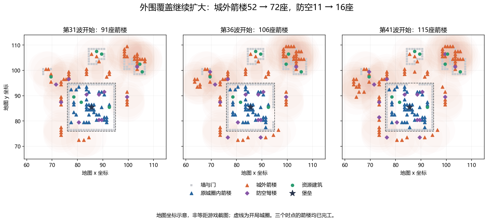
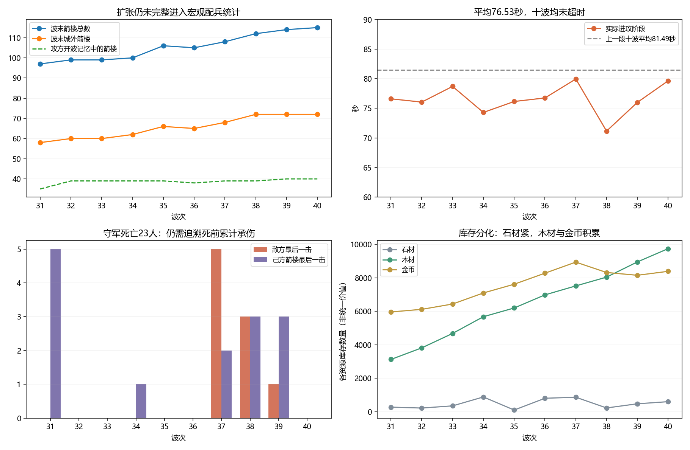
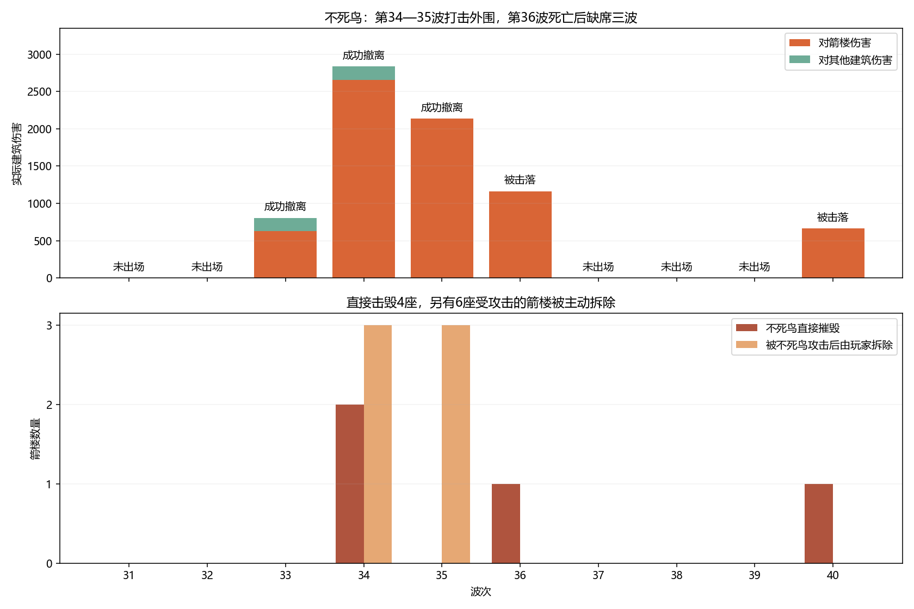

# 第31—40波深度复盘：外围塔阵、攻守行为与配平

[主报告](README.md) · [逐条事件](events.md) · [猎骑机制核查](ranger.md) · [补充核对表](supporting-tables.md) · [证据与复现](evidence.md)

分析日期：2026-09-17。对象：《圣城守望》1.0.1，地图 `gen_01009000`，脚本攻方。

## 1. 结论先行

**玩家的整体优势依然明确，但这十波出现了比上一段更值得研究的局部对抗：不死鸟会拆掉外围箭楼，另有受其攻击的箭楼被玩家主动拆除；地面部队仍主要消耗墙，未能持续清除塔阵。**

第31波开始到第41波开始，箭楼91→115座，原城圈外箭楼52→72座，堡垒14→16级且全程满血。十波平均进攻阶段76.53秒，全部正常清波，没有120秒超时。木材库存2458→9746，金币5066→8391；持续扩张和升级仍可负担。

需要更新上一轮判断的地方：

1. **“敌方只拆5座塔”不足以描述实际压力。** 不死鸟直接摧毁其中4座；另有6座塔在遭它攻击后被玩家主动拆除，包括一座5级塔。退款减轻材料损失，却不能保留火力位置和升级投入。
2. **不死鸟不是单纯数值弱或不会选塔。** 第34、35波能有效袭击外围并撤离；第36、40波则在同一处袭扰路线低血不撤，被防空击落。
3. **修好撤退会改变跨波压力。** 两组离线对照中，不死鸟都能保命、下一波再次出场；原规则则进入三波复活等待。单看当波伤害会低估撤退价值。
4. **枪卫死亡的原因比最后一击复杂。** 最终被锤击杀的7名枪卫，累计82.1%的承伤来自己方箭楼，不能把全部损失解释为锤独立造成。
5. **本段出现工匠伤亡。** 一名3级工匠在逃离过程中被骑士追上；等级不加工作速度，但额外生命在这种具体接触中确实可能有价值。
6. **猎骑低血后长期退出自动战斗。** 两名老兵十波零输出，两名新兵各打两下后也降至40%撤退线以下；缺少回血机制，回撤到位又不停止。详见[猎骑机制核查](ranger.md)。

## 2. 范围与可靠性

本次冻结存档位于第41波准备期，tick 96610。主分析只统计十个完整波次：第31波起点74073至第41波起点95979，合计1095.30秒模拟时间。第41波已经发生的31.55秒准备操作另列，不混入十波结果。

新存档与上一份存档的地图、数值、种子和既有操作前缀一致。从此前已验证的第31波起点继续重放，终态哈希与本次冻结存档完全一致：`3200466901981574840`。逐tick观测重放也一致；第36、40波单独基线再次分别匹配实际下一波起点。

种子为 `8709371129856055178`，平台 `msvc-1944/win/x64`，存档v6、World/16、Stats/13。存档中的学习策略身份为空，因此这份报告评价的是脚本攻方，不能直接用于评价RL训练成果。

本轮逐条附录共444条：343条玩家输入、27次征兵完成、23次守军阵亡、51次敌方摧毁建筑/工地。另有逐次伤害、AI决策、收入和工程状态记录。时间均为模拟时间，不包含玩家暂停时的现实时间。

## 3. 与上一段十波对比

| 指标 | 第21—30波 | 第31—40波 |
|---|---:|---:|
| 起止箭楼 | 45→91 | 91→115 |
| 起止城外箭楼 | 11→52 | 52→72 |
| 堡垒实际受伤 | 0 | 0 |
| 平均进攻阶段 | 81.49秒 | 76.53秒 |
| 敌方摧毁建筑/工地 | 79 | 51 |
| 敌方摧毁箭楼 | 5 | 5 |
| 守军阵亡：敌方/己方最后一击 | 25/32 | 9/14 |
| 箭楼占守方对敌伤害 | 98.7% | 99.0% |
| 城外箭楼占全部箭楼伤害 | 53.5% | 76.3% |
| 石/木/金收入 | 10559/6167/10423 | 10035/11445/7097 |
| 维修支出 | 212木 | 164木 |

起止箭楼均已完工。城外按开局城圈格坐标76—94之外定义，不代表没有后来新建的墙保护。平均用时受行军、编成和撤离影响，不能单独作为强弱指标；与堡垒安全、存量增长和低损耗合看，才支持优势持续的判断。

玩家的变化主要是**继续填补外围覆盖，同时加深已有塔的等级和防空保护**。这段新增塔数少于上一段，但每秒建筑状态采样确认了93次箭楼升级完成；结束时已有6座8级塔。不能将塔数增速下降解读为防御成长停滞。

## 4. 逐波总览

下表“敌杀/误杀”按最后一击统计；敌毁不含主动拆除或取消。逐波建筑数可含工地，主区间起止的箭楼均已完工。

| 波次 | 进攻秒 | 敌杀/误杀 | 敌毁实体（完工） | 毁墙/毁塔 | 波末塔/城外塔 | 石/木/金收入 |
|---|---:|---|---|---|---|---|
| 31 | 76.60 | 0/5 | 3（3） | 3/0 | 97/58 | 814/959/1034 |
| 32 | 76.05 | 0/0 | 8（8） | 4/1 | 99/60 | 940/1232/881 |
| 33 | 78.70 | 0/0 | 5（4） | 2/0 | 99/60 | 912/1232/592 |
| 34 | 74.30 | 0/1 | 7（7） | 5/2 | 100/62 | 996/1232/660 |
| 35 | 76.15 | 0/0 | 5（5） | 5/0 | 106/66 | 1122/1232/660 |
| 36 | 76.75 | 0/0 | 4（4） | 2/1 | 105/65 | 1122/938/660 |
| 37 | 79.95 | 5/2 | 5（5） | 3/0 | 108/68 | 1024/1064/660 |
| 38 | 71.15 | 3/3 | 5（5） | 5/0 | 112/72 | 973/1176/630 |
| 39 | 76.00 | 1/3 | 5（5） | 5/0 | 114/72 | 1122/1232/660 |
| 40 | 79.65 | 0/0 | 4（4） | 2/1 | 115/72 | 1010/1148/660 |

### 第31波：扩张继续，取消未动工塔；枪卫集中死于己方箭雨

13次建塔输入，最终箭楼91→97，城外52→58；同时增建伐木场。tick 75390一次取消4个1血箭楼工地，退回320石/120木，符合玩家解释的“工地太脆，先保住材料”。

敌方只摧毁3段墙，没有击杀守军。5名枪卫却在清波前约半秒内连续被己方箭楼击杀，位置集中在 `(92,84)` 附近。不能把这组损失归为攻方突破造成的直接战果。

### 第32波：11台攻城锤，首次摧毁这段的箭楼；升堡垒、调整矿区

侦查记忆的缺口为0，攻城锤从5增至11。它们这一波终于摧毁1座2级箭楼 `(106,103)`；另损失4墙、1门、2木栅。守军没有阵亡，堡垒仍满血。

玩家完成4名14级枪卫、1名14级猎骑，堡垒14→15级。主动拆除 `(104,102)` 的满血金矿场，以及 `(105,99)` 的166/552血二级金矿场，后者重建。波末金矿场数量3→2，且重建矿场当时仍在施工。拆掉满血矿场的具体意图未确认，不应擅自全部归为被迫止损。

### 第33波：不死鸟重新出场，打到防空后成功撤离

当期基础不死鸟配额升到4，原城圈内记忆6座防空扣减3只，因此计划出场1只。其等级36、满血560；在准备期的矿区袭扰分支停留约23.85秒，开战后造成807建筑伤害，其中630打在箭楼、177打在采石场。

它遭 `(71,94)` 防空打击，降到200血后成功撤离。没有摧毁箭楼；地面部队毁1座完工采石场、2段墙、2座门，其中一座门是工地。玩家新增防空，持续升级，但本波没有新兵完成；两次征兵输入不能当作两名实际新兵。

### 第34波：外围第一次被不死鸟连续清理

不死鸟从另一方向接近，没有触发矿区袭扰分支，而是正常选塔。准备期就造成1266建筑伤害并拆掉1座三级箭楼；开战后又摧毁1座二级箭楼。

玩家随后主动拆除3座受它攻击的塔：二级塔480/662血、五级塔186/823血、一级塔145/600血。它们此前在本分析区间承受的伤害全部来自不死鸟。此后尝试重建，最后又取消4个1血塔工地和1个1血防空工地。

因此这波不能只写“损失2座塔”。**两座被击毁，三座主动退出阵地，重建工地又撤回**，才是完整过程。不死鸟最终以167血撤走。与此同时，玩家在其他位置继续建设，波末塔数仍99→100，整体优势没有逆转。

### 第35波：不死鸟持续打击外围塔阵，玩家继续扩张和升级

敌方战果表只记5段墙、0座塔；玩家却在不死鸟攻击过程中主动拆了3座塔：三级69/720血、一级135/600血、二级104/662血。

不死鸟造成2139箭楼伤害，最后153血撤离；其中1209伤害发生在准备期。玩家另下9次建塔、2次建防空和40次升级输入，波末塔100→106、防空12→14。石材库存884→104，是这十波最明显的集中投入之一。

40次升级输入不等于40次完成：本波采样确认11次塔升级和1次防空升级完成，部分工程跨波推进，部分输入可能未被接受。

### 第36波：不死鸟再次落入旧行为冲突，死亡后留出三波空窗

它在 `(108.348,109.348)` 附近因矿区袭扰任务停住约23.45秒，开战后攻塔。虽然已经拆掉1座一级塔，但降到188/588血后仍连续20次决策继续袭扰攻击，最终在 `(102.691,105.954)` 被防空击落。

本波玩家没有新建箭楼，塔数106→105，继续升级、补墙和防空。主动拆除一段满血墙及一座满血伐木场，无法仅凭血量判断动机。第37—39波虽仍有1只不死鸟配额，实际都因复活等待没有出场。

### 第37波：一台攻城锤完成五杀，但枪卫此前已被己方打残

堡垒15→16级，塔105→108，重建伐木场；敌方毁3墙、1门、1采石场，没有拆塔。

临近波末，tick 89430，同一台攻城锤一次范围攻击击杀5名枪卫；它们命中前只剩30—41血，吃到的是54点溅射。随后又有2名枪卫被己方箭雨击杀。锤到达过城内 `(87,91)` 附近，但没有对堡垒造成伤害。

这是一段局部损失，不能据此推断濒临陷落；也不能只看五杀就认定锤对完整枪卫群具有同等杀伤能力。

### 第38波：补兵和升级；工匠首次被骑士追上

玩家下21次升级输入，采样确认19次塔升级、1次门升级、1次防空升级完成；实际出兵6名15级枪卫、1名15级弓手。塔108→112。

一名3级工匠沿城墙外侧向南、随后向东撤离，骑士从后方接近。工匠先受到14点己方箭雨，随后被154点骑士攻击击杀；另有两名工匠各吃到14点己方箭雨并存活。记录中没有手动移动或强制施工输入，不能归因于玩家下了冒险强制单。

另外2名枪卫最终被锤击杀、3名被塔误杀。敌方仍只拆了5段墙；本波进攻阶段71.15秒，是十波最短。

### 第39波：恢复兵力，金币支出回升，持续升级

实际完成6名枪卫、1名工匠、1名猎骑，均15级。其中两名枪卫由上波输入启动的训练延续到本波完成。工匠从13补回14；猎骑3→4，显示玩家没有完全放弃其他兵种。

新兵与恢复令金币净减少167，塔112→114；本波确认11次塔升级完成。敌方只拆5段墙，击杀此前新招的弓手；己方又误杀3名枪卫。新增防空使数量达到16座。

### 第40波：不死鸟复活，再走同一路线、同一失效分支

不死鸟复活后46级627血；又在相同位置停23.45秒，袭扰目标仍为 `(100,106)` 的采石场，实际攻击最近箭楼。降至211血后连续15次决策不撤，拆掉1座二级塔后，在与第36波相同的位置被击落。

这次两处防空参与伤害：`(99,106)` 造成300，`(103,101)` 造成327。玩家补建和调整外围资源建筑，完成3名枪卫，波末塔115、防空16、工匠14、枪卫21、猎骑4；人口39/40。堡垒4975/4975。

## 5. 不死鸟：已有战术价值，缺陷在任务优先级和跨波利用

### 5.1 出场、直接战果和主动撤除要一起看

| 波次 | 实际出场 | 建筑伤害 | 直接毁塔 | 受其攻击后主动拆塔 | 结果 |
|---|---|---:|---:|---:|---|
| 31—32 | 无 | 0 | 0 | 0 | 配额为0 |
| 33 | 1 | 807 | 0 | 0 | 200血撤离 |
| 34 | 1 | 2838 | 2 | 3 | 167血撤离 |
| 35 | 1 | 2139 | 0 | 3 | 153血撤离 |
| 36 | 1 | 1164 | 1 | 0 | 低血撤退被覆盖，击落 |
| 37—39 | 无 | 0 | 0 | 0 | 计划配额1，实际复活等待 |
| 40 | 1 | 662 | 1 | 0 | 同一失效分支，击落 |

第33—36波连续出场的是同一花名册身份，撤离后次波恢复血量；第36波死亡使其缺席接下来三波，第40波再复活。不能把“编成计划有1只”当作这些波次实际都有鸟。

第34、35波合计4977建筑伤害，而且能撤走，是它在缺少局部防空的外围阵地上的实际表现。全场防空很多，不代表每条外扩线都受保护；新增的外围防空也未进入原城圈内的宏观防空计数。

### 5.2 六次主动拆塔的材料账

6座主动拆除塔的原等级重建价值为792石/297木，实际退回384石/144木，未收回的建造和已完成升级投入合计408石/153木。

5座被敌方直接摧毁的塔，按当时等级从零恢复为568石/213木。因此，**这11次完工塔退出合计对应976石/366木的未收回材料投入**。它不是实际重建支出，也不包含失去覆盖的时间、工时或重新选址收益；不能与“打了多少血”混为一谈。

部分主动拆除发生在尚有较多生命时，例如480/662血的塔，不能一概描述为下一击必死。可以确认的是它们当时正在遭不死鸟攻击，玩家主动回收了部分材料。

### 5.3 两组撤退对照：保命会降低当波伤害，却保留下一波机会

只把不死鸟撤退检查放到矿区袭扰之前；地图、初始状态、种子、伤害、玩家原指令均不变。未同时修准备期停滞或地面AI。

| 波次/规则 | 不死鸟建筑伤害 | 不死鸟毁塔 | 被击落 | 下一波实际有鸟 | 全攻方建筑伤害 |
|---|---:|---:|---|---|---:|
| 36 原规则 | 1164 | 1 | 是 | 否 | 4863 |
| 36 撤退优先 | 788 | 1 | 否 | 是 | 4487 |
| 40 原规则 | 662 | 1 | 是 | 否 | 6388 |
| 40 撤退优先 | 400 | 0 | 否 | 是 | 4499 |

两个原规则基线都匹配实际下一波状态，四个分支堡垒均满血。第36波同样拆1座塔，减少后续零散伤害换来生还；第40波则少完成一次拆塔，保住下一波出场资格。

第40波总建筑伤害差异超过不死鸟自身差异，涉及后续战斗轨迹变化，不能全部归于少一次俯冲。实验仍固定原操作，未让玩家重新适应；只验证了撤退可以执行及下一波出场状态，没有模拟修正后的连续三波收益。

这直接提醒后续评价体系：当波伤害较高不一定代表策略更好，保存可跨波恢复的单位有未来价值；相应地，也不能只因鸟活下来就判定撤退时机已最优。

### 5.4 准备期规则仍不一致

第34、35波不死鸟准备期就主动攻塔，造成1266、1209伤害；第33、36、40波却因先命中袭扰分支长时间停止。这种差异来自任务优先级，不是玩家防空把它合理逼停。

应明确准备期究竟允许哪些进攻行为，再让各任务遵守同一规则。如果保留不死鸟提前骚扰，玩家需要清晰的提示和可用应对；如果准备期应当安全，则不能只修停止分支让它更早进攻。

## 6. 地面攻方仍未解决的核心问题

十波攻城锤110次承诺攻击中：墙65、门19、枪卫21、猎骑3、箭楼1、金矿场1。与上一段“0次主动指塔”相比，出现了例外，但总体选择仍明显偏向墙和守军。承诺攻击包含可能落空的前摇，不等于命中次数。

攻方68227建筑伤害中，墙49891、门4908，合计80.3%；箭楼10759，其中不死鸟贡献7251。全体地面攻方对箭楼的伤害只有3508，十波仅由锤击毁1座塔。资源建筑合计1932伤害；2座被敌军摧毁的资源建筑都是采石场，没有敌军击毁金矿场或伐木场。

箭楼总数持续增长，攻方开波记忆却只在35—40座之间变化；外围塔不进入宏观配兵统计的问题依旧存在。第32波记忆无缺口增加到11台锤，其余九波5台，仍将破墙与拆塔需求混在一起判断。

地面单位在完工箭楼射程内选择队形等待，合计约2005单位秒；等待指令期间承受69834伤害，占守方对敌伤害约16.2%。其中有合法建筑攻击却仍等待约327.35单位秒。第36波一名骑士在外围连续等待约12.8秒。

上一段对应为1458.35单位秒、41890伤害。这里能确定损失更大，不能单凭差值证明AI行为本身变差：塔阵、敌军等级和接战轨迹也改变了。已有上一段实验表明，完全取消等待并不能稳定提高效果，仍需把队形、路线和攻击目标一并处理。

## 7. 守军损失与工匠死亡

### 7.1 最后一击统计低估了箭楼对枪卫的影响

枪卫本段阵亡21人：14名被己方塔击杀，7名被锤击杀。枪卫承受敌方伤害2961、己方箭楼伤害15707，84.1%的实际承伤来自己方。

进一步逐个追溯7名被锤击杀者：它们本段总承伤4886，己方箭楼4013、敌方873；这7名的承伤恰好覆盖各自完整生命池。最后被锤击杀不代表此前没有严重误伤，第37波五杀前只剩30—41血就是具体例子。

这不等于移除误伤后能够机械地保住所有人：站位、敌军存活和后续攻击都会变化。但足以说明，只按击杀归属评价单位威胁会失真。

### 7.2 工匠并非拒绝逃跑，但被更快的骑士追上

tick 91170—91266，死亡工匠持续从 `(74.10,89.18)` 向南撤到 `(74.74,94.78)`，再转向东。骑士沿邻近路线追赶，tick 91267在距离约1格时承诺攻击；工匠先被己方塔扣14血，再遭154点骑士伤害，剩130血不足以生还。

工匠移速每秒1.6格，骑士每秒3格。这段说明避险寻路不能保证被追上后仍可脱险，尤其缺少阻挡时。日志没有记录每次工匠避险内部候选路径，因此尚不能断言它选了全局最优逃路，也不能据此直接宣布寻路程序错误。

同位置、同两次伤害下，11级工匠215血理论上可剩47血，15级242血可剩74血；这是固定命中条件下的生命比较，并未模拟整个反事实逃跑过程。**高级工匠仍不提高移速或施工速度，但额外生命在本轮已有具体适用情境。** 上一段零受伤不能推广成高级生命永远无用。

### 7.3 兵种使用与职责

实际完成23名枪卫、2名猎骑、1名弓手、1名工匠。枪卫19→21、猎骑2→4、工匠14→14，新增工匠补回阵亡者。新工匠为15级；第41波准备期另出的工匠不计在这里。

对敌伤害：箭楼425655、防空2403、枪卫1430、弓手180、猎骑158。塔仍承担99.0%输出。少量机动兵的低输出可能受本局防线已强、拦截职责和自动行为影响，不能据此判定所有情境下都无价值；但这局仍缺少让机动兵可靠保护外围阵地的有效表现。

### 7.4 猎骑：低输出已有明确的行为原因

两名老猎骑整个区间分别维持172/532、174/572血，零输出。两名新猎骑各命中两次，共造成158伤害；随后分别剩106/628、30/646血。两名新兵共承受1138伤害，其中882来自己方箭楼，占77.5%。第40波四名猎骑都存活、都低于40%撤退线，该波没有猎骑攻击命中。

源码中的低血回撤优先于攻击，现有规则又无治疗或自动回血，造成长期退出自主战斗、仍占人口。回撤分支绕过到位停止判断；两名老兵在全部采样中一直移动，在驻防点附近反复走动。手动指令能临时覆盖自主逻辑，不能误写成任何操作都不能令它攻击。

因此，“机动兵输出低”不应只归因于塔阵太强：这里已经存在明确的控制流程问题。本段没有猎骑实际死亡，不把其他时段“送死”的体验冒充本段死亡记录。完整规则、逐名账目、活动范围和改进顺序见[猎骑专题](ranger.md)。

## 8. 经济、施工与玩家策略

本段收入10035石/11445木/7097金。库存148/2458/5066→603/9746/8391；含退款后的净支出9580石/4157木/3772金。木材库存增长7288、金币增长3325，石材却多次接近见底，说明资源约束明显分化。

金币收入下降与主动拆矿、重建空窗相符，不能全部视为敌军直接破坏经济。木材收入增加则与伐木设施扩充和持续运行一致。防御依赖石材建塔升级，而大量木材、金币的积累未自然转为同等有效的额外火力。

140次升级输入，按每秒状态采样确认完成：箭楼93、堡垒2、防空7、城墙4、城门1、木栅3，共110次。输入与完成不一一对应，既包括跨波工程，也可能有未接受输入；不能把差值直接当作失败次数。

11个被取消工地均仍为1血：8塔、1墙、1采石场、1防空，实际退回800石/310木。16次主动拆除退回656石/324木，另含一次同tick维修支出；合计回收1456石/634木。玩家的止损操作持续存在，没有在离线观察中被当作敌军击毁。

维修支出164木，仅占木材收入1.4%，但不能把全部68227建筑伤害都说成用164木恢复了：还有被毁、拆除、未恢复和工地成长。它继续支持“伤而不毁的经济代价较低”，同时本段主动拆塔显示非致死伤害也能通过逼迫撤除、打断布局产生实际效果。

策略从上一段大规模外扩，转向**扩张、塔升级、防空补点和局部止损并行**。这一概括来自操作与结果，未替玩家断言每次满血资源建筑拆除的具体意图。

## 9. 对配平的新增判断

1. **先修不死鸟任务冲突，再评价它的数值。** 它在第34、35波已能对缺少局部防空的阵地形成压力。直接加伤害，可能同时放大准备期偷袭和低血不撤时的临死输出。
2. **把持续出场纳入评价。** 保住不死鸟意味着下一波仍能施压；原规则三波空窗给玩家充足恢复机会。不能用单波伤害高低替代长期效果。
3. **将主动拆除与退款后的损失纳入战果。** 第35波敌毁塔数0，却有3座受攻击塔被主动拆除。评价要包含升级投入、失去覆盖的时间、退款和替代建设，避免只数最后一击。
4. **地面拆塔问题仍需独立解决。** 不死鸟有效并不代表地面编成已经能应对塔阵。宏观统计、缺口导致减锤、停步和最近目标限制依旧叠加。
5. **外围保护应当给守方留下实际操作空间。** 新建防空也只有1血，临时补点可能来不及；工匠逃跑速度又低于骑士。改进敌方策略时，需要一起核对守方掩护、调兵与信息提示是否可靠。
6. **目前证据仍不足以统一削弱箭楼或给它加维护费。** 同一段中既有整体安全积累，又有不死鸟局部有效打击。先让已有兵种职责稳定执行，再用允许玩家响应的连续对局衡量扩张余量。
7. **补齐猎骑回撤后的行为与用途。** 先修到位不停、无条件拒绝攻击的问题，再对休整/补员、外围防区和友军误伤做联合对照。存活数不能代表有效兵力；也不能未经配平便默认免费波间满血。

## 10. 第41波冻结时刻与文件

冻结于第41波准备期已过31.55秒：堡垒16级4975/4975，箭楼116、防空16、工匠15、枪卫21、猎骑4，库存376石/9905木/8520金。这些后续准备操作不混入第31—40波末115座塔、14名工匠的统计。玩家之后继续游玩不会改变本次分析的冻结副本。

- [逐条事件附录](events.md)：444条玩家操作、征兵及损失记录。
- [猎骑机制补充核查](ranger.md)：低血后不再自主参战、回撤到位不停，以及职责与误伤问题。
- [补充核对表](supporting-tables.md)：配兵与侦查、拆塔材料账、27次取消/拆除、110次升级完成采样和实验明细。
- [证据与复现说明](evidence.md)：输入指纹、统计精度、状态校验和实验限制。

前一段第21—30波分析见 [PR #195](https://github.com/Cody-ic/siege-rts-rl/pull/195)，更早的试玩整理见 [PR #193](https://github.com/Cody-ic/siege-rts-rl/pull/193)。本报告可独立审阅，不依赖先合入这两个PR。

本PR提交整理后的分析、事件附录、核对表和三张图。原始存档、逐tick日志、实验输出与临时观测工具保留在本地证据包，完整重跑仍需取得该包；文件指纹和复现步骤见证据说明。

规则基线：[1.0.1源码 fb0c36d](https://github.com/Cody-ic/siege-rts-rl/tree/fb0c36d6f121d24521a618c801393f17ad71f748)。分析和诊断分支均在独立副本运行，未修改玩家游戏、存档或正式规则。
