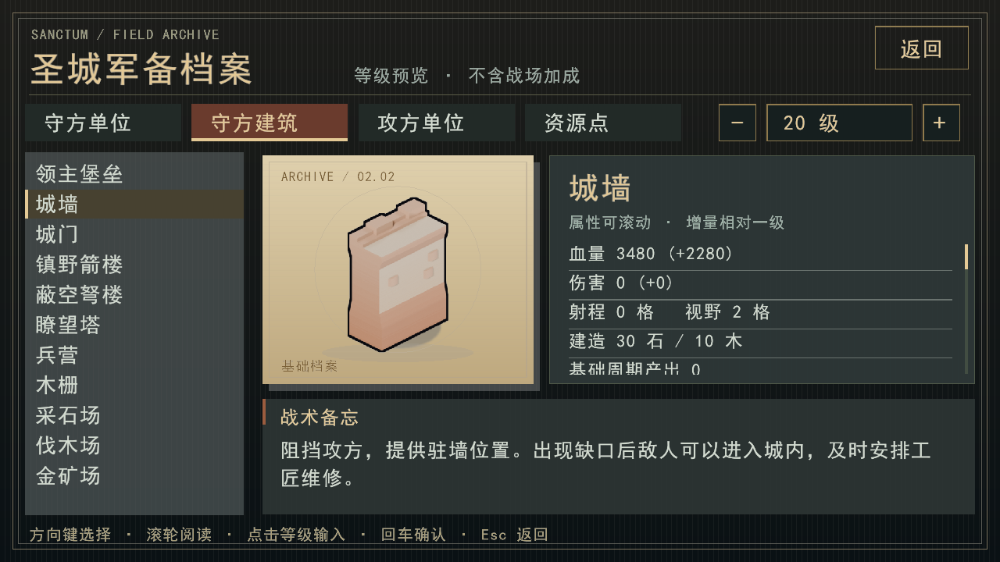
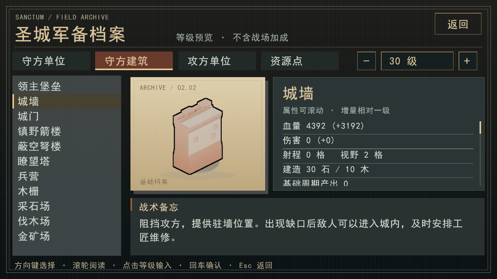

# #199–#201 集成复核与图鉴修复

审查基线：`7f12953855c77fee2b94fe834c1bdd60011c3af7`，包含 #199、#200、#201，以及每波进攻上限 150 秒的后续调整。日期：2026-09-19。

## 已修复的问题

#200 将城墙、城门、木栅栏改为分段耐久增长，但图鉴仍使用普通单位的平方根血量公式。20 级城墙会显示旧值 2730，而实际血量为 3480。

图鉴现在直接调用 `StatsTable::building_max_hp(type, level)`，与实际建造、升级使用同一入口；增量也从该结果计算。普通建筑及单位的规则不变，本修复不改变模拟、存档或模型指纹。

实际前端截图：





## 验证记录

- Windows/MSVC、C++20、Release，前端、ONNX 和训练接口开启，警告视为错误，完整重新构建成功。
- 20/30 级城墙实机截图已核对，分别为 3480/4392 血量，增量为 2280/3192。
- 12 张正式地图池、seed=1、脚本攻方、宏观守方每 20 tick 决策，全部完整通过前三波，无败局或观察窗口截断，共 100790 tick。[逐图结果](three-waves.csv)。运行命令：

```text
calibration_runner --maps game/data/maps/pool --seeds 1 --max-waves 3 --max-ticks 12000 --macro --out review-201-three-waves.json --compact
```

这批运行使用当前 150 秒进攻时限，没有改动正式地图和数值；与其他测试并行执行，不用于性能基准或与旧版本的胜率比较。

## 训练测试复核

首次完整 CTest 的 C++、前端及存档回归通过；部分 Python 测试受本机临时目录权限限制，另发现两个过时假设：

1. `defender_profiles` 只执行 200 次决策，balanced 与 mobile 在该时点尚未分化。独立诊断确认 300/400 次决策均有三种不同状态，400 次为配置定义的回合结束。测试改为完整、受 `max_ticks` 限制的回合，仍要求三种状态不同、默认策略等于 balanced，并新增终局断言；没有降低多策略多样性要求。
2. `macro_evaluate` 要求每 500 tick 只发一条命令的教师策略必胜。当前地图 gen_01009000、seed=101 下，正常脚本在 tick=3323 完成一波，教师在 tick=3400 战败。保留正常脚本通关断言；教师检查真实终局、非超时、完成/战败互斥、完成波数、败局堡垒血量及重复运行完全一致。此处修正的是评估测试的职责，**没有修复教师策略的战败，也没有证明教师足够强**。

最终 154 个 CTest 条目全部取得通过结果：完整首轮 141/154 通过（493.20 秒）；处理临时目录权限并修正上述两项测试后，仅重跑失败的 13 项，13/13 通过（360.94 秒）。没有把两轮描述成一次无失败的执行。覆盖 ONNX、PPO 运行时/恢复、多策略守方、宏观训练/冻结评估/模仿、连续战役评估、团队信用、前端和地图生成。命令：

```text
cmake --build build-release-final --config Release -j 6
ctest --test-dir build-release-final -C Release --output-on-failure -j 4
ctest --test-dir build-release-final -C Release --rerun-failed --output-on-failure -j 4
```

本机 MSBuild 需统一子进程的 `Path` 环境变量拼写并关闭旧节点复用；失败项重跑需要可正常读写系统临时目录。`git diff --check` 通过。

## 发布边界

- 基础存档为 v18，加载战术/宏观策略分别为 v19/v20；旧档需要对应旧程序，不承诺迁移。
- 使用本地 v1.0.1 正式模型运行新构建的 `policy_probe`，退出码 1，错误为 `Incompatible policy metadata: rts.stats_fingerprint`。不能直接把现有模型塞进新发行包，也不能仅修改元数据来冒充已验证兼容。
- RL 接管单位仍由模型输出最终动作；脚本寻路不等于模型学到了新战术。
- 本次只运行测试所需的小规模训练/恢复，不恢复服务器训练或产出新的正式模型，也不发布新游戏版本。前三波运行检查不能替代第 70–90 波平衡对照，尤其不能证明箭楼主导、远矿反制、猎骑协同问题已经解决。
