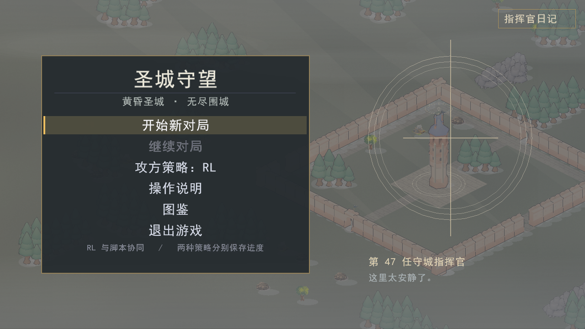
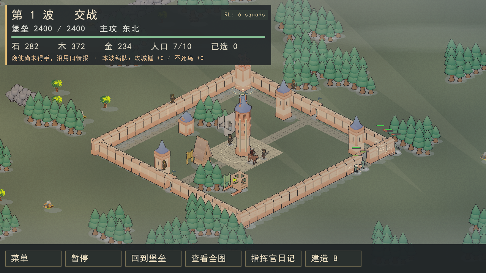

# v1.0.1：主菜单攻方策略切换

主菜单增加“攻方策略：脚本 / RL”，点击或键盘确认切换。每次启动默认脚本；
切换前自动保存，再加载该策略的独立对局。脚本继续使用原存档位置，RL 按模型身份
分目录保存，`--save-dir` 指定的根目录同样隔离。存档仍为 v6，兼容 v1.0.0。
字体沿用工程版黑体优先的规则。模型损坏或不兼容时保留脚本并提示，详情写入日志。

## 本次采用的训练成果

项目成员决定停止训练并将当前成果用于展示；采用服务器上最新一轮已保存的
`reward-compare-20260914/attrition-v1-seed-553/latest.pt`，65536 环境步。
没有继续训练，也不宣称模型已完成所有原定验收或优于脚本。

- 检查点 SHA256：`02b4786d9cfc4d39cb5f7683c40d51376653d007f2c286c97725ab54cceaa97a`
- 发布 ONNX SHA256：`bb9f041d8161486e8eec14fae1b06250be789af1a20d07d95d788981d839aa0e`
- 游戏模型身份：`1100857979700613263`
- 训练配置：attrition-v1、team、independent，seed 553，混编，等级 1/4，目标 keep。
- 模型支持 Ghoul、Shade、Knight、Ram、Phoenix，运行等级范围 1–4；其他兵种及超过 4 级
  保留脚本控制。2/3 级不是单独训练的等级，不宣称全等级、全兵种或全程纯 RL。

导出通过原始训练配置中的数值表摘要和观测布局核对；训练仿真与发布仿真并非同一
版本，导出记录分别保存两者指纹，没有修改训练元数据来伪装一致。
模型放在玩家包 `游戏数据/models/attacker.onnx`，无需 Python 或 GPU。
原训练检查点不纳入源码；导出验证记录见 `rl-results/2026-09-15-release-export.json`。

## 验证

- 下载的 5 个文件与服务器生成的 SHA256 全部一致。
- 冻结模型采集 126 行真实观测；1/9/32 编队的 Torch 与 ONNX 输出比较通过，
  原生 C++ 动作结果一致。仅推理，没有优化器更新。
- 菜单、策略和存档 31 个测试用例、1868 条断言通过；新增实际窗口重载往返和
  错误模型拒绝测试。菜单检查 960×540、1280×720、1920×1080。
- 实际成果完成脚本→RL→脚本往返，以及 1800 tick 游戏截图验证。

玩家压缩包在工程外中文空格路径完成解压验收：487 张素材校验通过，真实 GUI
启动器完成脚本→RL→脚本往返及 1800 tick 战斗。战斗 HUD 显示 6 支 RL 编队，
确认并非仅加载模型而未接管单位。没有使用 GPU，也没有重新训练。

