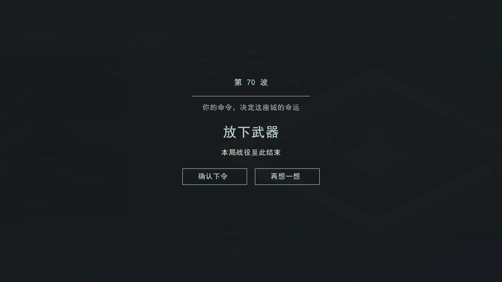
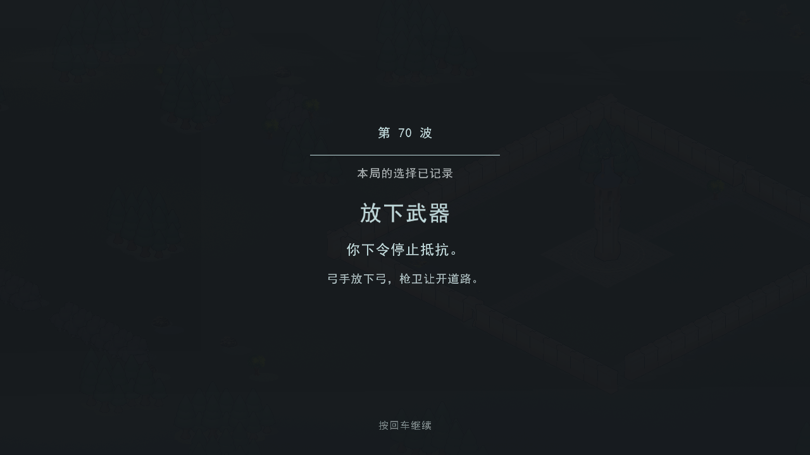
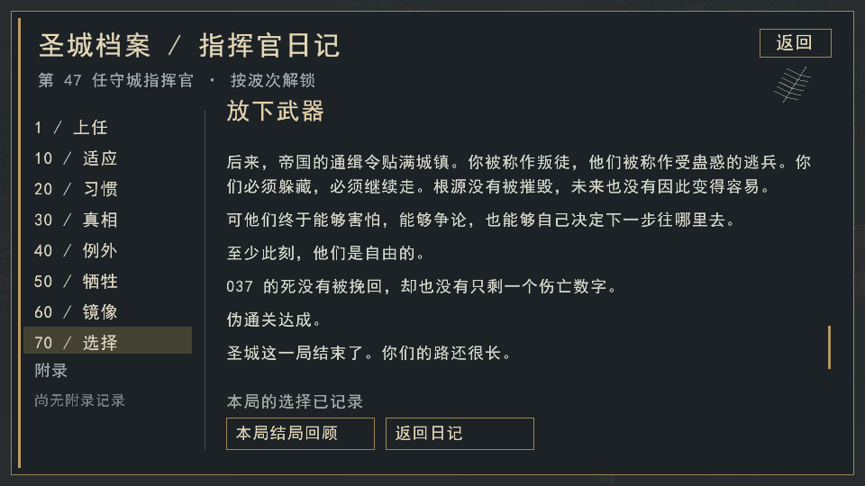
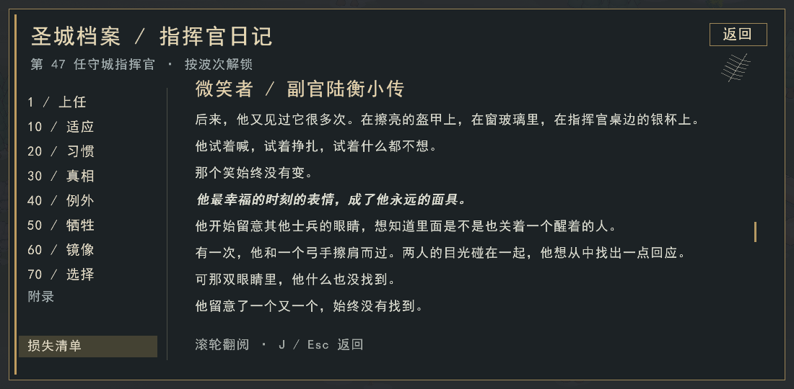

# 发布前体验修复 · 2026-09-19

对应 [提案 #198](https://github.com/Cody-ic/siege-rts-rl/pull/198) 的首批实现，问题证据见 [#197](https://github.com/Cody-ic/siege-rts-rl/pull/197)。这些修改解决具体行为与操作问题，不代表长局配平或 RL 表现已经验证。

## 本批行为变化

| 问题 | 实现与边界 |
| --- | --- |
| 攻方等队形时持续挨打 | 可攻击建筑时先攻击；进入可见火力范围或实际受伤后解除编队等待。安全区连续等待最多 100 tick，随后本波不再受此等待约束。 |
| 不死鸟撤离被其他逻辑打断、无目标空转 | 撤离优先于沿途资源袭击；没有可见目标时探索城中心，抵达视野范围仍无目标则撤离。保留现有低血量与地面部队耗尽时的撤离条件。 |
| 不死鸟被廉价木栅栏吸走攻击 | 射程内的非木栅栏建筑优先于栅栏；脚本有其他可见有效目标时先攻击或靠近，不为栅栏停留，也不主动飞向栅栏。无其他目标时仍可顺手攻击射程内栅栏，不给予伤害免疫。撤离仍优先，地面单位选敌不变。 |
| 建筑误伤守军 | 建筑弹丸的溅射排除同阵营单位，即使发射建筑已被拆毁也有效；单位发射的溅射沿用原规则。 |
| 斥候挤占人口、跑得慢 | 存活和在训斥候均不计人口；速度从 0.13 调到 0.20 格/tick，即 4 格/秒。工匠仍占普通人口，不新增玩家比例限制。 |
| 提速后在城门来回走 | 原方向保持 8 tick，可能越过一格宽的拐点。斥候进入新地块时重新采样已承诺目标的路径；其他单位与 RL 决策周期保持原规则。导航状态纳入快照。 |
| 情报被覆盖、因果不清 | 守方报告合并本波成功侦查的不同敌人，按含世代的单位身份去重，标明“累计发现，非剩余兵力”和回报时间。空营不抽签，遇敌后仍按每只每波独立抽签。 |
| 窥使瞬间传出情报 | 亲自连续观察塔、防空或堡垒至少 60 tick；完成前死亡或失去观察会取消。成功快照用于下一波，之后击落不能收回已传出的情报。统计包含已探索的扩张区城防，不读取未见建筑。 |
| 后期逐座升级繁琐 | Ctrl 框选普通建筑，Alt 框选墙、门、栅栏，U 批量升一级。显示当前可安排数量及总工料；资源不足时按地块顺序安排可负担的建筑，跳过已有工程和等级封顶项。仍需工匠施工。 |

5 秒编队等待、3 秒传输、4 格/秒斥候是本轮候选参数。传输完成与等待释放在决策拍检查，可能比阈值晚一个决策周期。它们需要后续跨波试玩验证，不能由单项回归测试推出最优性。

## 结局与阅读体验

第 70 波先显示抉择，再进入独立确认画面；确认后记录并保存本局选择，展示短过场，最后进入原结局正文。过场约 4.5 秒，1 秒后可按 Enter 继续。这里展示的是剧情文字，不伪造战场单位移动或建筑毁坏。

日记仅提供已选结局的回顾，《微笑者》第八节也仅显示本局分支。正文沿用审定稿；章节标题恢复层次，正文居中并限制行宽，关键句保留粗斜体。正式构建默认关闭 `RTS_INTERNAL_TOOLS`，Alt+F12 和锁定剧情预览不可用；内部截图另用开启该选项的构建。






以上是内部验收构建的实机截图，不表示已经发布新的安装包。

## 斥候到达实验

12 张固定演示地图，种子 1，自动守方每 20 tick 提交宏观命令；禁用侦查死亡抽签，仅隔离导航和时序。统计从开局到首次成功回报，包含自动招募等待。观察窗口为首波 900 tick（45 秒），两种速度都使用修复后的导航。

原始结果：[scout-first-wave.csv](scout-first-wave.csv)。`report_tick=-1` 表示窗口内无报告，不代表卡死或阵亡。

- 10/12 张在准备期内回报。0.13 速度为 31.70–33.95 秒，0.20 为 25.25–26.90 秒；新速度留下约 18.10–19.75 秒准备时间。
- `gen_01001000`、`gen_01007000` 两种速度都未在 45 秒内回报：斥候先探空营，再巡下一路，仍在正常行进。单独把准备期延长至 90 秒用于诊断，新速度分别在 82.50、88.15 秒回报。**没有据此延长正式游戏准备期。**
- 在导航修复前，0.20 速度还会使 `gen_01008000`、`gen_01012000` 在城门附近折返；现已纳入端到端回归，要求 600 tick 内交回报告。

这组实验没有覆盖随机死亡、后期扩张、玩家手动路线和所有种子；不能把 10/12 当作实际侦查成功率。空路线造成的延迟仍是后续侦查设计要处理的问题。

## 验证

Windows/MSVC、C++20、Release，先构建再测试：

```sh
cmake -S . -B build-verified -DCMAKE_BUILD_TYPE=Release -DRTS_BUILD_RENDER=ON -DRTS_INTERNAL_TOOLS=OFF
cmake --build build-verified --config Release
ctest --test-dir build-verified -C Release --output-on-failure
```

另以 `RTS_INTERNAL_TOOLS=ON`、`RTS_WITH_ONNX=ON` 构建内部验收版本，运行结局/小传截图检查和 `[rlpolicy],[rlgoals],[scoutnav]` 测试。重点覆盖建筑溅射、编队解散等待、资源袭击与撤离优先级、窥使传输中被击落、斥候人口及合法动作、报告去重、批量升级的预算与施工、快照和操作回放的一致性。

不死鸟木栅栏优先级另有 `[battlefix][phoenix-target]` 回归：七种非墙建筑与近处栅栏竞争、目标销毁后的回退、射程外建筑不压掉合法攻击、追逐可见单位/建筑、忽略未见建筑、不追逐远处栅栏，以及地面单位继续正常拆栅栏。

打包器语法检查通过；内部工具构建在创建输出目录之前被拒绝；已安装 v1.0.1 的真实模型在新数值表下明确报 `rts.stats_fingerprint` 不兼容。具体测试计数与耗时见 PR 验证记录。

## 兼容性与后续

规则标识变为 World/17，基础存档 v9、战术模型存档 v10、守方宏观模型存档 v11。旧 v6–v8 存档会保留备份，需要对应旧版本继续，未实现无损迁移。请保留旧安装目录与原存档。

**现有正式版的训练模型不能直接用于下一版发行包。** 三个 ONNX 测试夹具只更新合成模型的元数据，用于验证推理接口；不代表真实训练模型完成适配。需要针对新规则训练/导出、评估兼容模型后再发布，不能篡改旧模型元数据绕过检查。打包器现在强制检查这条约束。

猎骑重做、持久城外驻防、城墙/兵营升级收益、人口上限曲线、石材经济与《一跃》触发条件留在后续任务，本批没有宣称这些系统已经完成。
