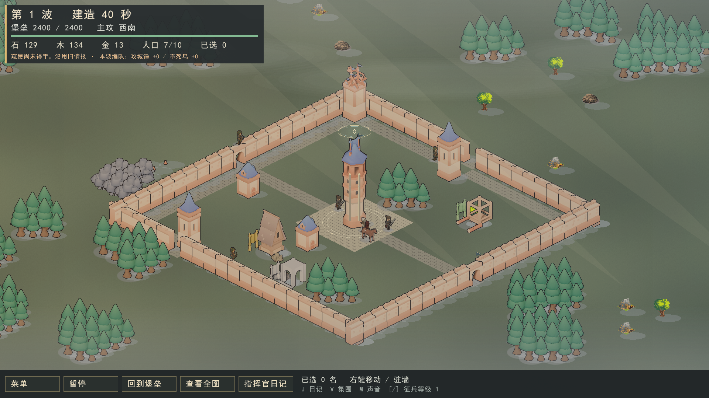
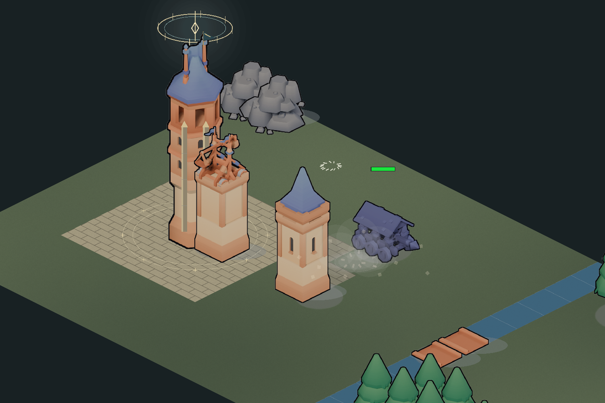

# 圣城表现升级与 RL 兼容边界

## 方向与当前批次

以“一座越来越强大、也越来越令人不安的圣城”为方向。保留八篇日记、每十波剧情节点、第七十波两种选择；放下武器结束本局，继续守护进入无尽。

第一批实现地表、堡垒与战斗视听基础，没有新增战术规则或启动训练任务。

- 地表使用原生渲染材质与共享顶点色，减少逐格明暗跳变。现有城门到堡垒之间增加装饰石路，堡垒周围增加铺装广场，墙内侧增加步道；路线避开静态岩林与墙体。铺装不是可通行性、速度或建造权限的提示，不改变地图数据。后续建筑可以覆盖铺装。
- 堡垒沿原落地点等比放大，增加石质扶壁与圣契冠环。冠环按 1–3、4–9、10 级以上三档变化。正文精灵、点击透明度检测和血条使用一致的缩放；冠环与装饰仍不参与碰撞。原模型未替换为新的三维模型。
- 箭与弩矢使用不同长度的轨迹；弩楼蓄力与释放效果跟随既有攻击动画。墙体按实际血量显示裂缝；建筑倒塌产生烟尘和留在地面的碎石痕迹；可见不死鸟死亡时散落白羽。
- 修正原倒塌效果丢失：实体销毁会清空槽位的类型和位置，表现必须使用上一次观测的落点，不能在已清空的槽位里取位置。
- 新增原创程序合成的风声、号角、箭弦、重弩、撞击、崩塌、白鸟短旋律与羽翼、工匠敲击。它们是声音基础版本，尚不是完整配乐或配音。声源按镜头位置衰减和左右定位，同类声音限频，暂停、菜单阅读与开发者面板停止战场声音；主菜单保留环境风声。
- `M` 切换声音，`--mute` 可静音启动；截图与回归探针不打开音频设备。没有音频设备时继续游戏。`V` / `--classic-visuals` 保留原视觉入口，声音可独立控制。

碎屑最多 96 组，白羽最多 16 组；地面痕迹最多 128 处。特效计时跟随仿真时间，暂停不继续飘落。新局清空表现状态；地面痕迹不写入对局快照，退出后不会保留，不影响真实受损血量与存档。

## RL 现状核对

以下以主分支 `78f105b` 和 PR #153 的 `03e0f7c` 为核对基线；旧 README 内的“逐单位”“没有训练脚本”等表述已有过时部分，应以调用路径为准。

| 路径 | 当前责任 |
|---|---|
| `train/ppo.py` / `evaluate.py` | 策略产生动作，经绑定传给 `BatchedEnv` |
| `BatchedEnv::step` | 每个编队一行动作，按编队展开到成员，再调用 `World::submit_actions`；不是为每名成员额外运行一个占位脚本 |
| `DemoBattle::issue_actions` | 试玩用占位攻方脚本，包括侦查、资源袭击和行军；目前没有从这里加载训练权重的推理入口 |
| [PR #153](https://github.com/Cody-ic/siege-rts-rl/pull/153) | 在绑定层组合真实守方脚本与宏观决策，用逐环境钩子接入训练；不能把其 PR 描述的历史实验读数当成当前训练效果 |

当前兼容面：`World/16`、`Stats/13`、对局保存 v3、观测语义版本 2、现有观测布局指纹、13 种战术动作和 32 行编队张量上限。本批不修改它们，也不修改 PPO、奖励、单位属性、攻方占位脚本或守方陪练。绘制列表新增的等级字段只把已有等级传给渲染，不进入世界状态或观测张量。

## 后续战术接入约束

1. **决策权唯一。** 规则基线和 RL 推理应是可切换的决策来源。RL 模式下不得先得到策略动作，再被“必须袭击资源点”“必须等攻城锤”之类占位脚本覆盖。通用执行只做既有规则与合法性处理。
2. **保留实际动作粒度。** 当前策略按编队输出一个低层动作。不能悄悄把它改成逐单位决策、目标建筑编号或高层战术卡。确需改动时同时升级观测/动作语义、训练打包、推理、回放与权重兼容检查；旧权重不能仅凭张量形状相同就直接使用。
3. **相同信息边界。** 策略只读所属阵营的观测与侦查记忆；人类提示与敌方声效经过守方视野检查。`WorldView` 同时含真相和迷雾，收到它并不等于已过滤迷雾。
4. **相同规则。** 改视野、主动技能、冷却、移动、目标选择、城门规则等机制，必须进入共用仿真并在无渲染环境可运行。新“圣契调度”若实现，守方训练动作/观测和陪练也须能够表达它，不能只做成前端特权按钮。
5. **同一模型可复核。** 推理接入时记录规则与观测版本、布局指纹、动作语义、权重及地图/数值表摘要、决策周期和对手配置。固定相同输入动作流比较无渲染与可视化状态；评估用固定种子集和保留地图，并对资源袭击、突破利用、胜率与耗时分别统计。
6. **展示按证据命名。** 编队数量变化可显示“情报后增加飞行兵力”；观察到绕行只描述绕行。除非能追溯策略或规则决策，不将战术标签写成已证实的意图，不将占位规则宣称为 RL 学习成果。

## 后续阶段

| 阶段 | 内容 | 接入前提 |
|---|---|---|
| 战术与可读性 | 少量可辨认的攻城战术、战况提示与战后复盘 | 明确规则基线 / RL 推理的切换，尊重现有编队动作语义 |
| 剧情演出 | 章节回忆、断弓物件、第七十波战场结局 | 固定剧情回忆与自由战局明确区分，不强制杀死玩家培养的单位 |
| 守城试炼 | 独立的短篇可玩展示关 | 使用实际规则，独立于正式存档与日记解锁 |
| 圣契调度原型 | 单战区的短时强化与整备代价 | 共用机制、陪练能力、观测与动作兼容设计完成后验证 |

## 验证方式

Release 构建成功，完整 CTest **150/150** 通过（162.87 秒）。已目视检查 960×540、1920×1080 战场、主菜单及近景的破墙和白羽帧；2560×1440 与传统视觉通过截图回归。`play.bat` 优先的 `build/render/Release/rts_render.exe` 已重新构建。

`presentation_observer_contract` 用真实交战检查号角、弩矢释放、建筑受损与倒塌；连续 240 步对比开关表现观察器的世界哈希。额外检查迷雾中的白鸟出现/死亡不泄漏、清空死亡槽位后的可见白鸟音效、同一步不重复发声、换局不回放历史音效、堡垒缩放点击映射与合成音频样本范围。

`presentation_combat_shots` 通过实际仿真输出蓄力/释放、破墙与白羽场景，并检查绘制前后世界哈希不变。固定小图仅用于表现回归，不用于平衡结论。另有 960×540、2560×1440 和传统视觉截图回归。

截图探针不打开音频设备，因此通过它只能证明事件与合成数据正确；实际扬声器音量、混音舒适度和键鼠交互仍需真人试玩。此次不声称重新训练成功、旧权重已接入试玩，也不把逐步哈希一致等同于帧率基准。

