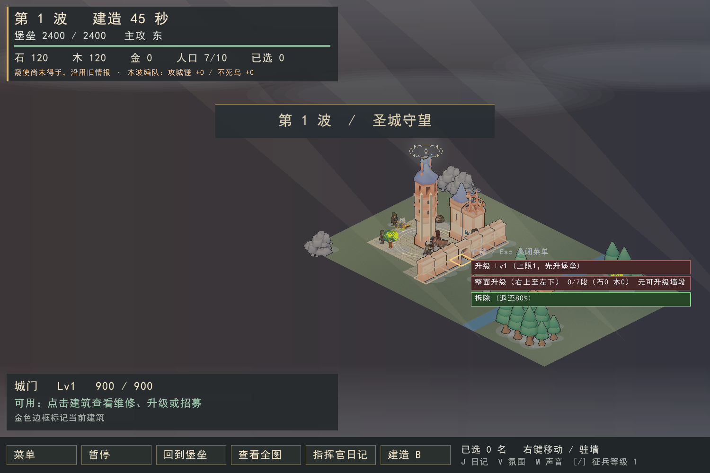
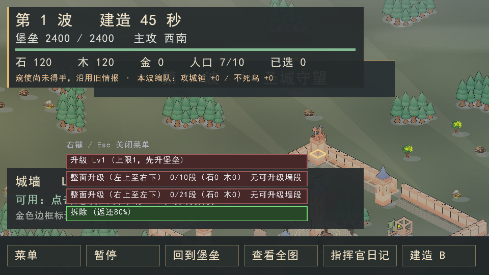

# 整面城墙升级

逐段点墙或拖框在长墙和密集建筑间仍然繁琐。现在点击其中一段，在菜单选择“整面升级”，即可给这一面墙安排升级。

## 识别范围

- 一面墙是穿过所点地块、沿同一网格轴连续相邻的墙段；包含两端拐角，但不会转弯或带上岔出的另一面。
- 拐角和交叉口分别提供“左上至右下”“右上至左下”选项。悬停对应选项即可检查范围。
- 同线城门与城墙一起计算。木栅栏也支持整面升级，但与石墙、城门分开成面。
- 缺口、拆除位置和其他建筑截断连接；已放下的墙类工地保持连接。孤立一段仍使用原单座升级入口。
- 读取当前实际建筑，不按初始地图猜测，也不跨越缺口寻找远处同方向的墙。

## 操作与费用

菜单显示本次能安排的段数/整面总段数，以及本次石木总费用。悬停时，青色边框表示本次可安排，灰褐色表示跳过的段。每段各升一级，不保证不同等级的墙升到同一等级。

沿用批量升级的预算规则：按地块稳定排序，资源不足时安排负担得起的部分；已有工程、未完工、达到等级上限的段跳过。它们不影响同一面其他段参与。所有报价与实际扣款共用现有升级价格，仍需工匠到场施工，保持受损比例，不替代维修。

提交后整面保持高亮选中，可按 U 再次安排；原有单座升级、重叠建筑连续点击切换和 Ctrl/Alt 框选继续可用。更宽的菜单在空间允许时避开原点击位置。

## 验证与兼容性

回归覆盖横竖直线、城门、拐角、岔口、拆除缺口、工地、木栅栏与石墙分组、地图边缘、纯查询不改变世界，以及混合升级状态下的预算、实际扣费和无工匠停工。

MSVC/C++20 Release 前端重建通过。输入、菜单、直墙/拐角截图和帮助页共 5/5 项 CTest 通过（4.66 秒）；菜单避让及背景调整后再次重建，相关两项截图回归通过（3.70 秒）。1500×1000 与 960×540 截图已目视检查；未进行真人鼠标交互试玩。

```sh
ctest --test-dir build-verified -C Release -R '^(rts_tests_(input|menu)|render_wall_(run|corner)_menu|render_help_shot)$' --output-on-failure -j 2
```

截图模式 `--battle --inspect X,Y --inspect-menu --screenshot output.png` 使用真实菜单及预览绘制，只读场景且不读写真实存档。此选项必须用于截图。大窗口检查直墙，小窗口检查拐角两个入口。

下图为开局尚未升级堡垒时的禁用状态：可以预览整面范围，菜单提示先升级堡垒。





沿用现有逐段 Upgrade 命令及操作日志，不新增仿真规则或存档字段。基于 #201，尚未更新已安装正式版。
